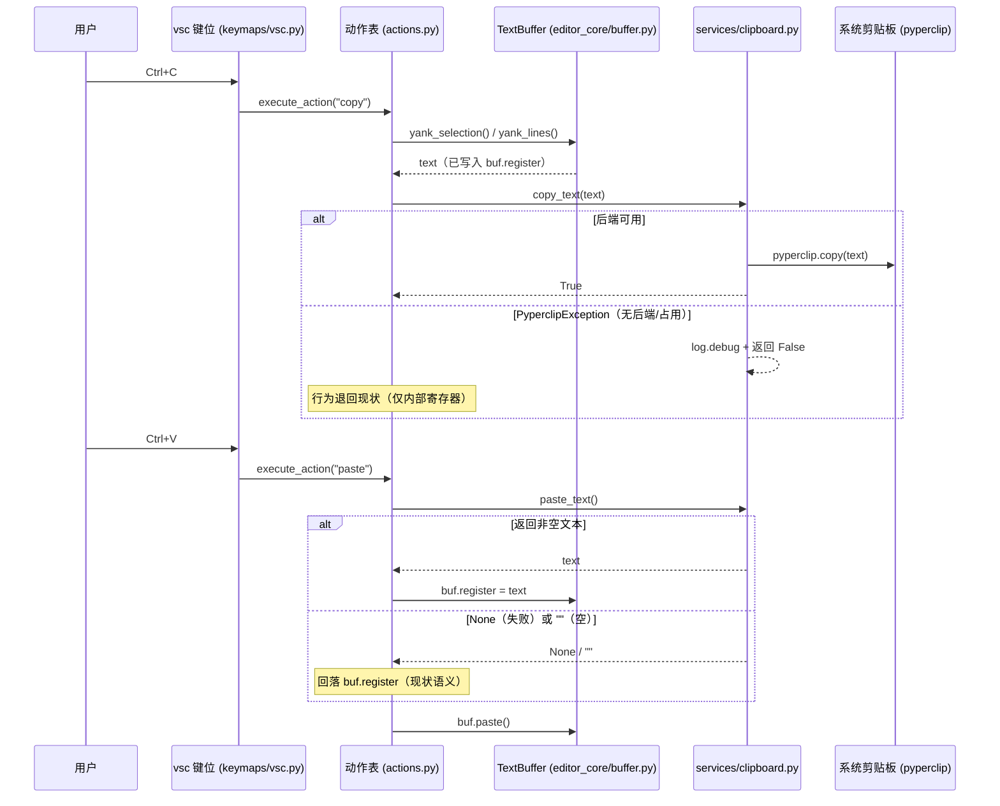
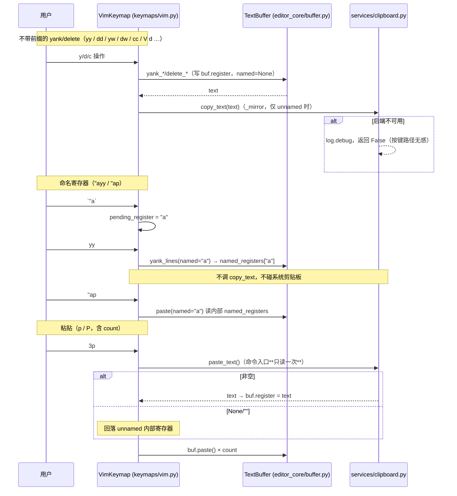

# system-clipboard-plan（系统剪贴板集成，Gitee issue IKJHBO）

- 分支 / worktree：`feat/system-clipboard`（本仓库 worktree，下文所有路径均为
  仓库根相对路径，所有命令均在 worktree 根执行）
- 规则依据：`plan-before-execute.md`（方案先行）、`architecture-boundaries.md`
  （R1-R13）、`python-coding-style.md`（pyright strict 零诊断）、`doc-conventions.md`
  （双语成对更新、相对路径引用）
- 用户已批准的设计决策（本文档不得另提替代）：
  1. pyperclip 作为**硬依赖**加入 pyproject.toml；
  2. vsc 键位（ctrl-x/c/v）全量同步系统剪贴板：copy/cut 写系统剪贴板；paste
     优先读系统剪贴板，失败或为空回落内部寄存器；
  3. vim 键位：unnamed 寄存器**别名**系统剪贴板（等价 vim `clipboard=unnamed`）；
     命名寄存器 `"a`-`"z` 经 `"` 前缀显式指定，纯内部存储（读写均不碰系统剪贴板）；
     范围最小化：仅 a-z，不做 A-Z 追加、编号寄存器、`"+`/`"*`、黑洞寄存器。

---

## 一、调研事实清单（全部已在 worktree 复核）

### 1.1 内部寄存器（yate/editor_core/buffer.py）

| 事实 | 位置 |
|---|---|
| unnamed 寄存器字段 `self.register: str = ""` | `yate/editor_core/buffer.py:126` |
| `yank_lines(self) -> str`：内部写 `self.register` 并返回文本 | `yate/editor_core/buffer.py:575-584` |
| `yank_selection(self) -> str`：同上 | `yate/editor_core/buffer.py:586-593` |
| `delete_lines(self) -> str`：同上 | `yate/editor_core/buffer.py:595-613` |
| `delete_selection(self) -> str \| None`：**只返回文本，不写 register** | `yate/editor_core/buffer.py:402-412` |
| `paste(self, below: bool = True) -> None`：读 `self.register`，空则 no-op；以 `\n` 结尾按行粘贴 | `yate/editor_core/buffer.py:671-685` |

### 1.2 动作层与 vsc 键位

| 事实 | 位置 |
|---|---|
| `cut`：有选区时 `buf.register = buf.selected_text() or ""` 后 `delete_selection()`；否则 `delete_lines()` | `yate/actions.py:101-108` |
| `copy`：`yank_selection()` / `yank_lines()` | `yate/actions.py:110-116` |
| `paste` 是 lambda `lambda ctx: ctx.buffer.paste()` | `yate/actions.py:120` |
| vsc 键位 `ctrl-x/c/v` 绑定 `cut`/`copy`/`paste` | `yate/keymaps/vsc.py:82-84` |
| `ActionContext` / `KeyUi` 定义（keymaps/base.py，L0） | `yate/keymaps/base.py:180-209` |

### 1.3 vim 键位（yate/keymaps/vim.py）

| 事实 | 位置 |
|---|---|
| pending 状态字段：`op` / `prefix` / `obj_scope` / `op_count` / `count_str` / `last_find` | `yate/keymaps/vim.py:84-90` |
| `_clear_pending` / `_clear_operator`（清 pending 的两处入口） | `yate/keymaps/vim.py:199-209` |
| VISUAL y/d/x：linewise y 在 272、linewise d 在 279、charwise y 在 283、charwise d/x 经 `delete_selection()` 后键位自写 register 在 290-292 | `yate/keymaps/vim.py:269-295` |
| `x` 与 `d` 共用 269 的 `("y", "d", "x")` 分支（visual x 也写 unnamed） | `yate/keymaps/vim.py:269` |
| p/P：`for _ in range(self._take_count()): buf.paste(...)` | `yate/keymaps/vim.py:412-419` |
| `_linewise_op`（dd/yy/cc）：548 delete_lines、551 yank_lines；**557 的 cc 走 `delete_selection()` 但返回值被丢弃、不写 register** | `yate/keymaps/vim.py:536-558` |
| `_resolve_gg`（`d5gg` 等 linewise）：579 yank_lines、584 delete_lines；**587 的 c 分支同样丢弃返回值不写 register** | `yate/keymaps/vim.py:560-588` |
| `_finish_operator`（d/y/c + motion）：812 yank_selection；818-821 `delete_selection()` 后写 register（c 在 821-822 进入 insert） | `yate/keymaps/vim.py:754-824` |
| NORMAL 模式 `"` 当前被「swallow unmapped normal keys」静默吞掉（无行为，新增处理零回归） | `yate/keymaps/vim.py:500-505` |
| `_handle_normal` 的分发顺序：esc → ctrl-g → digit → prefix resolve → operator pending → arm prefix → arm operator → motion → … | `yate/keymaps/vim.py:338-505` |

### 1.4 服务层风格 / 架构守卫 / 打包 / 类型

| 事实 | 位置 |
|---|---|
| L0 服务模块风格参照：模块 docstring、`from __future__ import annotations`、`log = tracing.get_logger(__name__)`、stdlib/子进程皆可用 | `yate/services/fonts.py:1-46` |
| 架构守卫 `UI_FREE_PACKAGES = ("keymaps", "services", "keyproto", "editor_sprites")`——只禁 `editor_view` 与 `textual.app`，**keymaps → services 的横向 L0 依赖不触犯任何 R 条款** | `tests/test_architecture.py:97-98` |
| pyproject dependencies 现仅 `textual>=8.0` | `pyproject.toml:12-14` |
| `[tool.pyright]`：strict、`include = ["yate", "tools", "tests"]`、`venv = ".venv"`；未设 stubPath（pyright 默认 stubPath 即仓库根 `typings/`） | `pyproject.toml:55-62` |
| PyInstaller `hiddenimports = collect_submodules("yate")`；已实证 pyperclip 1.11.0 全部后端函数（copy_windows/copy_xclip/…）定义在 `pyperclip/__init__.py` 自身内，`import pyperclip` 为静态可见，Analysis 可自动收集 | `pack/yate.spec:61-63` |
| pyperclip 1.11.0 实证（worktree venv）：`copy(text)` / `paste() -> str` 签名、`PyperclipException(RuntimeError)`、Windows 后端为 `init_windows_clipboard` 内的 `copy_windows`/`paste_windows` | venv 内 pyperclip 1.11.0 |
| pyperclip **无 py.typed、无类型标注** → pyright strict 直接 import 报 missing-stubs；python-coding-style 禁止 `# type: ignore` → 解法为本地最小 stub `typings/pyperclip/__init__.pyi`（`typings/` 目录现不存在，需新建） | — |
| 打包 spec 为 git-ignore 默认但被 force-add 跟踪 | `pack/yate.spec:20-21` |

### 1.5 双语手册（必须同步更新，doc-conventions §三硬约束）

| 事实 | 位置 |
|---|---|
| 总览 Note「不与系统剪贴板交换数据」 | `yate/resources/manual.en.md:252-253`；`yate/resources/manual.zh.md:238-239` |
| vsc History/Clipboard 表（三行描述 internal register）+ Clipboard note | `yate/resources/manual.en.md:315-326`；`yate/resources/manual.zh.md:300-311` |
| vim 5.2 Editing 表（`dd`/`yy`/`p`/`P` 行，需补 `"{a-z}` 行） | `yate/resources/manual.en.md:428-442`；`yate/resources/manual.zh.md:410-425` |
| vim 速查表只按键名罗列，语义未变，**不改** | `yate/resources/manual.en.md:1397-1405`；`yate/resources/manual.zh.md:1259-1272` |
| CHANGELOG 由 `python -m tools.changelog` 生成（"do not edit by hand"），**本任务不手工改** | `CHANGELOG.md:1-4` |

### 1.6 测试现状

- `tests/test_vim_keymap.py:36-74`：headless 风格——真实 `EditorSession` +
  真实内置动作表 + 录制型 `KeyUi`，经 `VimKeymap.handle_key(ctx, key)` 驱动。
- `tests/test_action_table.py:1-70`：recording stub editor + 真实
  `EditorSession` + `ActionRegistry.execute(name, ctx)` 驱动动作表闭包。
- `tests/test_clipboard.py`：新建（见 §六）。

---

## 二、目标与非目标

### 目标

1. yate 与系统剪贴板打通：vsc 键位 ctrl-x/c/v 全量同步；vim 键位 unnamed
   寄存器别名系统剪贴板（`clipboard=unnamed` 语义）。
2. vim 命名寄存器 `"a`-`"z`：经 `"` 前缀显式指定，纯内部存储，读写不碰系统剪贴板。
3. 降级安全：系统剪贴板不可用（Linux 无 xclip/xsel/wl-clipboard 后端、Windows
   剪贴板被占用等抛 `PyperclipException`）时，服务层返回失败值并 debug 日志，
   编辑器行为退回纯内部寄存器现状，**绝不抛异常进按键路径**。
4. pyperclip 1.11.0 作为硬依赖入库；pyright strict 零诊断（本地 stub 解决无类型问题）。
5. 双语手册同步更新（删「不与系统剪贴板交换数据」的陈述，写明新语义）。

### 非目标

- 不做 A-Z 追加寄存器、编号寄存器、`"+`/`"*` 选择与剪贴板寄存器、黑洞寄存器 `_`。
- 不改 Textual 层的 bracketed-paste 事件处理（终端窗格已自持，
  `yate/editor_view/terminal.py:257`；编辑器视图的 paste 事件路由不在本任务）。
- 不为 L2/L3 引入任何剪贴板感知（同步点只落在 L0 keymaps 与 L3 actions）。
- 不手工修改 CHANGELOG（工具生成）。
- 不改 `pack/yate.spec`（预计无需改动，仅保留一项验证性说明，见步骤 1.4）。
- 不支持 vim `:registers` ex 命令（范围外）。

---

## 三、备选方案与否决理由

| 方案 | 说明 | 否决理由 |
|---|---|---|
| A. win32yank 外部 exe | vim 社区常用：Windows 下调 win32yank.exe 子进程读写 | 需要随包分发或要求用户自备外部二进制，违背「优先 Python 类库」的 issue 诉求；打包（PyInstaller datas）与跨平台分发复杂化；pyperclip 在 Windows 用 ctypes 直读 Win32 API，零外部依赖 |
| B. 自实现 ctypes + CLI 后端 | 仿 pyperclip 手写 Windows ctypes / macOS pbcopy / Linux xclip|xsel|wl-copy 分支 | 与 pyperclip 完全重复造轮子；五个平台的后端差异（编码、换行、错误语义）都需要自测维护；issue 明确「优先 Python 类库」 |
| C. pyperclip 可选依赖（extras / 缺失时降级） | `pyperclip` 放 `[project.optional-dependencies]`，import 失败时静默降级 | 用户已批准硬依赖；可选依赖会让「同一构建在不同环境行为不同」，且 PyInstaller 冻结构建是否携带 pyperclip 变得不可预测；降级路径已保留在**运行时异常**层（后端缺失），无需在依赖层再降级 |
| D. 仅用 Textual `App.copy_to_clipboard`（OSC 52） | 零新依赖 | 实证 `App.copy_to_clipboard` 只写不读（site-packages/textual/app.py:1770-1786），且 OSC 52 需终端支持并常被禁用；`App.clipboard` 仅应用内（1015）。**无法满足 paste 读取系统剪贴板**这一核心诉求 |
| E. 在 buffer 层（editor_core）内嵌剪贴板同步 | `yank_lines`/`delete_lines` 内直接调 pyperclip | 编辑内核（纯 L0 算法层）引入外部副作用（系统调用），内核测试被迫处理剪贴板 mock；vsc 动作层与 vim 键位层的同步语义不同（vsc 无命名寄存器），统一塞进内核反而需要额外开关。**否决**：同步点归键位层（vim）与动作层（vsc），内核保持纯净 |

---

## 四、总体设计

### 4.1 分层落位

| 层 | 模块 | 职责 |
|---|---|---|
| L0 服务（新建） | `yate/services/clipboard.py` | 唯一触碰 pyperclip 的位置：`copy_text` / `paste_text` + 降级 |
| L0 类型桩（新建） | `typings/pyperclip/__init__.pyi` | pyright strict 所需的最小签名（仅类型检查用，不参与运行时/打包） |
| L0 内核 | `yate/editor_core/buffer.py` | 命名寄存器存储模型（`named_registers`）+ `named` 参数化读写；**不 import 任何剪贴板服务** |
| L0 键位 | `yate/keymaps/vim.py` | `"` 前缀状态机；unnamed 写点镜像到系统剪贴板；p/P 入口优先读系统剪贴板 |
| L3 动作 | `yate/actions.py` | vsc 的 cut/copy/paste 同步系统剪贴板 |
| 文档 | `yate/resources/manual.en.md` / `manual.zh.md` | 双语成对更新 |
| 依赖 | `pyproject.toml` | `pyperclip>=1.8.2` 入 dependencies |

新增依赖边：`yate.keymaps.vim → yate.services.clipboard`（L0 横向，keymaps→services，
不触犯 R4——`tests/test_architecture.py:97` 的 `UI_FREE_PACKAGES` 只禁
editor_view 与 textual.app）；`yate.actions → yate.services.clipboard`（L3→L0，
向下依赖合法）。

### 4.2 数据流（vsc 键位）



### 4.3 数据流（vim 键位）



### 4.4 核心签名（设计定稿，实现时按 python-coding-style 补 docstring）

```python
# yate/services/clipboard.py（新建，L0）
def copy_text(text: str) -> bool:
    """Write *text* to the system clipboard; False when unavailable."""

def paste_text() -> str | None:
    """Read the system clipboard; None when unavailable, "" when empty."""

# yate/editor_core/buffer.py（改造）
# __init__ 新增（:126 之后）：
self.named_registers: dict[str, str] = {}
# yank_lines / yank_selection / delete_lines 增加 keyword-only 参数：
def yank_lines(self, *, named: str | None = None) -> str: ...
# named is None → 现行为（写 self.register）；否则写 self.named_registers[named]
def paste(self, below: bool = True, *, named: str | None = None) -> None: ...
# named is None → 读 self.register；否则读 self.named_registers.get(named, "")

# yate/keymaps/vim.py（新增状态与 helper）
self.pending_register: str | None = None  # ""=等字母；"a".."z"=已命名待消费
self.op_register: str | None = None       # 操作符的目标命名寄存器
def _take_named_register(self) -> str | None: ...   # 消费 pending_register
def _mirror(self, text: str, named: str | None) -> None: ...
#   named is None and text 非空 → clipboard.copy_text(text)
def _store_deleted(self, buf: TextBuffer, text: str | None, named: str | None) -> None: ...
#   delete_selection 结果的写入+同步（None 直接返回；named 走 named_registers）
def _prime_paste(self, buf: TextBuffer, named: str | None) -> None: ...
#   named 非 None 直接返回；否则 paste_text() 非空时写 buf.register
```

同步触发规则（一句语义）：**凡写入 unnamed 寄存器的 yank/delete（vsc 与 vim 均
是）就镜像系统剪贴板；凡显式命名寄存器（`"a`-`"z`）就纯内部**。p/P 读取方向的
优先级与回落由 `_prime_paste` / actions.paste 承担。

---

## 五、分步实施计划

波次总表（wave 内文件互不重叠；wave 间串行，上一波验收命令全绿才进下一波）：

| 波次 | 内容 | 改动文件 |
|---|---|---|
| wave-1 | 依赖 + 类型桩 + 服务模块 + 服务层测试 | `pyproject.toml`、`typings/pyperclip/__init__.pyi`（新）、`yate/services/clipboard.py`（新）、`tests/test_clipboard.py`（新） |
| wave-2 | 寄存器模型参数化 + vim `"` 前缀 + unnamed 镜像 | `yate/editor_core/buffer.py`、`yate/keymaps/vim.py`、`tests/test_vim_keymap.py`（追加） |
| wave-3 | 动作层同步 + 双语手册 + 全量门禁 | `yate/actions.py`、`yate/resources/manual.en.md`、`yate/resources/manual.zh.md`、`tests/test_clipboard.py`（追加动作用例） |

---

### 步骤 1（wave-1）：pyperclip 硬依赖 + 类型桩 + 服务模块

**输入**：§1.4 调研事实（pyperclip API 实证、pyright stubPath 默认值、L0 服务风格参照 `yate/services/fonts.py`）。

**改动文件清单与具体修改**：

1. `pyproject.toml`
   - `:12-14` 的 `dependencies` 追加 `"pyperclip>=1.8.2"`（1.8.2 起即含
     `copy`/`paste`/`PyperclipException` 与全部现代后端；worktree venv 已装 1.11.0 满足）。
2. `typings/pyperclip/__init__.pyi`（新建）
   - 最小 stub，恰好覆盖服务层用到的面：
     `def copy(text: str) -> None: ...`、`def paste() -> str: ...`、
     `class PyperclipException(RuntimeError): ...`。
   - 不写 `def __getattr__`、不引入 `Any`（pyright strict 干净）。
3. `yate/services/clipboard.py`（新建，L0）
   - 模块 docstring（职责：pyperclip 的降级包装；引用 issue IKJHBO）；
     `from __future__ import annotations`；`import pyperclip`（顶部静态 import，
     PyInstaller 可见）；`log = tracing.get_logger(__name__)`（R12）。
   - `copy_text(text: str) -> bool`：`try: pyperclip.copy(text); return True`
     `except PyperclipException as exc: log.debug("clipboard copy unavailable: %s", exc)`
     `; return False`。日志用惰性 `%` 占位（§4.6 / R12 守卫用例 14）。
   - `paste_text() -> str | None`：`try: return pyperclip.paste()`；同款 except
     返回 `None`。`""`（空剪贴板）原样返回，由调用方与 None 同样回落。
   - 不定义类、不做任何 Textual/UI 引用；异常只捕 `PyperclipException`
     （精确捕获，避免宽 `except Exception` + noqa，符合 §4.5）。
4. `tests/test_clipboard.py`（新建，wave-1 先落服务层用例，wave-3 追加动作用例）
   - 用例见 §六 A 组。

**输出**：服务模块可独立降级工作；pyright 对 pyperclip 零诊断。

**验收命令**（worktree 根执行）：

```powershell
python -m pytest tests/test_clipboard.py -q
python -m pyright yate/services/clipboard.py typings/
python -c "import pyperclip; pyperclip.copy('probe'); assert pyperclip.paste() == 'probe'; print('os clipboard ok')"
```

通过判定：pytest 退出码 0；pyright `0 errors, 0 warnings, 0 informations`；
第三条冒烟在真实 Windows 会话中打印 `os clipboard ok`（若在 CI/无交互会话运行，
此条仅要求退出码 0）。

**人工验证（可选）**：PowerShell 里执行
`python -c "import pyperclip; pyperclip.copy('yate-probe')"` 后在记事本 Ctrl+V，
应出现 `yate-probe`。

---

### 步骤 2（wave-2）：寄存器模型参数化 + vim `"` 前缀 + unnamed 镜像

**输入**：步骤 1 的 `yate/services/clipboard.py`；§1.1/§1.3 行号清单。

**改动文件清单与具体修改**：

1. `yate/editor_core/buffer.py`（内核，保持纯逻辑，不 import services）
   - `:126` 后新增 `self.named_registers: dict[str, str] = {}`（带 `#:` 注释，
     说明「显式 `"` 命名寄存器，纯内部存储，不镜像系统剪贴板」）。
   - `yank_lines`（:575）、`yank_selection`（:586）、`delete_lines`（:595）签名
     追加 keyword-only `named: str | None = None`；内部写点（:583/:592/:605）
     改为 `named is None → self.register = text`，否则
     `self.named_registers[named] = text`。返回值不变。
   - `paste`（:671）签名改为
     `def paste(self, below: bool = True, *, named: str | None = None) -> None`；
     `:673` 的 `text = self.register` 改为
     `text = self.named_registers.get(named, "") if named is not None else self.register`。
     其余行粘贴逻辑不动（空文本 no-op 语义天然覆盖「命名寄存器不存在」）。
2. `yate/keymaps/vim.py`
   - **状态字段**（`:84-90` 区块）：新增
     `self.pending_register: str | None = None` 与
     `self.op_register: str | None = None`（带注释：`""` 哨兵语义见 4.4）。
   - **清理路径**：`_clear_operator`（:205-209）追加
     `self.op_register = None`；`_clear_pending`（:199-203）追加
     `self.pending_register = None`（它已调 `_clear_operator`）。
   - **`"` 前缀处理**：
     - `_handle_normal`（:338 起）在 digit 分支（:351-357）**之前**插入两个分支：
       ① `if self.pending_register == "":` 跟随键为 `a`-`z` 则
       `self.pending_register = key`，否则置回 `None`，两种都 `return True`
       （吞键：无效跟随静默丢弃，与 :504 unmapped swallow 一致）；
       ② `if key == '"':` 设 `self.pending_register = ""` 并 `return True`。
     - `_handle_visual`（:236 起）在 `("y", "d", "x")` 分支之前插入同款两个分支
       （visual `"ay` 支持）。
   - **helper**（新增三个私有方法，签名见 4.4）：
     `_take_named_register` / `_mirror` / `_store_deleted` / `_prime_paste`；
     模块顶部新增 `from yate.services.clipboard import paste_text`（或
     `from yate.services import clipboard`，实现取其一，全文一致即可）。
   - **落点改造**（行为=同步 unnamed 到系统剪贴板；`x` 随 `d` 同路径）：
     - VISUAL（:269-295）：分支入口
       `reg = self._take_named_register()`；:272 →
       `self._mirror(buf.yank_lines(named=reg), reg)`；:279 →
       `self._mirror(buf.delete_lines(named=reg), reg)`；:283 →
       `self._mirror(buf.yank_selection(named=reg), reg)`；:290-292 →
       `self._store_deleted(buf, buf.delete_selection(), reg)`。
     - p/P（:412-419）：每分支入口
       `reg = self._take_named_register()`；`self._prime_paste(buf, reg)`；
       循环体改 `buf.paste(below=True/False, named=reg)`。系统剪贴板读取
       发生在命令入口一次（`_prime_paste`），count 循环只读内部寄存器。
     - arm operator（:393-397）：追加
       `self.op_register = self._take_named_register()`。
     - `_linewise_op`（:536-558）：`self._clear_operator()`（:541）之前取
       `reg = self.op_register`；:548 → `self._mirror(buf.delete_lines(named=reg), reg)`；
       :551 → `self._mirror(buf.yank_lines(named=reg), reg)`；:557 →
       `self._store_deleted(buf, buf.delete_selection(), reg)`
       （**行为修正**：cc 从此写入寄存器并同步剪贴板，与 `cw` 一致，见 §九.3）。
     - `_resolve_gg`（:560-588）：分支内同模式改造 :579/:584/:587
       （:587 的 c 同样补写，**行为修正**，见 §九.3）。`op` 取自
       `self.op_register`（在 `self._clear_operator()`（:569）之后使用，需先取）。
     - `_finish_operator`（:754-824）：进入时取 `reg = self.op_register`；
       :812 → `self._mirror(buf.yank_selection(named=reg), reg)`；
       :818-821 → `self._store_deleted(buf, buf.delete_selection(), reg)`。
   - **帮助表单**（`build_bindings` 的 `KeyBinding` 列表，EDT 分类区）新增
     `KeyBinding('"{a-z}', "named register", "Yank/delete/paste via register a-z", EDT)`
     风格条目（F1 帮助可见）。
3. `tests/test_vim_keymap.py`（追加，用例见 §六 B 组；monkeypatch 注入
   `yate.services.clipboard` 的 `copy_text`/`paste_text`——vim.py 若以
   `from ... import paste_text` 导入则 patch 点为 `yate.keymaps.vim.paste_text`，
   实现时统一并在测试中对应）。

**输出**：vim 键位 unnamed 写点全部镜像系统剪贴板；`"` 前缀命名寄存器纯内部；
p/P 单次读取系统剪贴板；cc/c-gg 补写寄存器。

**验收命令**：

```powershell
python -m pytest tests/test_vim_keymap.py -q
python -m pytest tests/test_editor_core.py -q
python -m pyright yate/editor_core/buffer.py yate/keymaps/vim.py
```

通过判定：两条 pytest 退出码 0（既有 vim/buffer 用例无回归 + §六 B 组新用例全绿）；
pyright 零诊断。

---

### 步骤 3（wave-3）：动作层同步 + 双语手册 + 全量门禁

**输入**：步骤 1 的服务模块；§1.5 手册行号清单。

**改动文件清单与具体修改**：

1. `yate/actions.py`
   - 顶部 import 区（:12-21）追加
     `from yate.services import clipboard`（L3→L0 向下依赖）。
   - `copy`（:110-116）：两分支改为取返回值
     `text = buf.yank_selection() / buf.yank_lines()`，末尾
     `clipboard.copy_text(text)`（返回值忽略——降级已记日志；
     忽略 bool 返回值在 pyright strict 下合法）。
   - `cut`（:101-108）：有选区分支在 `buf.register = buf.selected_text() or ""`
     之后 `clipboard.copy_text(buf.register)`；无选区分支
     `text = buf.delete_lines()` 后 `clipboard.copy_text(text)`。
   - `paste`（:120）：lambda 扩为具名函数
     `def paste(ctx: ActionContext) -> None:`：`text = clipboard.paste_text()`，
     `if text: buf.register = text`，然后 `buf.paste()`；注册行改为
     `reg("paste", paste, "Paste")`。
2. `yate/resources/manual.en.md` 与 `yate/resources/manual.zh.md`（**双语成对**）
   - `en:252-253` / `zh:238-239`：Note 改写为——剪贴板操作默认同步系统剪贴板；
     系统剪贴板不可用时退回内部寄存器（指向 5.1/5.2）。
   - `en:315-326` / `zh:300-311`：表格三行描述改为「剪切/复制到系统剪贴板
     （镜像内部寄存器）」「从系统剪贴板粘贴（不可用/为空时回落内部寄存器）」；
     Clipboard note 改写为新语义。
   - `en:428-442` / `zh:410-425`：Editing 表新增 `"{a-z}` 行（命名寄存器，
     纯内部，不触碰系统剪贴板）；`dd`/`yy`/`p`/`P` 行补「同步系统剪贴板」语义。
   - 速查表（`en:1397-1405` / `zh:1259-1272`）不动。
3. `tests/test_clipboard.py` 追加动作同步用例（§六 C 组；驱动方式参照
   `tests/test_action_table.py` 的 stub editor + `ActionRegistry.execute`）。

**输出**：vsc 动作全量同步；手册双语一致；全量门禁绿。

**验收命令**（全量门禁，最终 gate）：

```powershell
python -m pytest tests/ -q
python -m pyright yate/ tests/ tools/
python -m pytest tests/test_architecture.py -q
python -m pytest tests/test_clipboard.py tests/test_vim_keymap.py tests/test_action_table.py -q
```

通过判定：`tests/` 全绿退出码 0（含 22 个架构守卫用例）；pyright 全仓零诊断。

**手工验证（端到端，Windows 真实终端，无法自动化的部分）**：
1. 运行 `python -m yate`，vsc 键位：选中文字 Ctrl+C → 在记事本 Ctrl+V 出现该文字；
   在其它应用复制文字 → yate 内 Ctrl+V 粘贴出该文字。
2. 切 vim 键位（Ctrl+/）：`yy` → 记事本可粘贴该行；`"ayy` → 记事本粘贴的是
   **此前**系统剪贴板内容（`"a` 未外泄）；`"ap` 贴出寄存器 a 内容。
3. count 验证：`3p` 一次粘贴 3 份（系统剪贴板只读一次）。
4. `F1` 帮助浮层出现 named register 条目；`F8` 手册 5.1/5.2 新文案双语一致。

**打包验证性说明（不阻塞，预计零改动）**：`pack/yate.spec` 的
`hiddenimports = collect_submodules("yate")`（`pack/yate.spec:63`）不含 pyperclip，
但 `yate/services/clipboard.py` 顶部静态 `import pyperclip` 会被 PyInstaller
Analysis 自动收集（已实证全部后端函数位于 `pyperclip/__init__.py` 自身，无懒加载
子模块）。如后续执行 `pyinstaller pack/yate.spec`，对 dist 产物冒烟
`yate.exe` 内 Ctrl+C/Ctrl+V 即可确认；仅当发现 frozen 构建缺 pyperclip 时，
才在 spec 的 `hiddenimports` 追加 `"pyperclip"`（回填偏离记录）。

---

## 六、新增测试详单（三要素齐全）

驱动约定：服务层用例 monkeypatch `pyperclip.copy`/`pyperclip.paste`（不碰真实
系统剪贴板）；vim/动作用例 monkeypatch 服务模块（`yate.services.clipboard` 或
键位模块的导入名，实现时统一）为录制替身，避免测试间系统剪贴板污染。

### A 组：服务层降级（`tests/test_clipboard.py`，wave-1）

| 用例名 | 前置条件与 fixture | 操作（arrange/act） | 断言期望 |
|---|---|---|---|
| `test_copy_text_returns_true_and_forwards_on_success` | monkeypatch `pyperclip.copy` 为记录调用并 no-op | `clipboard.copy_text("abc")` | 返回 `True`；记录收到 `"abc"` |
| `test_copy_text_returns_false_when_backend_raises` | monkeypatch `pyperclip.copy` 抛 `PyperclipException("no backend")` | `clipboard.copy_text("abc")` | 返回 `False`（不向上抛） |
| `test_paste_text_returns_clipboard_content` | monkeypatch `pyperclip.paste` 返回 `"xyz"` | `clipboard.paste_text()` | 返回 `"xyz"` |
| `test_paste_text_returns_none_when_backend_raises` | monkeypatch `pyperclip.paste` 抛 `PyperclipException` | `clipboard.paste_text()` | 返回 `None`（不向上抛） |
| `test_paste_text_keeps_empty_string_distinct_from_unavailable` | monkeypatch `pyperclip.paste` 返回 `""` | `clipboard.paste_text()` | 返回 `""`（不是 `None`——空与不可用可区分，回落语义由调用方统一） |

### B 组：vim 寄存器与同步语义（`tests/test_vim_keymap.py`，wave-2）

前置通用：复用文件既有 `_Editor` fixture 风格（真实 `EditorSession` +
录制 `KeyUi` + `VimKeymap.handle_key`）；`_fake_clip` fixture 提供
`copies: list[str]` / `pastes: list[int]` 并 monkeypatch 服务入口
（`copy_text` 记录返回 `True`；`paste_text` 记录调用次数并返回可配置值）。

| 用例名 | 前置条件与 fixture | 操作（arrange/act） | 断言期望 |
|---|---|---|---|
| `test_linewise_yy_mirrors_unnamed_to_clipboard` | buffer 两行文本；`_fake_clip` | 逐键 `y` `y` | `buf.register` 为第一行含 `\n`；`copies == [第一行+"\n"]` |
| `test_delete_dd_mirrors_unnamed_to_clipboard` | 同上 | 逐键 `d` `d` | `copies == [被删行+"\n"]`；行已删 |
| `test_charwise_yank_mirrors_to_clipboard` | 文本 `hello`；`_fake_clip` | `y` `w`（或 `v`…`y`） | `copies == ["hello"]`（按 motion 定义的 span） |
| `test_paste_prefers_clipboard_and_reads_once_for_count` | `_fake_clip.paste_text` 返回 `"SYS"` 且计数；寄存器内预置 `OLD` | 逐键 `3` `p` | buffer 出现 `SYSSYSSYS`；`pastes` 调用次数恰为 `1` |
| `test_paste_falls_back_to_unnamed_when_clipboard_unavailable` | `_fake_clip.paste_text` 抛层已拦（返回 `None`）；先 `yy` 预置 unnamed | 逐键 `p` | 粘贴出 unnamed 内容；buffer 无异常 |
| `test_paste_falls_back_when_clipboard_empty` | `paste_text` 返回 `""`；先 `yy` | 逐键 `p` | 粘贴出 unnamed 内容 |
| `test_named_register_yy_stores_internally_without_clipboard` | `_fake_clip`；文本 `alpha` | 逐键 `"` `a` `y` `y` | `buf.named_registers["a"] == "alpha\n"`；`copies == []`；`buf.register` 保持空（unnamed 未被写） |
| `test_named_register_paste_reads_internal_only` | 先 `"ayy` 预置；`_fake_clip` | 逐键 `"` `a` `p` | 粘贴出 `alpha`；`pastes` 计数为 `0` |
| `test_bare_quote_with_invalid_follower_is_swallowed` | `_fake_clip` | 逐键 `"` `5` | 无异常；`pending_register is None`；`5` 未进入 buffer/count |
| `test_quote_then_motion_keeps_register_for_next_operator` | 文本 `one two`；`_fake_clip` | 逐键 `"` `a` `w` `y` `w` | `"a` 先被 motion 穿过（w 照常移动），`named_registers["a"] == "two"`；`copies == []` |
| `test_visual_quote_ay_yanks_to_named_register` | 文本多行；`_fake_clip` | `v` `"` `a` `y` | `named_registers["a"]` 为选区文本；`copies == []` |
| `test_linewise_cc_writes_register_and_mirrors` | 文本两行；`_fake_clip` | 逐键 `c` `c` 进入 insert 后写入新文本 | 原行内容进 `buf.register` 且 `copies == [原行+"\n"]`（行为修正回归锚） |
| `test_operator_register_prefix_yiw_paths`（可选合并） | `_fake_clip` | `"` `a` `d` `w` | `named_registers["a"]` 为删除文本；`copies == []` |

### C 组：vsc 动作同步（`tests/test_clipboard.py`，wave-3）

前置通用：参照 `tests/test_action_table.py` 的 stub editor +
`ActionRegistry` + 真实 `EditorSession`；服务入口 monkeypatch 为录制替身。

| 用例名 | 前置条件与 fixture | 操作（arrange/act） | 断言期望 |
|---|---|---|---|
| `test_copy_action_mirrors_register_to_clipboard` | 选区文本 `hello`；替身记录 | `registry.execute("copy", ctx)` | `buf.register == "hello"`；替身收到 `"hello"` |
| `test_copy_action_without_selection_yanks_line_and_mirrors` | 单行 `line1`，无选区 | 同上 | 替身收到 `"line1"` |
| `test_cut_action_mirrors_deleted_text_to_clipboard` | 选区文本；替身记录 | `execute("cut", ctx)` | 文本已删；替身收到被删文本 |
| `test_cut_action_without_selection_cuts_line_and_mirrors` | 单行 | 同上 | 行删除；替身收到该行+`\n` |
| `test_paste_action_prefers_system_clipboard` | `paste_text` 返回 `"SYS"`；unnamed 预置 `OLD` | `execute("paste", ctx)` | buffer 粘贴出 `SYS` |
| `test_paste_action_falls_back_to_register_on_failure` | `paste_text` 返回 `None`；unnamed 预置 `OLD` | 同上 | 粘贴出 `OLD` |
| `test_paste_action_falls_back_when_clipboard_empty` | `paste_text` 返回 `""` | 同上 | 粘贴出 `OLD` |

### D 组：架构守卫回归（不新增用例，既有 22 例天然覆盖）

新增依赖边 `keymaps → services.clipboard` 与 `actions → services.clipboard`
不在任何禁止清单内（R4 只禁 `editor_view`；`test_architecture.py:97` 的
`UI_FREE_PACKAGES` 断言面天然回归）。**如发现守卫用例对新边报警（不应发生），
按「架构测试失败 = 阻塞合并」处理，回填本文档评审，不得加豁免注释。**

验证命令：`python -m pytest tests/test_architecture.py -q`（wave-3 门禁内）。

---

## 七、架构边界核对

| 触碰点 | 条款 | 结论 |
|---|---|---|
| `yate/services/clipboard.py` 新增于 L0 services | R4（services 不 import editor_view）、R12（tracing 日志） | 合规：只 import stdlib + pyperclip + `yate.logs.tracing` |
| `yate/keymaps/vim.py` import `yate.services.clipboard` | R4 的 `UI_FREE_PACKAGES` | 合规：keymaps→services 为 L0 横向叶子依赖，守卫面（:97）只禁 editor_view / textual.app |
| `yate/actions.py` import services | 分层职责表（L3 动作表可依赖 L0） | 合规：向下依赖 |
| `yate/editor_core/buffer.py` 加 `named_registers` | L0 内核不 import 上层 | 合规：纯数据模型扩展，无新 import |
| 无新增 Protocol / TYPE_CHECKING / `Any` / `# type: ignore` | R2 / R6 / §4.2 | 合规：pyperclip 类型缺口用本地 stub（typings/）解决，不改源码注解 |
| 新 widget / 外壳 CSS / 按键二次派发 | R9 / R10 | 不触碰：本任务不加 widget，vim `"` 前缀在键位内消费并 `return True`，无二次派发 |
| 日志 | R12 + 日志惰性 % | 合规：`log.debug("clipboard copy unavailable: %s", exc)` |

---

## 八、风险清单与回滚路径

| # | 风险 | 影响 | 缓解 | 回滚 |
|---|---|---|---|---|
| 1 | pyperclip 无类型 → pyright strict 报 missing-stubs | 门禁阻塞 | `typings/pyperclip/__init__.pyi` 本地 stub（pyright 默认 stubPath 即 `typings/`）；wave-1 验收即验证 | 删 stub 并回退 `clipboard.py` 的 import（无运行时耦合） |
| 2 | Linux 无 xclip/xsel/wl-clipboard 后端 → `PyperclipException` | paste/copy 失败 | 服务层精确捕获降级返回 `False`/`None` + debug 日志；键位/动作层回落内部寄存器；A 组用例锚定 | 行为退化为功能上线前现状（纯内部寄存器），无需代码回滚 |
| 3 | cc（`_linewise_op:557`）与 c-gg（`_resolve_gg:587`）现状**不写**寄存器，与 `cw`（:818-821 写）不一致 | 本改造需一并补写（否则 cc/c-gg 不镜像剪贴板，行为分裂） | 计划内显式行为修正（§九.3），B 组 `test_linewise_cc_writes_register_and_mirrors` 锚定新行为 | 单独 revert 该两处落点即恢复旧行为，其余不受影响 |
| 4 | visual `x` 与 `d` 共用分支（:269），会随 d 一起镜像剪贴板 | 与「y/d/c 同步」字面范围略宽 | 语义上 visual x 即删除进 unnamed，随 d 同步是自洽行为；在评审时确认（§九.2） | 不适用（无独立开关；如评审否决，visual x 分支单独改回不镜像） |
| 5 | p/P 每循环读系统剪贴板导致 count 粘贴不一致或性能浪费 | 行为错误 | 设计已规避：`_prime_paste` 在命令入口读一次，循环只读内部寄存器；B 组用例断言调用次数恰为 1 | — |
| 6 | 测试污染真实系统剪贴板 | 开发体验 | 所有测试 monkeypatch 服务入口，零真实剪贴板访问 | — |
| 7 | PyInstaller frozen 构建缺 pyperclip（预计不会） | 打包产物降级 | §步骤 3 打包验证性说明；后端全在 `pyperclip/__init__.py`，静态 import 可收集 | spec `hiddenimports` 追加 `"pyperclip"` 一行 |
| 8 | `"a` 后插 motion（`"aw`）的 pending 生命周期与 vim 有细微差异 | 边缘行为偏差 | B 组 `test_quote_then_motion_keeps_register_for_next_operator` 固化本项目语义（`"a` 保持到下一条 y/d/c/p/P），文档如实描述 | — |
| 9 | pyperclip 硬依赖与既有 lock/构建环境冲突 | 构建 | venv 已实证 1.11.0 可用；`dependencies` 下限 1.8.2 宽松 | 回退 pyproject 一行 |

**整体回滚路径**：功能由三个独立可验收的 wave 组成，任一 wave 失败可
`git revert` / `git restore` 对应文件（wave-1：pyproject + 3 个新文件；
wave-2：buffer/vim/test；wave-3：actions/manual/test），互不产生半成品耦合
（wave 间依赖单向，先回滚 wave-3 → wave-2 → wave-1）。合并前所有门禁
（pyright + pytest + 22 个架构守卫）是阻塞线。

---

## 九、与给定调研事实的差异 / 偏离记录（评审重点确认项）

1. **验收命令 cwd**：实测在主仓 cwd 下 `import yate` 指向主仓，仅在 worktree
   根 cwd 下才指向 worktree——非事实错误，但所有验收命令必须先 `Set-Location`
   到 worktree 根（本文档命令均已按 worktree 根书写）。
2. **visual `x`**：`yate/keymaps/vim.py:269` 中 `x` 与 `d` 共用分支且同样写
   unnamed，会随 d 一起镜像系统剪贴板（设计只提 y/d/c）。按「写 unnamed 即镜像」
   的统一规则处理，视为自洽行为（风险表 #4）。
3. **两处既有不一致（给定事实未提及，属调研新发现）**：
   `_linewise_op` 的 cc（`yate/keymaps/vim.py:557`）与 `_resolve_gg` 的 c 分支
   （:587）调用 `delete_selection()` 后**丢弃返回值、不写 register**，与
   `_finish_operator` 的 c（:818-821 写 register）不一致。unnamed 同步要求所有
   c 落点统一，本计划将其补写寄存器并同步剪贴板（行为修正，B 组用例锚定）。
4. **手册更新面比给定清单多一处**：除 `en:252-253 / 315-326` 与
   `zh:238-239 / 300-311` 外，vim 5.2 Editing 表（`en:428-442` /
   `zh:410-425`）需补 `"{a-z}` 行并改写 dd/yy/p/P 语义；速查表
   （`en:1397-1405` / `zh:1259-1272`）按键名罗列、语义未变，不改。
5. **CHANGELOG 不手工更新**：`CHANGELOG.md:3` 声明由 `python -m tools.changelog`
   生成，本任务不改（合并后由工具刷新）。
6. **paste 动作现状是 lambda**（`yate/actions.py:120`），改造需扩为具名函数
   （给定事实未展开，此处落到行号）。
7. **`pack/yate.spec` 预计零改动**（与给定判断一致），但保留打包验证性说明与
   应急改动点（§步骤 3 末尾）。

### 执行期偏离登记（2026-10-02 实施复核，均为行号漂移 / 实况落点，不改设计语义）

8. **`_finish_operator` 已不存在**：§1.3 与步骤 2 落点清单基于旧结构
   （`yate/keymaps/vim.py:754-824`）；实施时实况是该入口已重构为
   `_apply_operator` / `_apply_span` / `_resolve_find` / `_apply_text_object`
   四段，`op_register` 经 `_apply_span(reg=...)` 参数透传。方案的落点语义
   （y → `_mirror(yank_selection(named=reg))`、delete →
   `_store_deleted(delete_selection(), reg)`）由 `_apply_span` 单点覆盖，
   `_resolve_find` / `_apply_text_object` / `_apply_operator` 全部经
   `reg=` 透传，语义等价实施。
9. **`"` arm 分支落点**：步骤 2 建议 `_handle_normal` 在 digit 分支前插入
   `pending_register == ""` 与 `key == '"'` 两个分支；实况只把
   `pending_register == ""` 分支放在 digit 前，`"` 的 arm 分支放在
   operator-pending 之后——否则 `"` 先被吞会破坏 `ca"` 文本对象
   （既有用例 `test_ca_quote_changes_including_the_quotes` 锚定）。行为与
   方案兼容：`"` 在非 operator-pending 语境下照常 arm。
10. **wave-3 手册更新为本次执行补齐**：worktree 中 wave-1/2 的代码与测试文件
    在执行开始前已存在（未提交），但双语手册三处仍为旧文案；本次按步骤 3
    完成（总览 Note、vsc History/Clipboard 表 + note、vim 5.2 Editing 表补
    `"{a-z}` 行并改写 dd/yy/p/P 语义，en/zh 成对）。
11. **pyright 修复一处**：全量门禁首跑发现
    `tests/test_vim_keymap.py:1418` 未使用解包变量 `editor`
    （reportUnusedVariable），改名 `_editor` 后全仓 0 errors。
12. **前序产出全部重跑复核**（不引用自述数字）：wave-1
    `tests/test_clipboard.py` 12 passed、wave-2
    `tests/test_vim_keymap.py + tests/test_editor_core.py` 229 passed
    1 skipped、OS 剪贴板冒烟 `os clipboard ok`；所有 pyright 范围 0 errors。

---

## 十、批准与执行

- 本文档为实施唯一规范来源；未经批准不进入实施（plan-before-execute §二.3）。
- 执行中偏离本文档（阈值、范围、选型）必须回填 §九并附实测依据，不得静默改设计。
- 全量门禁通过后：计划文档回填真实结果 → 提交（提交信息遵循 `git-commit-message.md`，
  如 `feat(clipboard): sync editor registers with the system clipboard`）。

### 执行结果回填（2026-10-02，worktree 根，venv 解释器）

| 验收命令（wave） | 实测结果 |
|---|---|
| wave-1 `python -m pytest tests/test_clipboard.py -q` | 12 passed（A 组 5 + C 组 7，前序文件整体产出） |
| wave-1 `python -m pyright yate/services/clipboard.py typings/` | 0 errors, 0 warnings, 0 informations |
| wave-1 OS 剪贴板冒烟 | 输出 `os clipboard ok`，退出码 0 |
| wave-2 `python -m pytest tests/test_vim_keymap.py tests/test_editor_core.py -q` | 229 passed, 1 skipped |
| wave-2 `python -m pyright yate/editor_core/buffer.py yate/keymaps/vim.py` | 0 errors, 0 warnings, 0 informations |
| wave-3 `python -m pytest tests/` | 1518 passed, 7 skipped（约 4 分 13 秒） |
| wave-3 `python -m pyright yate/ tests/ tools/` | 0 errors, 0 warnings, 0 informations（修复 §九.11 后） |
| wave-3 `python -m pytest tests/test_architecture.py -q` | 22 passed（22 个架构守卫全绿，无新边报警） |
| wave-3 `python -m pytest tests/test_clipboard.py tests/test_vim_keymap.py tests/test_action_table.py -q` | 157 passed |

- 打包验证性说明（§步骤 3 末尾）：未执行 PyInstaller（预计零改动，
  `yate/services/clipboard.py` 顶部静态 `import pyperclip` 可被 Analysis 收集）。
- 端到端手工验证（真实终端 vsc/vim 键位、F1 帮助条目、F8 手册）未在本轮自动化
  执行，留给合并前人工抽查。
- CHANGELOG 未手工改（工具生成）；`pack/yate.spec` 未改动。
