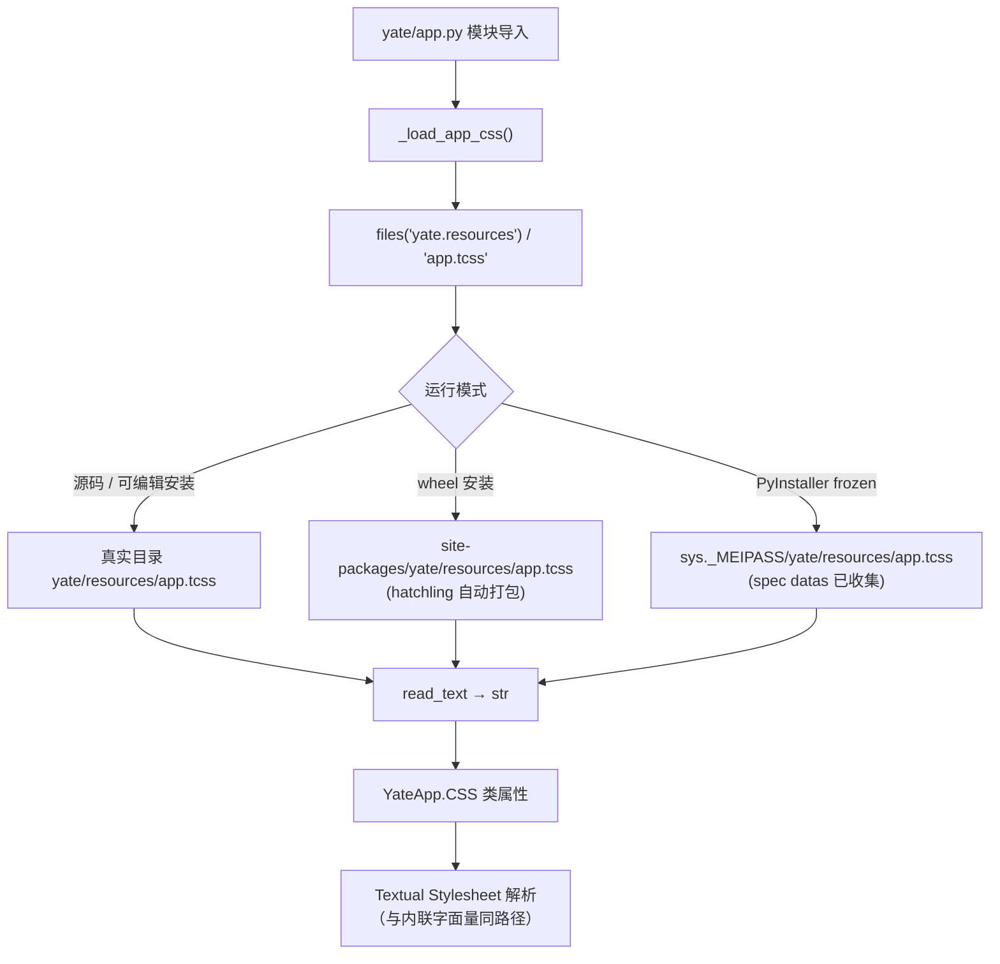
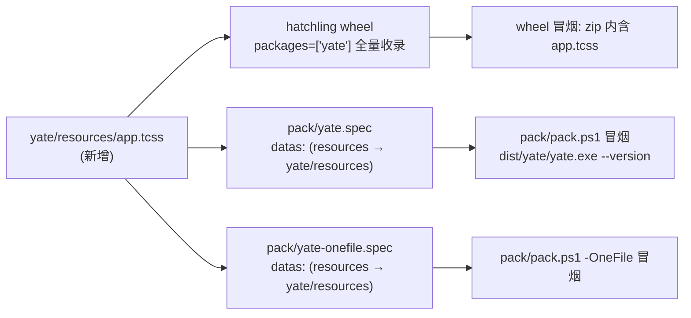

# Plan: 从 app.py 拆分 CSS 到 tcss 文件并集成打包

- Issue: <https://gitee.com/jermaine/yate/issues/IKINFT>（ENH - 从app里面拆分css到tcss文件，集成打包）
- 分支: `enh/tcss-enh`（基于 master@479f192，worktree 位于仓库同级目录）
- 状态: ✅ **已执行**（代码侧已全部落地；**2026-09-28 核对修正**：原记"待执行"与代码不符，
  落地证据见文末 §9「实施现状」）
- 前置结论（已验证的事实）:
  - Textual 8.2.8 中 `App.CSS`（字符串）与 `App.CSS_PATH`（文件）最终产出的样式表等价；
    `CSS_PATH` 由 `App.__init__` 相对「App 子类所在模块目录」解析，CSS 文件在挂载时读取，
    dev 模式下才有 FileMonitor 热重载；运行帧循环对 CSS 来源零感知。
  - 现有 `app.py` 的 CSS（第 37–77 行）是 10 条纯 id 规则
    （`#bottom-dock` `#bottom` `#terminal-dock` `#body` `#sidebar` `#sidebar-head`
    `#explorer` `#editor-col` `#tabbar` `#breadcrumbs`），
    **不含任何 `$theme` 变量**，与主题桥（`get_theme_variable_defaults` / `theme.*`）无耦合。
  - PyInstaller 打包链路已经覆盖目标：`pack/yate.spec` 与 `pack/yate-onefile.spec` 的
    `datas` 均整体收集 `yate/resources → yate/resources`，
    wheel 由 hatchling 自动打包包内全部非代码文件——**把 tcss 放进 `yate/resources/` 后
    两个打包通道零配置变更**。
  - 运行时读取包内资源的既有先例是 `yate/editor_view/manual.py::load_doc_markdown`：
    `files("yate.resources").joinpath(...).read_text(encoding="utf-8")`，
    在源码 / wheel / frozen（`sys._MEIPASS/yate` 镜像布局）三种模式下均已验证可用。

## 1. 目标

1. `YateApp` 的内联 `CSS = """..."""` 迁出为包内资源文件 `yate/resources/app.tcss`，
   `app.py` 改为加载该文件，**样式行为逐字节等价**（纯搬移，不改任何规则）。
2. 三种运行模式（源码 / wheel / PyInstaller frozen）下资源解析均成立，
   打包链路（hatchling wheel + 两个 PyInstaller spec + `pack/pack.ps1`）零或最小变更。
3. 新增回归测试守护「CSS 来自 tcss 文件」这一事实；全量门禁通过。

## 2. 非目标（明确排除）

- 不迁移 `editor_view/*` 各 widget 的 `DEFAULT_CSS`（issue 范围仅 app 层 CSS；
  widget 自持样式符合「组件行为写在组件内部」的分层职责）。
- 不改任何选择器、属性值、id（R9 约束：id 归调度层，改 id 必须同步改 CSS——本次不改 id）。
- 不引入 dev 热重载能力（那是 `CSS_PATH` 方案的副产品，见 §4 备选方案）。
- 不动主题桥、`get_theme_variable_defaults`、`theme.py`。

## 3. 架构合规性分析

| 关注点 | 结论 |
|---|---|
| 分层职责 | app 层 CSS 本就归 L4 外壳（分层职责表：「YateApp: Textual 生命周期、CSS、主题桥」）。搬移只改变 CSS 的存放形式，所有权不变 |
| 依赖方向 | `app.py` 新增 `from importlib.resources import files`（标准库）+ 读包内资源，无任何新增跨层 import；`yate/resources` 是 L0 数据，L4 读自身包资源合法 |
| R2/R6/R8 | 不新增 Protocol、不引入 `TYPE_CHECKING`、不建新抽象——加载函数是一个 3 行函数 |
| R9 | 10 个选择器全是 R9 冻结 id；「改 id 必须同步改 CSS」的同步对象从 `app.py` 变为 `app.tcss`（在 §6 步骤中注明，规则文件无需改动） |
| 资源单一路径 | 复用 `files("yate.resources")` 先例；**不**为 CSS 扩展 `yate/paths.py` 的职责（其 docstring 明确只管 extensions/fonts） |
| 架构测试 | `tests/test_architecture.py` 的 import 图不受影响，预期 13 用例不变绿转红（**2026-09-28 核对**：该用例数已随后续规则增至 **20**，全部通过） |
| 大任务拆分 | 单文件、单函数级变更，规模不足以拆子计划；步骤间严格串行 |

## 4. 方案设计

### 4.1 选型：importlib.resources → `CSS` 字符串（方案 A）

```python
# yate/app.py（示意）
from importlib.resources import files

def _load_app_css() -> str:
    """Read the app-level stylesheet packaged at yate/resources/app.tcss."""
    try:
        return files("yate.resources").joinpath("app.tcss").read_text(encoding="utf-8")
    except OSError as exc:
        raise RuntimeError(
            "bundled resource yate/resources/app.tcss is missing; "
            "the yate installation is broken"
        ) from exc

class YateApp(App[None]):
    CSS = _load_app_css()
```

理由（对比备选）：

1. **行为等价性由构造保证**：`CSS` 字符串走与现状完全相同的 Textual 消费路径
   （样式刷新时 `self.CSS` → Stylesheet 解析），不触碰 `CSS_PATH` 的目录解析逻辑。
2. **打包零配置**：tcss 位于 `yate/resources/`，两个 spec 的既有 `datas` 整目录收集、
   hatchling 自动打包，无需改 spec/pyproject 配置本体。
3. **先例一致**：与 `manual.py` 的资源读取模式同构（review 时不需要第二套心智模型）。
4. **失败模式可控**：资源缺失（打包 bug）在 import 时 fail-fast 并带明确原因，
   而不是挂载时抛出难排查的样式错误；manual 的「优雅降级」不适用于 CSS
   （说明书可缺，样式不可缺）。

### 4.2 备选方案（否决记录）

**方案 B：`CSS_PATH = paths.package_root() / "resources" / "app.tcss"`（绝对 Path）。**
优点：dev 模式（`textual run --dev`）获得 FileMonitor 热重载；读取发生在挂载时而非 import 时。
否决理由：需要扩展 `yate/paths.py` 的职责边界（其 docstring 明确不涵盖此类资源）；
绝对路径绕过 Textual 对 `CSS_PATH` 的常规解析，在 frozen 下依赖 `_MEIPASS` 布局镜像的正确性，
引入一条与现有 `importlib.resources` 先例平行的第二套机制——收益（dev 热重载）不值这个复杂度。
若未来确需热重载，可单独出小计划切换到 `CSS_PATH`，届时样式文件本身无需变动。



### 4.3 打包链路（现状即达标，验证性覆盖）



## 5. 文件与模块设计（高内聚低耦合四性）

| 文件 | 变更 | 说明 |
|---|---|---|
| `yate/resources/app.tcss` | 新增 | 内容 = 现 `app.py` 37–77 行 CSS 去缩进版；纯数据，无逻辑 |
| `yate/app.py` | 修改 | 删内联 CSS 字面量；新增模块级私有函数 `_load_app_css()`（含 docstring、`from importlib.resources import files` 导入按组序插入 stdlib 组首位）；类体 `CSS = _load_app_css()` |
| `tests/test_app_css.py` | 新增 | 守护「资源存在且非空」「`YateApp.CSS` 与文件内容一致」两条不变量 |
| `pyproject.toml` | 修改（可选注释行） | `[tool.hatch.build.targets.wheel]` 下注释的资源枚举补 `resources/app.tcss` 一词，保持注释与事实一致；不改任何配置键 |

健壮性：`_load_app_css` 对资源缺失 fail-fast 并给出可行动的错误消息（打包缺陷在启动即暴露）。
可维护性：CSS 归位资源目录，编辑器对 `.tcss` 有语法高亮；加载函数单点、有先例可循。
性能：import 时多读约 1 KB 文本，微秒级；解析路径与现状相同，帧循环零变化。
扩展性：未来 app 层新增样式规则只编辑 `app.tcss`；若规则膨胀或需要热重载，
切换 `CSS_PATH` 方案不影响文件本体。

## 6. 实施步骤（串行）

> 规模标注：S = 分钟级小改，M = 需要构建/多文件联动的中等步骤。
> 全部命令在 worktree 根目录、PowerShell 下执行，解释器一律 `.venv\Scripts\python.exe`。

### Step 0 — 环境准备（worktree 独立 venv）　规模 S

- 输入：新建 worktree（无 `.venv`）。
- 操作：
  ```powershell
  python -m venv .venv
  .venv\Scripts\python.exe -m pip install -e ".[dev,ts]"
  ```
- 输出/验收：`.venv\Scripts\python.exe -c "import textual, pytest, pyright"` 无报错。

### Step 1 — 新建 `yate/resources/app.tcss`　规模 S

- 输入：`yate/app.py` 第 37–77 行的内联 CSS。
- 操作：创建文件，内容为该 CSS 字面量去掉 `"""` 与公共缩进后的 10 条规则（逐条原样，不改值）。
- 验收：与原字面量逐条目视比对；文件以单个换行结尾。

### Step 2 — 改造 `yate/app.py`　规模 S

- 输入：Step 1 的文件。
- 操作：删 `CSS = """..."""` 字面量；新增 `_load_app_css()`（签名、docstring、异常包装见 §4.1）；
  类体改为 `CSS = _load_app_css()`；stdlib 导入组按字母序插入 `from importlib.resources import files`。
- 验收：`python -c "from yate.app import YateApp; print(len(YateApp.CSS))"` 输出非零；
  `yate.app` 模块内不再有 CSS 字面量。

### Step 3 — 新增 `tests/test_app_css.py`　规模 S

- 输入：Step 1/2 产物；`tests/` 现有命名规范（`test_<behavior>_<condition>_<expected>`）。
- 操作：两个用例：
  1. `test_app_tcss_resource_exists_and_is_nonempty` —— `files("yate.resources")` 下 `app.tcss`
     存在、内容含 `#editor-col`（防止空文件/错名静默通过）；
  2. `test_yateapp_css_matches_bundled_tcss` —— `YateApp.CSS == _load_app_css() 同源读取的文件文本`
     （同一读取函数对比，防止有人把字面量改回内联）。
- 验收：`.venv\Scripts\python.exe -m pytest tests/test_app_css.py -q` 全绿。

### Step 4 — pyproject 注释同步（可选但建议）　规模 S

- 输入：`pyproject.toml` 第 110–115 行注释。
- 操作：注释中资源枚举补上 `resources/app.tcss`。
- 验收：`git diff` 仅注释行变化，配置键零改动。

### Step 5 — 全量门禁　规模 M

- 操作与验收（任一失败即回改，不得绕过）：
  ```powershell
  .venv\Scripts\python.exe -m pyright yate tests tools     # 零诊断（硬门槛）
  .venv\Scripts\python.exe -m pytest tests -q              # 全绿，含 test_architecture 13 例
  ```
  另用 textual-pilot-smoke 做一次 headless 冒烟（启动 YateApp、断言关键界面文本/SVG 输出），
  确认布局规则生效如常（`#sidebar` 宽度、`#bottom` 高度等由 CSS 决定的可见特征）。

### Step 6 — 打包验证　规模 M

- 操作：
  ```powershell
  # wheel：确认 tcss 进包
  .venv\Scripts\python.exe -m pip wheel --no-deps -w build\wheeltest .
  .venv\Scripts\python.exe -c "import zipfile,glob; names=zipfile.ZipFile(glob.glob('build/wheeltest/*.whl')[0]).namelist(); assert any(n.endswith('yate/resources/app.tcss') for n in names), names"
  # PyInstaller one-folder（-SkipChangelog 避免弄脏生成的 changelog 资源）
  .venv\Scripts\python.exe -m pip install -e ".[build,ts]"
  .\pack\pack.ps1 -SkipChangelog
  .\dist\yate\yate.exe --version
  ```
- 验收：wheel 断言通过；`yate.exe --version` 打印版本且退出码 0；
  `pack\yate.spec` / `pack\yate-onefile.spec` **零 diff**（证明「零配置复用」成立）。
- 可选加强：`.\pack\pack.ps1 -OneFile -SkipChangelog` 后对 `dist\yate.exe` 重复 `--version` 冒烟。

### Step 7 — 收尾提交　规模 S

- 操作：按仓库提交规范（英文、`type(scope): subject`、conventional 风格）提交，
  建议 `feat(app): move app-level CSS to bundled app.tcss resource`；
  changelog 由打包链路按提交历史自动生成，无需手改 `resources/changelog.*.md`。
- 验收：`git status` 干净（除计划文档外）；提交信息含 issue 引用 `Refs #IKINFT`。

## 7. 风险与回滚

| 风险 | 概率 | 缓解 |
|---|---|---|
| frozen 下 `files("yate.resources")` 解析异常 | 低（manual.py 同模式已在 frozen 验证） | Step 6 的 exe `--version` 冒烟 + 如异常则临时改用 `paths.package_root()` 兜底并在提交中注明 |
| Textual 对 `CSS` 属性有未知预处理（如 dedent）导致格式差异 | 低（8.2.8 源码确认字符串直通 Stylesheet） | tcss 文件本身使用规范去缩进内容，与解析无关；pilot 冒烟兜底 |
| wheel 漏打 tcss（文件放错仓库根等） | 低 | Step 6 的 zip 断言是硬检查 |
| 工作树并发会话误用主仓 venv 导致安装位置漂移 | 中（流程性） | Step 0 强制 worktree 独立 venv；pack.ps1 自带同项防御 |

回滚：单一 commit 纯搬移，`git revert` 即可完全回退；`app.tcss` 为新增文件无共享状态。

## 8. 交付前自检（本计划）

> **2026-09-28 核对**：本计划代码侧 Step 1–Step 5 均已落地（见 §9），状态已由「待执行」改为「已执行」。

- [x] 步骤粒度可执行：每步有输入/操作/验收，命令可直接复制运行
- [x] 架构合规：不破坏依赖方向、R2/R6/R8/R9；分层职责与先例（manual.py、spec datas）对齐
- [x] 四性覆盖：健壮性（fail-fast + 冒烟）、可维护性（先例同构、单一加载点）、
      性能（启动一次毫秒级）、扩展性（CSS_PATH 可平滑升级）
- [x] 图表：两种运行模式资源解析图 + 打包链路图（Mermaid）
- [x] 无遗漏：三种运行模式、两套打包通道、测试/门禁/提交/回滚均已覆盖

---

## 9. 实施现状（2026-09-28 文档-代码核对）

本文档原记「状态: 待执行」，与当前代码不符。实测证据如下（均在 worktree `yate-enh-docs-update` 内取得）：

| 计划项 | 现状 |
|---|---|
| Step 1 `yate/resources/app.tcss` | ✅ 已存在。含 10 条 R9 冻结 id 规则（`#bottom-dock` `#bottom` `#terminal-dock` `#body` `#sidebar` `#sidebar-head` `#explorer` `#editor-col` `#tabbar` `#breadcrumbs`），外加 1 条后加的 `Widget { scrollbar-size-vertical: 1; }`（全局细滚动条，issue IKINF3）；文件头注释即声明 "selector ids are frozen by R9" |
| Step 2 `yate/app.py` | ✅ 内联 CSS 字面量已删除；模块级 `_load_app_css()`（`app.py:43-59`，`from importlib.resources import files` + 失败即 `RuntimeError`），类体 `CSS = _load_app_css()`（`app.py:118`）。`yate/app.py` 内已无 CSS 字面量 |
| Step 3 `tests/test_app_css.py` | ✅ 已存在，两个用例 `test_app_tcss_resource_exists_and_is_nonempty` / `test_yateapp_css_matches_bundled_tcss` 与计划一致；`python -m pytest tests/test_app_css.py --collect-only` → `2 tests collected` |
| Step 4 `pyproject.toml` 注释 | ✅ `[tool.hatch.build.targets.wheel]` 的注释已列 `resources/app.tcss`（`pyproject.toml:113`），配置键零改动 |
| Step 5 全量门禁 | ✅ `python -m pyright yate/ tests/ tools/` → `0 errors, 0 warnings, 0 informations`；`python -m pytest tests/ -q` → exit 0（1354 收集，架构守卫 20 passed） |

未核对项（超出本次文档核对范围，需另跑）：Step 6 打包验证（wheel zip 断言、`pack/pack.ps1` 冒烟）
与 Step 7 的提交 / issue 引用；本节不对二者作结论。

**与计划的偏离**：`app.tcss` 现含 11 条规则（10 条 id + 1 条 `Widget`），比计划描述的
"10 条纯 id 规则" 多一条后加的全局滚动条规则；"不含任何 `$theme` 变量" 的结论仍成立。
