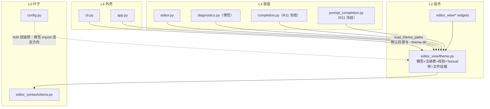
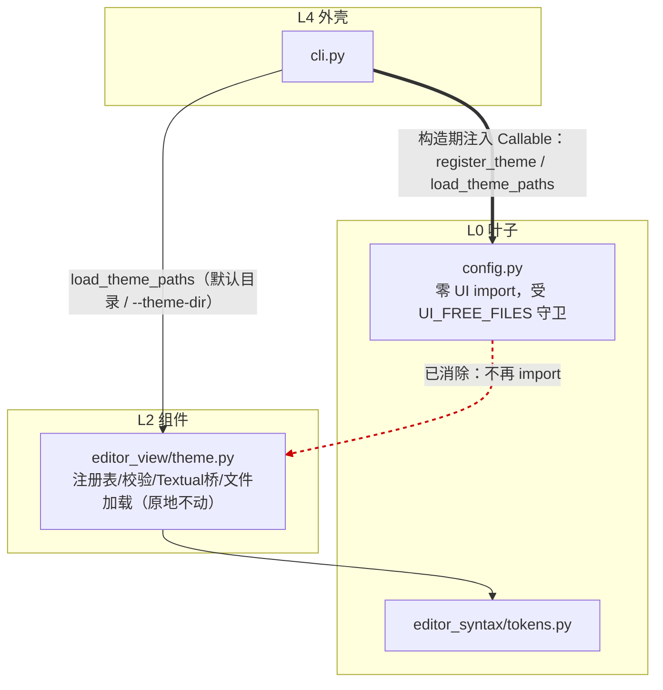
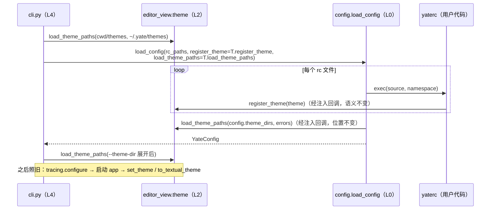
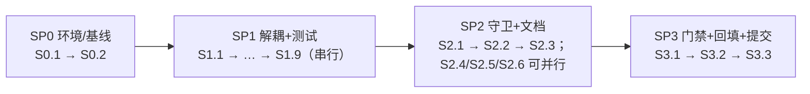

# 主题层级债重构计划：config 与 editor_view.theme 解耦（N30）

> 状态：**SP0–SP3 全部完成（✅，2026-09-26 实施并回填）**。
> 来源：[P2_nice_to_have_plan.md](../code-review-fix-plans/P2_nice_to_have_plan.md) **N30（✅）**
> 「L0 config 惰性 import L2 `editor_view.theme`（层级债）」，决策记录为
> 「下次做重构方案：下沉 / 注入回调二选一 + 架构规则登记」。
> 分支：`issues/refine-arch`（worktree `D:\Programming\yate-refine-arch`，基于 master `b599685`）。
> **本目录是本次重构的唯一计划来源**；代码侧的硬性边界同时固化在
> [`.trae/rules/architecture-boundaries.md`](../../rules/architecture-boundaries.md)，
> 由 `tests/test_architecture.py` 守护。执行结果回填各 Plan 的「执行记录」与本 README §9。

---

## 1. 问题定义与现状证据（2026-09-26 实测）

### 1.1 违规点

[yate/config.py](../../../yate/config.py)（L0 叶子）在 `load_config` 内**惰性 import L2 组件包**：

```python
# config.py:173-175（现状）
# Imported lazily: the theme registry lives in the UI package, and the
# config loader must not pull the whole widget stack at import time.
from yate.editor_view import theme as themes
```

两处上行使用：

| 位置 | 用途 | 说明 |
|---|---|---|
| `config.py:181` | `namespace["register_theme"] = themes.register_theme` | 注入每个 yaterc 执行命名空间，供用户 rc 注册自定义主题 |
| `config.py:204` | `themes.load_theme_paths(config.theme_dirs, config.errors)` | rc 加载完后装载 `theme_dirs` 声明的主题文件，须在 app 应用 `theme = "<custom>"` 之前 |

### 1.2 为什么是债

1. **依赖方向违规**：L0 是叶子层，架构规则要求「不 import 上层」。config 是全仓唯一一条 L0→L2 边，
   且因写法是函数内惰性 import，现有架构测试（`UI_FREE_FILES` 只覆盖 `session.py` / `registries.py`）**测不到它**。
2. **可测试性/可复用性受限**：任何想独立使用 `yate.config` 的工具（headless 校验器、未来的 CLI 子命令）
   一旦走 `load_config`，就会连带拉起 `textual.color` / `textual.theme` / `rich` / `editor_syntax.tokens`。
3. **冻结成本**：它不能进 `UI_FREE_FILES` 守卫，等于架构测试对该文件完全不设防，未来任何上行 import
   都可能悄悄混入。

### 1.3 现状依赖图

theme 模块内含四块职责：**Theme 模型 + 内置调色板**（依赖 `editor_syntax.tokens.SYNTAX_KINDS`，L0，合法）、
**注册表**（`THEMES` / `active` / `set_theme` / `register_theme` / `available`）、**Textual 桥**
（`to_textual_theme` / `validate_theme`，依赖 `textual.color` / `textual.theme`）、**主题文件加载**
（`load_theme_file` / `load_theme_paths`）与**无关的 cell 几何工具**。



---

## 2. 方案比选与决策

### 2.1 候选方案

| | **方案 A：注入回调（推荐）** | **方案 B：下沉主题注册表到叶子** |
|---|---|---|
| 做法 | `load_config` 增加两个 keyword-only `Callable` 参数，由 L4 `cli.py` 传入 `theme.register_theme` / `theme.load_theme_paths`；config.py 删除对 editor_view 的 import | 把 Theme 模型 / 注册表 / 文件加载迁到新叶子模块，`editor_view.theme` 保留 Textual 桥 |
| config 侧改动 | 单文件签名 + 2 行调用点 | 新模块 + 大规模 import 路径迁移 |
| 行为保持 | **逐字节不变**（回调即原函数，调用位置与顺序不动） | 校验语义必须随迁或改时序（见 2.2），**必有行为漂移** |
| rc 作者 API | `yate.editor_view.theme` 路径不变，yaterc.example / docs 零改动 | 公开 import 路径变更或需兼容 re-export（违反仓库「无兼容层」惯例） |
| 波及面 | cli.py 1 处 + 测试约 3–5 个调用点 | R11 冻结清单、editor_view 内 `from . import theme`、架构测试白名单、全部文档 |
| 架构守卫 | `config.py` 加入 `UI_FREE_FILES`（**直接禁止**，比 R11 白名单更严） | 仍需登记冻结（新叶子不得 import textual 的规则）+ 原 R11 不动 |

### 2.2 方案 B 的否决理由（关键证据）

1. **Textual 耦合无法干净下沉**：`register_theme` → `validate_theme` 用 `TextualColor.parse`
   做颜色合法性 + 不透明度校验（theme.py:465-531）。文本协议覆盖 hex / `rgb()` / `hsl()` / 命名色，
   叶子层自行重实现 = 与 Textual 版本漂移对赌（P2 N14 刚为此付过学费）。
2. **校验时序漂移**：若校验留在 L2 桥，rc 加载期报错（`config.errors` 逐条记录）会退化为
   app 启动期 `to_textual_theme` 兜底回退 mocha（app.py:116-123），诊断体验变差。
3. **若叶子层 import textual**：依赖方向在纸面修正，但 UI 工具箱仍被 L0 拖入，「叶子 = 纯逻辑」
   的分层契约名存实亡，且未消除任何真实耦合。
4. **`architecture-boundaries.md` R8**：共享状态传具体对象；config 与 theme 本就是
   「配置加载方 → 注册函数」的 1:1 关系，按规则 §三.2 用 `Callable` 即可，无需搬模块。

### 2.3 决策

**选方案 A（注入回调）**，理由对照架构规则逐条校验：

| 规则 | 合规性 |
|---|---|
| R2（禁新增 Protocol） | ✅ 传具体函数，不建协议类 |
| R4（UI-free 模块不 import editor_view） | ✅ config.py 彻底归零，并纳入守卫 |
| R8（1:1 回调用 `Callable` 别名 / `*Ui` 记录） | ✅ `type` 别名 + keyword-only 参数 |
| §三.6（能用函数就不造类） | ✅ 不建 hooks 类，两个裸参数 |
| R11（completion/prompt_completion 冻结） | ✅ 不触碰，theme 留在 L2 |
| R6（禁 TYPE_CHECKING） | ✅ 无类型跨层引用需求（主题对象对 config 不透明） |

四特性自评：**健壮性**（hooks 缺省时 rc 内 `register_theme` 报 NameError 仍走既有逐文件错误记录，不崩溃）；
**可维护性**（L0→L2 边归零且被架构测试拦截回归）；**性能**（config 模块可独立 import，headless 场景
不再连带 UI 栈；生产进程权重不变）；**扩展性**（回调参数是未来注入 rc 助手能力的标准缝位，
不引入全局注册点）。

### 2.4 目标架构



### 2.5 目标启动时序



---

## 3. 接口设计（方案 A 落地形态）

### 3.1 config.py 新签名

```python
from collections.abc import Callable

#: Callback injected as ``register_theme`` into every yaterc namespace.  The
#: theme object travels opaquely: L0 config must not know the Theme type
#: (that import is exactly the N30 layering debt), hence ``Any`` here.
type ThemeRegistrar = Callable[[Any], None]

#: Callback loading one batch of rc-declared theme files/directories; same
#: contract as :func:`editor_view.theme.load_theme_paths` (problems are
#: appended to *errors*, never raised).
type ThemeDirLoader = Callable[[list[Path], list[str]], None]


def load_config(
    paths: list[Path],
    *,
    register_theme: ThemeRegistrar | None = None,
    load_theme_paths: ThemeDirLoader | None = None,
) -> YateConfig:
```

（`Any` 依据编码风格 §3.3 附理由注释；`type` 语句为 PEP 695 新代码标准写法。）

### 3.2 行为契约

| 场景 | 注入回调（生产 / 主题相关测试） | 缺省 `None`（headless / 一般测试） |
|---|---|---|
| rc 调用 `register_theme(...)` | 原语义：注册进进程级注册表，非法主题 ValueError 记入 `config.errors` | 命名空间无此名字 → NameError 记入 `config.errors`，**其余 rc 继续执行**（复用既有逐文件容错） |
| rc 声明 `theme_dirs` | 原语义：`load_config` 返回前按原位置装载，错误追加 `config.errors` | 照常提取 `config.theme_dirs`，**不装载**（装载是注入方职责，docstring 声明） |
| 装载顺序 | 默认目录 → rc theme_dirs → `--theme-dir`，与现状逐字节一致 | — |

### 3.3 cli.py 调用点（唯一生产调用方）

```python
config = load_config(
    rc_paths,
    register_theme=theme_mod.register_theme,
    load_theme_paths=theme_mod.load_theme_paths,
)
```

### 3.4 独占文件域（SP1）

| 文件 | 改动性质 |
|---|---|
| `yate/config.py` | 新增 2 个 `type` 别名、签名、删惰性 import 与直接调用、docstring 更新（模块头「one injected helper」表述同步改） |
| `yate/cli.py` | 仅 264 行一处调用点 |
| `tests/test_config.py` | `_load` 助手增可选透传；依赖注入名 / theme_dirs 装载的用例传真回调（详见 [Plan SP1](plan_SP1_decouple.md) §4 审计修补表） |
| `tests/test_app_textual.py`、`tests/test_diagnostics.py` | 仅复核各自 `load_config(` 调用点（1026 / 32 / 34 / 256），涉主题则补回调 |
| `tests/test_architecture.py` | **SP2** 域，SP1 不动 |

---

## 4. 步骤总览与依赖



- 串行主线 SP0 → SP1 → SP2 → SP3，阶段间硬依赖：架构守卫必须压在解耦之后；
  文档回填必须引用实测数字；提交必须在全量门禁之后。
- 可并行点：S2.4 / S2.5 / S2.6 三处纯文档互不依赖，可并行（含子代理并行，文件域互斥）；
  门禁与提交统一由主代理收口。

## 5. Plan 索引（按序执行，每个 Plan 结束跑门禁）

| # | 文档 | 内容 | 状态 |
|---|---|---|---|
| SP0 | [plan_SP0_baseline.md](plan_SP0_baseline.md) | **环境准备**：worktree venv + 四项基线门禁留档 | ✅ |
| SP1 | [plan_SP1_decouple.md](plan_SP1_decouple.md) | **config 解耦**：别名 + 签名 + 实现 + cli 注入 + 调用点审计 + 存量修补 + 新增用例 ×2（含测试清单 §4） | ✅ |
| SP2 | [plan_SP2_guard_docs.md](plan_SP2_guard_docs.md) | **架构守卫**：`UI_FREE_FILES` 扩员 + 负向验证 + 四处规则/账目文档回填 | ✅ |
| SP3 | [plan_SP3_gate_commit.md](plan_SP3_gate_commit.md) | **收尾**：全量门禁两轮 + 校准记录回填 + 提交 | ✅ |

## 6. 门禁命令（Windows PowerShell，worktree 根目录执行）

```powershell
.venv\Scripts\python.exe -m pyright yate/ tests/ tools/
.venv\Scripts\python.exe -m pytest tests/ -q
.venv\Scripts\python.exe -m tools.smoke_test run --fail-only
```

统一门槛同 P0/P2：**pyright 全仓零诊断、pytest 全绿（收尾跑两轮防时序偶发）、冒烟全绿**。

## 7. 风险与回退

| 风险 | 对策 |
|---|---|
| 测试调用点遗漏 → hooks=None 静默跳过 theme 装载，断言失败或假绿 | S1.5 全仓 `load_config\(` 审计清单逐点核对（审计表见 [Plan SP1](plan_SP1_decouple.md) §4） |
| 未来调用方忘传钩子，`register_theme` 失效 | 失败信号非静默（NameError 记入 `config.errors`）；S1.8 新守卫用例锚定该语义；docstring 显式声明 |
| 装载顺序漂移 | 回调调用保持原位（`_extract_options` 之前）；theme 相关单测 + 冒烟覆盖 |
| `Any` 参数引入类型弱化 | 仅 `ThemeRegistrar` 一处，附理由注释；pyright strict 全仓门禁兜底 |
| 回退 | 两笔提交独立 revert 即可；无数据 / 格式 / API 迁移，rc 用户零感知 |

**明确非目标**：N8（kitty CSI-u，归 `issues/keybinding-fix-wt` 处理）；cell 几何工具迁出
theme.py（纯内聚优化，R11 冻结面不因此变化，YAGNI）；`editor_view/theme.py` 模块内容任何搬动。

## 8. 交付前自检清单

- [x] L0 无任何 `yate.editor_view` import（`UI_FREE_FILES` 守卫 + 负向验证通过）
- [x] 无新增 `Protocol` / `TYPE_CHECKING` / `*Host` / `*Ops` 命名
- [x] pyright 全仓 0 诊断、pytest 全绿（两轮）、冒烟全绿
- [x] architecture-boundaries.md / app-layering README / P2 账 / review.md 四处文档一致
- [x] 行为契约逐字节不变（装载顺序、错误消息、rc API 零变化）

## 9. 校准记录（回填区）

- 2026-09-26 计划细化：SP0–SP3 拆为 **19 个可执行步骤**（S0.1–S3.3，各 Plan 文件内），
  固化新增测试 ×2 与存量审计修补表 ×5 行（[Plan SP1](plan_SP1_decouple.md) §4），
  补步骤依赖图（§4）与可并行点说明。
- 参考基线（同码态主工作区 2026-09-26 实测，SP0 须在 worktree 复测为准）：
  pyright 全仓 0 errors；pytest 全量 1231 collected / 7 skipped / exit 0；
  冒烟 88/88 场景 · 917/917 checks · exit 0。
- 2026-09-26 **实施完成**（19 步全走完，逐 Plan 执行记录见各文件）：
  - **SP0**：worktree venv（`.[dev,ts]`——`ts` 为 pyright/测试基线事实必需，偏离已记录）；
    基线：架构 13 passed · pyright 0/0/0 · pytest 1216+7 skipped exit 0 · 冒烟 88/88 · 917/917。
  - **SP1**：config.py 归零 `editor_view` import（PEP 695 别名 + keyword-only 回调），
    cli.py:266 注入；38 处调用点审计——8 处传真回调、其余 N/A（含计划预估的
    test_cli.py 一行经核实改判 N/A）；新增 headless 契约用例 ×2。专项门禁：
    test_config 73 passed、pyright 0、全量 1218+7 exit 0。提交 `bd1c2cf`。
  - **SP2**：`UI_FREE_FILES` 收编 config.py；**负向验证**——临时加回 import 即
    `test_keymaps_services_and_models_stay_ui_free` FAILED（断言精确指向
    (config.py, 'yate.editor_view')），还原后 13 passed；四处文档回填
    （rules R4/§四/§六、app-layering README §11、P2 账、review.md）。提交 `066ae12`。
  - **SP3**：全量门禁两轮 1218+7 skipped exit 0（183.72s / 173.45s，零偶发）+
    pyright 0/0/0 + 冒烟 88/88 · 917/917 exit 0；对基线差异仅 collected +2，符合预期。
  - **偏离**：① 依赖组需 `.[dev,ts]`；② pytest 门禁统一 `-o addopts= -q`（addopts 叠加
    吞汇总行）；③ 计划的两笔提交按用户指令改为每 SP 末即提交（内容与文件域不变）。
