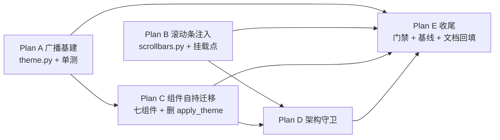

# 主题归属重构计划：滚动条注入 + 组件自持主题（T1/T2 治理）

> 状态：**Plan A–E 全部完成**（2026-09-27 落地，分支 `ref/theme-ownership`）。
> 目标：消除 [review_ui_refine_20260927.md](../../reviews/2026-09-27-ui-refine.md) §四记录的两条架构张力，
> 使滚动条注入与主题着色都符合"组件自持 + 严格分层"；改动性质以**代码搬运 + 删除**为主，
> 不重写渲染算法、不改任何视觉表现。
> 本目录是本轮重构的**唯一计划来源**；硬性边界同时固化在
> [`.trae/rules/architecture-boundaries.md`](../../rules/architecture-boundaries.md)，
> 由 `tests/test_architecture.py` 守护（本轮新增 2 条）。
> 逐项遗漏审计结果见 §10。

---

## 1. 事实基线（2026-09-27 实测）

### 1.1 上游取证（Textual 8.2.8）

| # | 事实 | 出处 |
|---|---|---|
| F1 | Textual 滚动条**懒创建**：`vertical_scrollbar` / `horizontal_scrollbar` 是 property，首次访问才创建并 `_start_widget` 注册 | `.venv/Lib/site-packages/textual/widget.py:2036-2076` |
| F2 | `ScrollBar.renderer` 是 ClassVar，**实例属性赋值有效**（文档自带 `my_widget.horizontal_scrollbar.renderer = MyScrollBarRender` 示例） | `textual/scrollbar.py:226,245` |
| F3 | 重构前 `Editor.apply_theme` 直改面：`app.screen.styles.background`、全部 view（bg + `apply_scrollbar_theme` + `content_changed`）、explorer_tree 6 项 scrollbar 样式、`status_bar.refresh_status`、`prompt_bar.styles.background`、`update_sidebar_head`、`tabbar.refresh_tabs`、`breadcrumbs.refresh_crumbs` | `yate/editor.py:1143-1177` |
| F4 | `apply_theme` 调用点仅 2 处：启动（`editor.py:260`）与 `set_theme`（`editor.py:1140`，`:theme` / `:set theme=` 命令经 `commands.py:156-220` 进入） | — |
| F5 | L2 组件自持先例已存在：`EditorView.on_mount` 自己读 `theme.active()` 上色；`StatusBar.refresh_status` / `TabBar.refresh_tabs` / `Breadcrumbs.refresh_crumbs` 均为组件自持刷新，L3 只是触发 | `editor_view/editor.py:219-222` 等 |
| F6 | 可滚动 widget 全集：`EditorView`(ScrollView)、`ExplorerTree`(Tree)、`MarkdownDocScreen` 内 `#doc-scroll`(VerticalScroll)；`TerminalView` 自绘滚动无 ScrollBar widget；palette/completion 弹层无滚动条 | `editor_view/{editor,explorer,manual,terminal,palette,completion}.py` |
| F7 | `theme.set_theme` 重构前无任何回调/通知机制，只改全局 `_active` | `yate/editor_view/theme.py:371-403` |

### 1.2 门禁现状（收口实测，2026-09-27）

| 门禁 | 结果 |
|---|---|
| `pyright yate/ tests/ tools/` | **0 errors, 0 warnings, 0 informations** |
| `pytest tests/ -q` | **全绿**（仅平台性 skip） |
| `pytest tests/test_architecture.py -q` | **20 passed**（原 18 + 本轮 2 条新守卫） |
| `tools.smoke_test run --skip-slow` | **882/882 checks、84/84 scenarios、exit 0** |
| `tools.smoke_test compare --skip-slow` | **exit 0**（2 处继承漂移已归因并重拍基线，见 [Plan E](theme-ownership-refactoring-gate-docs-plan-e.md) §E.4） |

### 1.3 复核命令

```powershell
$env:PYTHONDONTWRITEBYTECODE='1'
.venv\Scripts\python.exe -m pyright yate/ tests/ tools/
.venv\Scripts\python.exe -m pytest tests -q
.venv\Scripts\python.exe -m tools.smoke_test run --skip-slow
.venv\Scripts\python.exe -m tools.smoke_test compare --skip-slow
```

---

## 2. 问题陈述（重构前）

### T1 滚动条：进程级全局 monkey-patch

`yate/editor_view/scrollbars.py::install_slim_scrollbars()` 做的是
`ScrollBar.renderer = SlimScrollBarRender` **类属性**赋值，由 L4 `YateApp.__init__` 调用：

- 进程内**所有** Textual App（含测试嵌套、未来嵌入场景）全部生效，无法按 App 粒度区分；
- 隐式全局状态，新读者不易发现生效路径；
- 上游明明提供了 per-widget 覆盖钩子（F2），类级 patch 属于"用了更粗的工具"。

### T2 主题：L3 伸手改 L2 widget 内部状态

`Editor.apply_theme`（L3 调度层）直接写 `tree.styles.scrollbar_*`、`view.styles.background`、
`prompt_bar.styles.background`……严格说撞"Editor 不直接持有 widget 内部状态"（分层职责表）：

- 组件主题表现散落在 L3，新增主题感知组件时容易漏改（apply_theme 要记得加一行）；
- 组件无法独立测试主题行为；
- 属存量模式（ui-refine 轮仅改色值未扩大战果），本轮彻底治理。

## 3. 目标与非目标

- **目标 A（T1）**：删除进程级 monkey-patch，改为 per-widget 注入（F1/F2）。
- **目标 B（T2）**：`Editor.apply_theme` 的直改面全部下沉到各 L2 组件自持；L3 只保留
  "触发主题切换"，不再伸手改 widget 样式。
- **非目标**：不改任何视觉表现（重构后像素级等价）；不动 keyproto / completion / LSP 等
  无关模块；不引入全局 EventBus（规则四禁止）；`theme.py` 的 L2 归属不动（存量位置，
  消费方向全向下，搬迁属另一轮）。

## 4. 方案比选与否决理由

| 方案 | 内容 | 结论 |
|---|---|---|
| A. 主题回调广播（**选用**） | `theme.py` 增加订阅列表；组件 `on_mount` 订阅、`on_unmount` 退订，自己给自己上色 | 符合规则四"1:N 低频广播 → 回调列表"；组件自持可独立测试 |
| B. Textual `watch_theme`（否决） | 各组件覆写 App 的 theme watcher | 组件拿不到 App 实例的 watch 钩子，需绕道 message——等于发明事件总线，违反规则四 |
| C. 保持 L3 直改仅补注释（否决） | 承认存量 | 用户明确要求"严格层级划分"，不解决 T2 |
| D. 保留类级 patch（否决） | T1 不动 | 隐式全局状态正是本次要消除的张力 |

**已确认决策（2026-09-27 用户选定）**：`Editor.apply_theme` **彻底删除**（不保留薄壳）；
"先方案后执行"规则落主仓 `d:/Programming/yate/.trae/rules/plan-before-execute.md`。

## 5. Plan 索引（按序执行，每个 Plan 结束跑门禁）

| # | 文档 | 内容 | 状态 |
|---|---|---|---|
| A | [theme-ownership-refactoring-theme-broadcast-plan-a.md](theme-ownership-refactoring-theme-broadcast-plan-a.md) | **主题广播基建**：`theme.py` 订阅/派发（异常隔离）+ 4 项单测 | ✅ |
| B | [theme-ownership-refactoring-scrollbar-injection-plan-b.md](theme-ownership-refactoring-scrollbar-injection-plan-b.md) | **滚动条 per-widget 注入**：`apply_slim_scrollbars(widget)`，删类级 patch，三处挂载点 | ✅ |
| C | [theme-ownership-refactoring-widget-theme-selfhold-plan-c.md](theme-ownership-refactoring-widget-theme-selfhold-plan-c.md) | **七组件自持主题**：订阅/退订 + `_apply_theme`；删 `Editor.apply_theme` / `update_sidebar_head`；L4 `watch_theme` | ✅ |
| D | [theme-ownership-refactoring-architecture-guards-plan-d.md](theme-ownership-refactoring-architecture-guards-plan-d.md) | **架构守卫**：禁类级 patch、禁 editor.py 直改 widget styles | ✅ |
| E | [theme-ownership-refactoring-gate-docs-plan-e.md](theme-ownership-refactoring-gate-docs-plan-e.md) | **门禁与文档**：全量门禁、smoke run/compare、基线归因、review 回填 | ✅ |
| F | [theme-ownership-refactoring-theme-gap-terminal-message-plan-f.md](theme-ownership-refactoring-theme-gap-terminal-message-plan-f.md) | **遗留缺口收编**：TerminalPanel 订阅三件套 + PromptBar 动态色重渲染（存量旧账，非 A–E 引入） | ✅ |

### 依赖关系



- Plan A 与 Plan B **无依赖，可并行**；
- Plan C 依赖 A（组件订阅广播）；Plan D 依赖 B+C（守卫钉住治理结果）；
- Plan E 收尾（门禁、基线、文档回填）。

## 6. 重构后依赖面（T2 治理完成态）

| 机制 | 所在层 | 被谁消费 | 方向 |
|---|---|---|---|
| `theme.py` 订阅广播（`subscribe`/`_notify`） | L2 `editor_view` 包内 | L2 组件（订阅者）、L3 `Editor.set_theme`、L4 `watch_theme` | 全部向下消费 L2 |
| `apply_slim_scrollbars()` | L2 `scrollbars.py`，仅依赖 textual | L2 组件 `on_mount` 自调 | 同层自持 |
| 七组件 `_apply_theme` 自持 | L2 各 widget | 自己 | 组件行为组件内 |
| `Editor`（L3） | 只剩 `set_theme` 调 `theme.set_theme()` + 构造 `SidebarHead` | — | L3→L2 组装；直改面清零（Plan D 守卫钉死） |
| `YateApp.watch_theme`（L4） | 读 `theme.active()` 刷自家 screen | — | L4→L2 向下 |

边界说明：

1. **`theme.py` 保持 L2 归属**：全局主题状态，L2/L3/L4 消费方向全向下，合法；不挪 L0
   （动它是另一轮搬迁，存量位置不扩大）。
2. **L0 终端零参与**：原 `apply_theme` 就不给终端上色，本次不新增 L0→L2 依赖；
   未来终端要主题色时按规则走构造注入 `Callable`（N30 模式先例），不走订阅。
3. **广播是同步回调列表**，非 EventBus（规则四禁止全局总线）：`_notify` 同线程逐个派发 +
   异常隔离，符合"1:N 低频广播 → 回调列表"白名单机制。

## 7. 风险与缓解

| 风险 | 缓解 | 回滚 |
|---|---|---|
| 懒创建时序：`on_mount` 访问 scrollbar property 过早/过晚 | F1 证明 property 任意时刻访问安全（自动创建+注册） | Plan B 独立提交，可单独 revert |
| 分屏动态创建的 view 错过广播 | `on_mount` 先手动 `_apply_theme()`（F5 先例） | 组件级回退到 L3 调用一行 |
| 广播时无 app 上下文（cli 启动期 `theme.set_theme`） | 此时订阅列表为空，派发为 no-op | — |
| 视觉漂移 | Plan E 跑 `smoke_test compare` 记录 drift，逐条归因 | 按 widget 回退 |
| 单个订阅者异常中断广播 | `_notify` 逐个 try/except 隔离 + `log.warning` | — |

## 8. 冒烟清单

- 启动 / explorer 图标与轨道 / `:theme <name>` 往返切换 / prompt_bar 提交流程 /
  `:help`（MarkdownDocScreen 滚动条注入路径）——由 `tools.smoke_test` 的
  `view` / `explorer` / `integration` 组场景覆盖（84/84 scenarios）。
- 主题广播专项：一次性 pilot 探针断言六处 styles 随 `:theme latte` 切换更新、切回 mocha 复原
  （Plan C §C.5，临时脚本已删，结论记录于 §C.5）。

## 9. 相关文档

| 文档 | 关系 |
|---|---|
| [`.trae/rules/architecture-boundaries.md`](../../rules/architecture-boundaries.md) | 硬性边界规则（R1–R12）；本轮无规则变更，仅新增 2 条守护用例 |
| [`.trae/rules/plan-before-execute.md`](../../rules/plan-before-execute.md) | 本轮流程教训的固化：复杂任务先方案后执行 |
| [`../theme-ownership-plan.md`](../theme-ownership-plan.md) | 前序单文件方案（已被本目录取代，保留为指针） |
| [`../../review/2026-09-27-ui-refine.md`](../../reviews/2026-09-27-ui-refine.md) | T1/T2 的发现来源；§四已回填治理结果 |

## 10. 审计记录（2026-09-27）

以 §3 目标 + §5 各 Plan 验收为基准逐项盘点（原单文件方案 §九，迁入本节）：

| # | 基准项 | Plan 覆盖 | 执行状态 | 结论 |
|---|---|---|---|---|
| 1 | Plan A 四项订阅单测 | A | 4 passed | 无遗漏 |
| 2 | Plan B 实例注入 + 类默认不动（F1/F2 取证） | B | pilot 断言过 | 无遗漏 |
| 3 | Plan C 两个调用点删除（F4：启动 / set_theme） | C | `apply_theme` 整体删除，守卫钉死 | 无遗漏 |
| 4 | Plan C `update_sidebar_head` 处置 | C | 用户决策升级为彻底删除（原设计"缩为纯文本更新"），已同步 | 无遗漏（决策覆盖） |
| 5 | Plan D 两条架构守卫 | D | 20 用例全过 | 无遗漏 |
| 6 | **风险表"compare 记录视觉漂移"** | E | **执行时遗漏**（只跑了 `run`）→ 已补跑：发现 2 处基线漂移（`set_options_matrix` 新增 readonly 检查项、`stress_key_fuzz` 序列置换），在重构前分支 `enh/ui-refine` 上逐一复现 → **归因为 master 合并继承，非本次重构引入**；重拍该 2 基线后 compare exit 0（882/882） | **已闭合**（Plan E §E.4） |
| 7 | `watch_theme` 挂载前 no-op + `on_mount` 补刷 | C | 已实现并探针覆盖 | 无遗漏 |
| 8 | 实现细化两处（`@override`、`setattr`） | B/C | 已记录于对应 Plan 验收节 | 无遗漏 |
| 9 | 风险表"分屏动态创建 view 错过广播" | C | `on_mount` 先自取主题兜底（F5 先例），探针含动态 view 路径 | 无遗漏 |
| 10 | L0 终端不参与主题（§6 边界点 2） | — | 维持零参与；未来需要走构造注入 Callable | 按计划外推 |
| 11 | 二轮 review 遗留①：TerminalPanel 不随主题切换（存量，旧 apply_theme 也未覆盖） | F | 三件套补齐，5 用例新测试含 TerminalPanel 两例 | 已闭合（Plan F） |
| 12 | 二轮 review 遗留②：PromptBar 激活前缀色/消息色切主题滞留（存量瞬时态） | F | `prefix_spec` 单源默认 + `_render_message` 重渲染，owner 语义钉死 | 已闭合（Plan F） |
| 13 | PR #29 AI 审查阻断项：`_render_message` 消息文本未转义拼 markup（存量同病） | F 跟进 | `rich.markup.escape()` 包裹插值 + 回归用例 | 已闭合（评审跟进） |
| 14 | PR #29 AI 审查改进项：`subscribe` 不去重，重复订阅残留 stale 条目 | A 跟进 | append 前相等性折叠 + 回归用例 | 已闭合（评审跟进） |
| 15 | PR #29 AI 审查性能项：`ExplorerTree._apply_theme` 全量 `refresh_tree()` | — | 审查自评当前频率可接受，登记挂起 | ⏸ 挂起（已知优化点） |

**结论：除第 6 项（compare 门禁漏跑，已补齐并归因）外无遗漏；所有验收均实测通过。**
PR #29 AI 审查（1 阻断 + 2 改进）处置详见 [review_ui_refine_20260927.md §七](../../reviews/2026-09-27-ui-refine.md)。

## 11. 提交记录

| 提交 | 内容 |
|---|---|
| `046fcff` | Plan A/B/C：重构产品代码（广播基建 + 注入 + 自持迁移 + 删 apply_theme） |
| `1b49208` | Plan D：2 条架构守卫 |
| `47567db` | Plan E：review 文档回填"已治理" |
| `766b266` | Plan E：子计划拆分 + 2 处继承漂移基线重拍 |
| `fec98ed` | Plan E：计划目录按 app-layering-plans 规格重组（README + Plan A–E 分册） |
| （评审修复） | Plan B §B.6：补 `ExplorerTree.on_mount` / `EditorView.on_mount` 的 `super().on_mount()`（前者本轮引入、后者存量），修复 `ScrollView._refresh_scrollbars` 遮蔽；顺带清 `test_scrollbars.py` 重复 `asyncio` 导入 |
| （Plan F） | Plan F：TerminalPanel 订阅三件套 + PromptBar `prefix_spec`/`_render_message` 动态色重渲染；`test_theme_subscribe.py` 扩 5 用例（9 passed）；pyright 0 诊断、pytest 全绿、smoke run 882/882 + compare 932/932 零漂移 |
| （PR 审查跟进） | PR #29 AI 审查：阻断项 markup 转义（`escape()`）+ 改进项 subscribe 去重；新增 2 回归用例；review 文档 §七 登记 |
