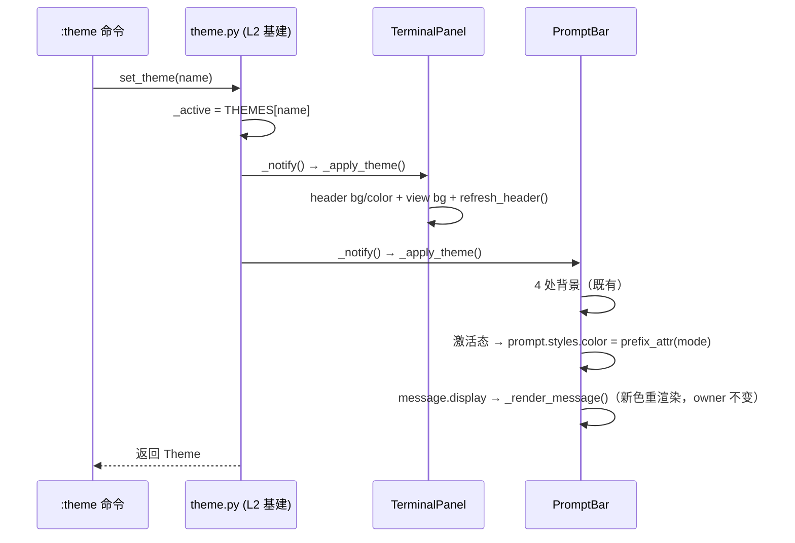

# Plan F — 遗留主题缺口治理：TerminalPanel 订阅 + PromptBar 动态色重渲染

> **实施状态**：✅ 已实施 —— 2026-10-05 全量核对：文档自述与代码产物一致。
> 重构前就存在的旧账（见 F1/F7），非本轮重构引入；本 plan 把它们收编进统一治理。

## F.1 事实基线（2026-09-27 实测）

| # | 事实 | 位置 |
|---|---|---|
| F1 | `TerminalPanel.on_mount` 一次性刷 header/view 颜色，**无订阅**，切主题后滞留旧色 | `yate/editor_view/terminal.py:421-426` |
| F2 | TerminalPanel 启动即挂载、用 `display=False` 隐藏（非 unmount）→ `on_mount` 全生命周期只跑一次，缺口必然暴露 | `yate/editor.py:246,255`；`terminal.py:447,461` |
| F3 | `Vertical` MRO **无公开 `on_mount`**（实测探针：`textual.containers.Vertical` → 无）→ 加 `on_mount` 不构成遮蔽，无需 `super()`、不加 `@override` | 探针输出 2026-09-27 |
| F4 | `TerminalView.render_line` 每行实时读 `theme.active()`，有输出即自愈；但**闲置时无重绘**，背景滞留 | `terminal.py:290` |
| F5 | `PromptBar._apply_theme` 只刷 4 处背景；激活态 prompt 前缀色在 `activate()` 时一次性写入 `styles.color` | `yate/editor_view/commandline.py:264-269,300` |
| F6 | 消息行颜色在 `_show_message` 时以 Rich markup 烧进内容（`[{color}]text[/]`），切主题后滞留旧色直至下一条消息 | `commandline.py:327` |
| F7 | 旧 L3 `apply_theme` 从未覆盖 terminal —— 缺口为继承性（`046fcff^:yate/editor.py` 的 8 个刷写点无 terminal） | git 取证 `046fcff^` |
| F8 | `write`/`idle` 是 `_show_message` 的全部调用方；`owner` 语义独立于颜色 | `commandline.py:310-318` |

## F.2 目标与非目标

**目标**

- G1：`TerminalPanel` 补齐组件自持三件套（`_apply_theme` + `on_mount` 订阅 + `on_unmount` 退订），主题切换即时生效。
- G2：`PromptBar` 在主题切换时：① 激活态 prompt 前缀色按新主题重取；② 当前消息行按新主题重渲染（文本与 `owner` 不变）。
- G3：单测覆盖两处行为；全量门禁 + 冒烟 compare 零漂移。

**非目标**

- 终端内容区的 ANSI 256/truecolor 不随主题（仿真器语义，VS Code 同款行为；`TerminalView` 实时读 active 已足够）。
- 不新增广播机制/协议/事件——沿用 `theme.subscribe`（plan_A 基建）。
- 不处理 `CommandInput` 的 placeholder/cursor 配色（Textual design token 驱动，已随 `to_textual_theme` 桥自动跟随）。

## F.3 备选方案与否决理由

| 方案 | 描述 | 结论 |
|---|---|---|
| **1. 组件自持三件套（采纳）** | TerminalPanel 与 PromptBar 均在组件内订阅广播、自刷自绘 | 与 plan_C 七组件模式完全一致，架构方向不变 |
| 2. L3 手动补刷（否决） | `Editor.set_theme` 里追加 `terminal_panel._apply_theme()` | 违反组件自持原则，是 T2 治理的方向倒退；且 PromptBar 场景同样要回 L3，等于复活已删除的 `apply_theme` |
| 3. 消息色改 Textual design token（否决） | 消息行不用 markup 烧色、改用 CSS 变量 `$text` 等 | 消息经 `Static.update(Rich markup)` 渲染，改造成本大；且引入"yate Theme 字段 → Textual 变量"的第二条映射面，与 `to_textual_theme` 既有桥重复 |

## F.4 分步实施计划

### Step 1 — TerminalPanel 三件套

- **输入**：F1/F2/F3/F4。
- **改动文件**：`yate/editor_view/terminal.py`。
- **输出**：
  - `_theme_unsubscribe: Callable[[], None] | None = None` 类属性；
  - `_apply_theme()`：header `background=t.panel` / `color=t.fg_dim`、view `background=t.bg`、`refresh_header()`（重建缓存头部文本，与 F1 现值逐一相同）；
  - `on_mount`：`_apply_theme()` + `theme.subscribe(self._apply_theme)`（**无 `super()`**，F3 实测无遮蔽；不加 `@override`）；
  - `on_unmount`：退订 + 置 `None`（chrome.py 同款）。
- **验收命令**：
  ```
  $env:PYRIGHT_PYTHON_FORCE_VERSION='latest'; .venv\Scripts\python.exe -m pyright yate/ tests/ tools/
  .venv\Scripts\python.exe -m pytest tests/test_theme_subscribe.py -q
  ```

### Step 2 — PromptBar 动态色重渲染

- **输入**：F5/F6/F8。
- **改动文件**：`yate/editor_view/commandline.py`。
- **输出**：
  - 模块级小助手 `prefix_attr(mode: str) -> str`：返回 `PREFIXES.get(mode, (":", "yellow"))[1]`（`activate` 与 `_apply_theme` 两处共用，避免默认值漂移）；
  - `_show_message` 签名由 `(text, color: str | None)` 改为 `(text, attr: str)`（Theme 属性名而非烧死的 hex），内部新增 `_render_message()` 只做 `self.message.update(...)`（解析时取 `theme.active()`）；
  - 新增 `_message: tuple[str, str] | None`（`(text, attr)`），`write`/`idle` 写入；
  - `_apply_theme` 尾部追加：`active_mode is not None` 时按 `prefix_attr` 重设 `prompt.styles.color`；`message.display` 时调 `_render_message()` 重渲染（**不动 `owner`/`active_mode`/回调状态**，F8）。
- **验收命令**：同 Step 1（另加 `tests/test_commandline.py` 若存在则跑）。

### Step 3 — 单测

- **改动文件**：`tests/test_theme_subscribe.py`（扩展；测试文件不计文件数判据）。
- **新增用例**：
  1. `test_terminal_panel_follows_theme_change`：run_test 内切主题 → `terminal_panel.header.styles.background` 变为新主题 `panel` 色；
  2. `test_terminal_panel_unsubscribes_on_unmount`：`remove()` 后再 `set_theme` 不触碰已卸载面板（退订钩子置 `None`）；
  3. `test_promptbar_prompt_color_follows_theme_change`：`activate("find")` 后切主题 → `prompt.styles.color` == 新主题 `accent`；
  4. `test_promptbar_message_rerendered_on_theme_change`：`write("...", kind="warn")` 后切主题 → 消息内容含新 `yellow` 色值；
  5. `test_promptbar_message_owner_survives_theme_change`：切主题后 `owner` 与文本不变。
- **验收命令**：`.venv\Scripts\python.exe -m pytest tests/test_theme_subscribe.py -q`

### Step 4 — 全量门禁 + 文档回填

- **改动文件**：`.trae/documents/theme-ownership-refactoring-plans/overview.md`（§5 索引加 F 行、§10 审计追加、§11 提交记录回填真实结果）。
- **验收命令（全量）**：
  ```
  .venv\Scripts\python.exe -m pytest tests/ -q
  .venv\Scripts\python.exe -m tools.smoke_test run --skip-slow
  .venv\Scripts\python.exe -m tools.smoke_test compare        # 期望 exit 0 零漂移
  ```

## F.5 风险清单与回滚路径

| 风险 | 缓解 | 回滚 |
|---|---|---|
| 未来 Textual 给 `Container`/`Vertical` 加公开 `on_mount` 后造成遮蔽（29eeb52 同类） | F3 已实测当前无；若上游变化，`super()` 一行即可补（注释里已说明探针结论） | 单 commit revert |
| 消息重渲染误伤 LSP echo 的 `owner` 语义 | `_render_message` 是纯视觉函数，不触碰 `owner`/回调；用例 5 钉死 | 单 commit revert |
| smoke compare 漂移 | 启动路径视觉零变化（只新增"切换时"行为）；若漂移先按既有流程归因再处理，不许直接改断言 | 按基线重拍流程 |
| `_show_message` 签名变更波及外部调用方 | F8 取证：仅 `write`/`idle` 两个内部调用方，无外部依赖 | 签名回退 |

## F.6 交互图



## F.7 提交规划

- 单 commit：`fix(ui): close legacy theme gaps in TerminalPanel and PromptBar`
- 落在 `ref/theme-ownership`（worktree `<worktree>`）；**提交不推送**（既定约束）。

## F.8 执行结果（2026-09-27 回填）

| 步骤 | 结果 |
|---|---|
| Step 1 TerminalPanel | 三件套落地（`_theme_unsubscribe` / `on_mount` 订阅 / `on_unmount` 退订 / `_apply_theme` 含 `refresh_header()`）；无 `super()`（F3 实测） |
| Step 2 PromptBar | `prefix_spec` + `_show_message(text, attr)` 签名改造 + `_render_message` 重渲染 + `_apply_theme` 尾部两段；`write`/`idle` 全调用方收敛 |
| Step 3 单测 | `test_theme_subscribe.py` 4 → 9 passed（5 新用例） |
| Step 4 门禁 | pyright strict **0 errors**；pytest 全量全绿；smoke run **882/882**、compare **932/932 exit 0 零漂移** |

### 偏离计划的记录（均已在实现中验证更优）

1. **`prefix_attr(mode) -> str` → `prefix_spec(mode) -> tuple[str, str]`**：`activate`
   同时需要 prefix 与 attr，元组版让两处共用同一默认值，消除了计划未覆盖的
   `PREFIXES.get` 默认字面量重复（计划意图"避免默认值漂移"被完整实现）。
2. **用例 2 断言方式**：计划写"断言退订钩子置 None"，pyright strict
   `reportPrivateUsage` 拦截对外访问 `_theme_unsubscribe` → 改为行为断言
   （卸载后切主题，dock 样式保持原值不变），不触碰私有面且更贴近真实契约。
3. **`OWNER_LSP` 导入源**：计划笔误为 `theme.OWNER_LSP`，实际常量定义于
   `commandline.py`，测试从 `yate.editor_view.commandline` 导入。

## F.9 四维评审跟进（2026-09-27）

二轮 review 两条"建议级"整改（commit 见 §F.7 提交信息）：

1. **`activate()` 清除 `_message`**：prompt 打开时丢弃上一条消息的
   `(text, attr)` 残留——状态机收紧为"prompt 与 message 互斥且不同时持有"，
   消除无害冗余（`display=False` 守卫本使其无后果）。
2. **卸载测试去 shutdown 依赖**：`test_terminal_panel_unsubscribes_on_unmount`
   改为显式 `await panel.remove()` 触发卸载（run_test 内），不再依赖
   Textual shutdown 顺序调用 `on_unmount` 的行为；取证 `TerminalView.shutdown`
   在 `proc is None` 时早退 + Editor 侧 try/except 兜底，显式 remove 后
   既有退出路径安全。

门禁复验：pyright 0 errors、pytest 全绿、smoke run 882/882 + compare
932/932 exit 0 零漂移。
