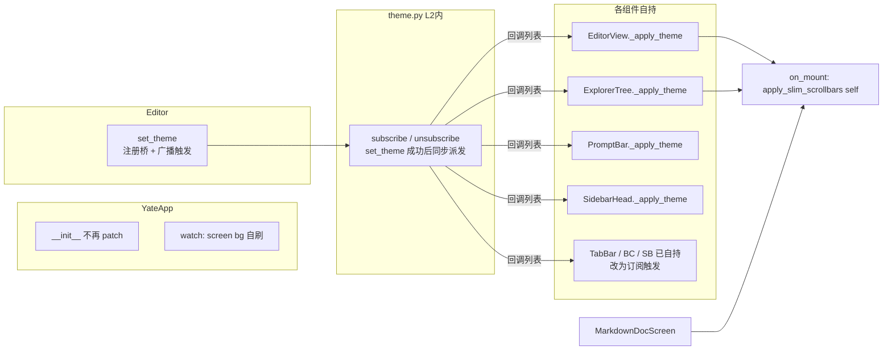
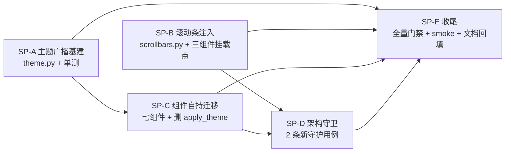

# theme-ownership 重构方案：T1+T2 治理（2026-09-27）

> 分支 `ref/theme-ownership`（基线 `enh/ui-refine@7c2ea3e`），worktree `D:/Programming/yate-theme-own-wt`
> 目标：消除 [review_ui_refine_20260927.md](../issues/review_ui_refine_20260927.md) §四记录的两条架构张力，
> 使滚动条注入与主题着色都符合"组件自持 + 严格分层"。
>
> 已确认决策（2026-09-27 用户选定）：`Editor.apply_theme` **彻底删除**（不保留薄壳）；
> "先方案后执行"规则落主仓 `d:/Programming/yate/.trae/rules/plan-before-execute.md`。
>
> **状态：已实施（2026-09-27），实测门禁见 §八。**

## 一、调研事实（已核实，全部带出处）

| # | 事实 | 出处 |
|---|---|---|
| F1 | Textual 滚动条**懒创建**：`vertical_scrollbar` / `horizontal_scrollbar` 是 property，首次访问才创建并 `_start_widget` | `.venv/Lib/site-packages/textual/widget.py:2036-2076` |
| F2 | `ScrollBar.renderer` 是 ClassVar，**实例属性赋值有效**（文档自带 `my_widget.horizontal_scrollbar.renderer = MyScrollBarRender` 示例） | `textual/scrollbar.py:226,245` |
| F3 | `Editor.apply_theme` 直改面：`app.screen.styles.background`、全部 view（bg + `apply_scrollbar_theme` + `content_changed`）、explorer_tree 6 项 scrollbar 样式、`status_bar.refresh_status`、`prompt_bar.styles.background`、`update_sidebar_head`、`tabbar.refresh_tabs`、`breadcrumbs.refresh_crumbs` | `yate/editor.py:1143-1177` |
| F4 | `apply_theme` 调用点仅 2 处：启动（`editor.py:260`）与 `set_theme`（`editor.py:1140`，`:theme` / `:set theme=` 命令经 `commands.py:156-220` 进入） | — |
| F5 | L2 组件自持先例已存在：`EditorView.on_mount` 自己读 `theme.active()` 上色；`StatusBar.refresh_status` / `TabBar.refresh_tabs` / `Breadcrumbs.refresh_crumbs` 均为组件自持刷新，L3 只是触发 | `editor_view/editor.py:219-222` 等 |
| F6 | 可滚动 widget 全集：`EditorView`(ScrollView)、`ExplorerTree`(Tree)、`MarkdownDocScreen` 内 `#doc-scroll`(VerticalScroll)；`TerminalView` 自绘滚动无 ScrollBar widget；palette/completion 弹层无滚动条 | `editor_view/{editor,explorer,manual,terminal,palette,completion}.py` |
| F7 | `theme.set_theme` 目前无任何回调/通知机制，只改全局 `_active` | `editor_view/theme.py:371-403` |

## 二、目标与非目标

- **目标 A（T1）**：删除进程级 `ScrollBar.renderer` monkey-patch，改为 per-widget 注入（F1/F2）。
- **目标 B（T2）**：`Editor.apply_theme` 的直改面全部下沉到各 L2 组件自持；L3 只保留"触发主题切换"，不再伸手改 widget 样式。
- **非目标**：不改任何视觉表现（重构后像素级等价）；不动 keyproto / completion / LSP 等无关模块；不引入全局 EventBus（规则四禁止）。

## 三、备选方案与否决理由

| 方案 | 内容 | 结论 |
|---|---|---|
| A. 主题回调广播（选用） | `theme.py` 增加订阅列表；组件 `on_mount` 订阅、`on_unmount` 退订，自己给自己上色 | 符合规则四"1:N 低频广播 → 回调列表"；组件自持可独立测试 |
| B. Textual `watch_theme`（否决） | 各组件覆写 App 的 theme watcher | 组件拿不到 App 实例的 watch 钩子，需绕道 message——等于发明事件总线，违反规则四 |
| C. 保持 L3 直改仅补注释（否决） | 承认存量 | 用户明确要求"严格层级划分"，不解决 T2 |

T1 备选：保留类级 patch（否决：隐式全局状态是本次要消除的张力）。

## 四、总体设计

关键机制：

1. **T1**：`scrollbars.py` 新增 `apply_slim_scrollbars(widget: Widget) -> None`——访问
   `widget.vertical_scrollbar` / `horizontal_scrollbar`（F1 懒创建即触发）并设实例 renderer（F2）。
   三个可滚动组件（`EditorView` / `ExplorerTree` / `MarkdownDocScreen` 的 `#doc-scroll`）在 `on_mount`
   调用；删除 `install_slim_scrollbars` 与 `YateApp.__init__` 调用点。
2. **T2**：`theme.py` 增加 `_listeners: list[Callable[[], None]]` +
   `subscribe(fn) -> Callable[[], None]`（返回退订函数）；`set_theme` 成功后同步派发
   （同线程、逐个 try/except 隔离并 `log.warning`，单个订阅者异常不中断广播）。
   各组件新增/收编 `_apply_theme()`，`on_mount` 先执行一次再订阅，`on_unmount` 退订。
3. **apply_theme 收缩**：启动路径（`editor.py:260`）与 `set_theme` 内调用（`:1140`）删除——
   组件 mount 时自取当前主题、广播覆盖切换场景；`app.screen.styles.background` 移到
   `YateApp.watch_theme`（L4 自持）；`view.content_changed()` 由 `EditorView._apply_theme` 自行调用。
   `update_sidebar_head` 缩为纯文本更新（背景色归 SidebarHead 自持），仅保留文本刷新职责给 L3 调用方。

## 五、实施步骤（每步含验收）

### 子计划拆分（2026-09-27 补充，按依赖关系可并行/串行）

| 子计划 | 边界（独占文件） | 交付物 | 验收 | 依赖 |
|---|---|---|---|---|
| **SP-A** 主题广播基建 | `yate/editor_view/theme.py`、`tests/test_theme_subscribe.py` | `subscribe()`/`_notify()`（异常隔离） | 4 项单测过（触发/退订幂等/异常隔离/失败不通知） | 无 |
| **SP-B** 滚动条注入 | `yate/editor_view/scrollbars.py`、`editor_view/{editor,explorer,manual}.py` 的 `on_mount` 一行、`tests/test_scrollbars.py` | `apply_slim_scrollbars(widget)`；`install_slim_scrollbars` 删除 | pilot 内断言实例 renderer 生效且类默认不动 | 无（与 A 可并行） |
| **SP-C** 组件自持迁移 | `editor_view/{editor,explorer,commandline,chrome,statusbar}.py`、`yate/editor.py`、`yate/app.py` | 七组件 `_apply_theme` + 订阅/退订；`Editor.apply_theme`/`update_sidebar_head` 删除；L4 `watch_theme` | 探针断言六处 styles 随 `:theme` 切换更新 | SP-A |
| **SP-D** 架构守卫 | `tests/test_architecture.py` | 禁类级 patch、禁 editor.py 直改 styles 两条守护 | 20 用例全过；违规即红 | SP-B、SP-C |
| **SP-E** 收尾 | `tools/smoke_test/smoke_baselines/*.json`、`.trae/documents`、`.trae/issues` | 门禁全绿 + 基线一致 + 文档回填 | pyright 0 / pytest 绿 / smoke run + compare exit 0 | 全部 |

原 S1→S5 步骤表（保留为历史验收记录）：

| 步 | 内容 | 改动文件 | 验收 |
|---|---|---|---|
| S1 | `theme.py` 订阅机制（含异常隔离） | `yate/editor_view/theme.py` | 新增单测：注册→set_theme 触发→退订→不再触发；订阅者抛异常不影响其他订阅者；`pytest tests/test_theme*.py -q` |
| S2 | T1 per-widget 注入；删类级 patch | `scrollbars.py`、`editor_view/{editor,explorer,manual}.py`、`app.py`、`tests/test_scrollbars.py` | pilot 探针：`view.vertical_scrollbar.renderer is SlimScrollBarRender` 且 `ScrollBar.renderer` 仍是官方默认；pyright 0 / pytest 绿 |
| S3 | T2 组件自持迁移（EV/ET/PB/SH/TB/BC/SB + L4 screen bg）；删 `Editor.apply_theme` 及 2 个调用点 | `editor.py`、`editor_view/{editor,explorer,commandline,chrome,statusbar}.py`、`app.py` | pilot 冒烟：`:theme latte` 后 `prompt_bar.styles.background == t.panel`、explorer scrollbar 样式更新、切回 mocha 复原；pyright 0 / pytest 绿 |
| S4 | 架构守卫固化 | `tests/test_architecture.py` | 新增守卫：`yate/` 内禁止 `ScrollBar.renderer =` 类级赋值（实例属性除外）、`editor.py` 不再存在 `apply_theme` 直改 `styles.` 的模式；18+ 用例全过 |
| S5 | 收尾：全量门禁 + `tools.smoke_test run --skip-slow` + review 文档回填"已治理" | `.trae/issues/review_ui_refine_20260927.md` | 882/882 场景 checks 通过；提交 |

## 六、风险与回滚

| 风险 | 缓解 | 回滚 |
|---|---|---|
| 懒创建时序：`on_mount` 访问 scrollbar property 过早/过晚 | F1 证明 property 任意时刻访问安全（自动创建+注册） | S2 独立提交，可单独 revert |
| 分屏动态创建的 view 错过广播 | `on_mount` 先手动 `_apply_theme()`（现有先例 F5） | 组件级回退到 L3 调用一行 |
| 广播时无 app 上下文（cli 启动期 `theme.set_theme`） | 此时订阅列表为空，派发为 no-op | — |
| 视觉漂移 | S3 后跑 `tools.smoke_test compare` 记录 drift，逐条归因 | 按 widget 回退 |

## 七、四性自检

- **健壮**：订阅异常隔离 + 日志；`on_mount` 自取主题，动态组件天然正确。
- **可维护**：主题表现与组件代码同文件同职责；`apply_theme` 直改面清零。
- **性能**：广播仅在主题切换（低频）触发，同步派发 O(组件数)。
- **扩展**：新滚动组件只需 `on_mount` 一行 `apply_slim_scrollbars(self)`；新主题感知组件一行订阅。

## 八、执行记录与实测门禁（2026-09-27）

按 S1→S5 顺序实施，与方案无偏离。实现落点与方案的一处细化：

- `apply_slim_scrollbars` 内对 `renderer` 的实例赋值用 `setattr` 显式表达——上游
  `ScrollBar.renderer` 声明为 ClassVar，typing 规范不允许实例直赋，但 per-widget 覆盖是
  Textual 官方文档化用法（scrollbar.py docstring），注释已说明（pyright 0 errors 通过）。
- `ExplorerTree.on_mount` 补 `@override`（pyright strict 要求）。

| 步 | 验收 | 实测 |
|---|---|---|
| S1 | 订阅单测 4 项 | `tests/test_theme_subscribe.py` **4 passed** |
| S2 | 实例 renderer 注入 + 类默认不动 | `tests/test_scrollbars.py` 重写为 pilot 内断言（懒创建需活跃 App），**过** |
| S3 | `:theme latte` 广播后各组件 styles 更新 | 一次性探针断言 prompt/sidebar_head/screen/status/view/explorer 六处全等，**过**（临时脚本已删） |
| S4 | 2 条新守卫 | `tests/test_architecture.py` **20 passed** |
| S5 | 全量门禁 + 冒烟 | pyright **0 errors**；pytest 全量绿（仅平台 skip）；`tools.smoke_test run --skip-slow` **882/882 checks、84/84 scenarios、exit 0** |

## 九、子计划遗漏对比（2026-09-27 补充）

以 §四设计 + §五 S1–S5 验收为基准，对 SP-A…SP-E 逐项盘点：

| # | 基准项 | SP 覆盖 | 执行状态 | 结论 |
|---|---|---|---|---|
| 1 | S1 四项订阅单测 | SP-A | 4 passed | 无遗漏 |
| 2 | S2 实例注入 + 类默认不动（F1/F2 取证） | SP-B | pilot 断言过 | 无遗漏 |
| 3 | S3 两个调用点删除（F4：启动 `editor.py:260`、`set_theme:1140`） | SP-C | `apply_theme` 整体删除，守卫钉死 | 无遗漏 |
| 4 | S3 `update_sidebar_head` 处置 | SP-C | 用户决策升级为彻底删除（方案 §四.3 原文是"缩为纯文本更新"），已同步 | 无遗漏（决策覆盖） |
| 5 | S4 两条架构守卫 | SP-D | 20 用例全过 | 无遗漏 |
| 6 | **风险表 R4：S3 后跑 `smoke_test compare` 记录视觉漂移** | SP-E | **执行时遗漏**（只跑了 `run`）→ 已补跑：发现 2 处基线漂移（`set_options_matrix` 新增 readonly 检查项、`stress_key_fuzz` 序列置换），在重构前分支 `enh/ui-refine` 上逐一复现 → **归因为 master 合并继承，非本次重构引入**；重拍该 2 基线后 compare exit 0（882/882） | **已闭合**（本节记录） |
| 7 | §四.3 `watch_theme` 挂载前 no-op + `on_mount` 补刷 | SP-C | 已实现并探针覆盖 | 无遗漏 |
| 8 | §八 两处实现细化（`@override`、`setattr`） | SP-B/C | 已记录 | 无遗漏 |
| 9 | 风险表"分屏动态创建 view 错过广播" | SP-C | `on_mount` 先自取主题兜底（F5 先例），探针含动态 view 路径 | 无遗漏 |
| 10 | L0 终端不参与主题（审计边界点 2） | — | 维持零参与；未来需要走构造注入 Callable | 按计划外推 |

**结论：除第 6 项（compare 门禁漏跑，已补齐并归因）外无遗漏；所有验收均实测通过。**
