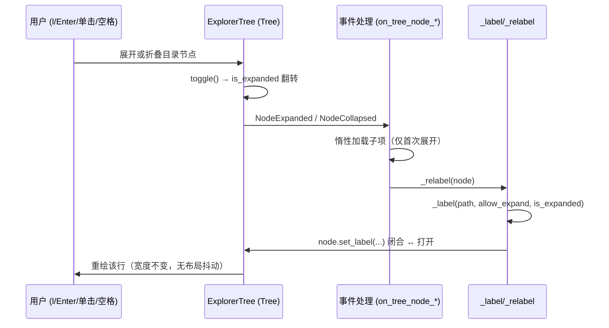
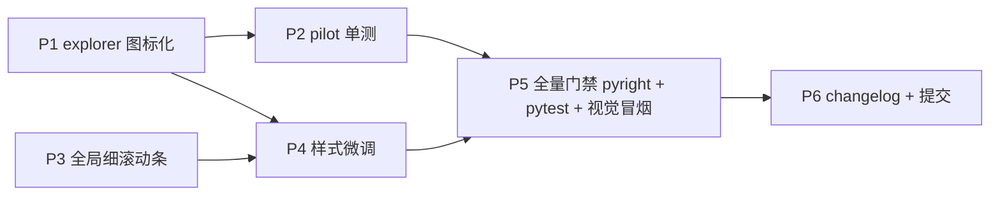

# UI 美观优化设计方案（issue IKINF3）

> **实施状态**：✅ 已实施 —— 2026-10-05 全量核对：文档自述与代码产物一致。
- Issue：gitee `jermaine/yate#IKINF3`「ENH - 美观优化」
- 日期：2026-09-27
- 状态：✅ 已实施（2026-09-27 分支 `enh/ui-refine` 交付，评审与修复记录见
  [2026-09-27-ui-refine.md](../reviews/2026-09-27-ui-refine.md)；2026-10-01 状态头照实回填）

## 1. 需求与目标

Issue 原文三点：

1. explorer 文件夹展开/关闭目前由箭头（`▶`/`▼`）指示，期望改为截图中的 nerd icon；
2. scrollbar 太粗太难看；
3. 调整部分外观使整体更 modern。

目标效果（issue 截图）：文件树每行以「nerd 文件夹/文件类型图标 + 名称」呈现，
**无箭头列**，文件夹开合状态由图标本身（`` 闭合 ↔ `` 打开）表达；
缩进靠留白/参考线，整体细线条、低饱和。

## 2. 已确认的视觉决策

| 决策点 | 结论 |
|---|---|
| 展开指示器 | **仅文件夹图标**：隐藏 Textual Tree 的 toggle 箭头，动态切换 ``/`` |
| 滚动条 | **1 格细条**：全局 `scrollbar-size-vertical: 1` + 现有主题弱化色 |
| modern 范围 | **保守微调**：分割线/边框降饱和变细、tree guides 调暗；不改布局结构 |

交互安全性依据（已核对 Textual 源码 `_tree.py::_on_click`）：toggle 字形隐藏后，
单击目录标签行仍触发 `NodeSelected`，`ExplorerTree.on_tree_node_selected` 对目录执行
`toggle()` —— 鼠标单击展开能力保留；键盘 `l`/Enter/space 路径不变。

## 3. 现状与差距

| # | 现状 | 差距 | 改动位置 |
|---|---|---|---|
| S1 | `Tree` 用类属性 `ICON_NODE="▶ "`/`ICON_NODE_EXPANDED="▼ "` 画箭头；`_label()` 只在建节点时渲染一次，展开后文件夹图标停留在闭合态 | 箭头非 nerd icon；开合态图标不切换 | `yate/editor_view/explorer.py` |
| S2 | Textual `Widget` DEFAULT_CSS 固定 `scrollbar-size-vertical: 2`；编辑器/explorer 滚动条颜色已按主题弱化（`apply_scrollbar_theme`、`Editor._apply_theme`），但宽度仍是 2 格 | 太粗 | `yate/app.py`（App CSS） |
| S3a | explorer 右边框 `tall $primary 20%`（mauve 色调） | 彩色边框不够中性低调 | `yate/editor_view/explorer.py` |
| S3b | 分屏分割线 `heavy $primary 60%`（`█` 整块字符） | 块状粗线条 | `yate/editor_view/panes.py` |
| S3c | tree 缩进参考线用 Textual 默认 `$surface-lighten-2` | 偏亮，与低饱和目标不符 | `yate/editor_view/explorer.py` |

## 4. 架构合规性

全部改动落在 **L2 `editor_view/*`（组件自持行为与默认样式）+ L4 `app.py`（App 级 CSS）**，
不新增跨层依赖、不加 Protocol/`TYPE_CHECKING`、不触碰按键分发路径（R10 无涉）、
不动 `Editor`（无需新增跨协作者操作）。

```
L4 app.py            ── S2: App CSS 一条规则（全局滚动条宽度）
L2 editor_view/
  explorer.py        ── S1: 图标开关 + 动态 relabel；S3a/S3c: DEFAULT_CSS 微调
  panes.py           ── S3b: 分割线 DEFAULT_CSS 微调
  icons.py           ── 不改（FOLDER/FOLDER_OPEN 已存在）
```

依赖方向不变；`icons.py` 已是 L2 内聚的字形注册表（扩展性：新增文件类型只改一张表）。

## 5. 设计细节

### S1 展开指示器改为「仅文件夹图标」（explorer.py）

利用 `Tree.render_label` 读取 `self.ICON_NODE / ICON_NODE_EXPANDED` 类属性的事实，
在 `ExplorerTree` 上覆盖为空串即可隐藏箭头列（`Text.assemble(("", style), label)` 合法，
宽度计算走 `get_label_width` → `render_label`，零宽前缀无副作用）：

```python
class ExplorerTree(Tree[NodeData]):
    #: icon-only 展开/折叠指示：状态由文件夹开/闭图标表达（issue IKINF3）
    ICON_NODE = ""
    ICON_NODE_EXPANDED = ""
```

动态图标：标签统一由 `_label(path, is_dir, expanded)` 生产（唯一真源），三处保持同步：

```python
def _relabel(self, node: TreeNode[NodeData]) -> None:
    """Rebuild a node's label so the folder icon matches its expansion state."""
    path = node.data
    if isinstance(path, Path):
        node.set_label(self._label(path, node.allow_expand, node.is_expanded))
```

| 调用点 | 改动 |
|---|---|
| `refresh_tree()` | 根标签保持 `_label(root_path, True, True)`；`_load_children(..., expanded)` 构建子标签时按 `entry.path in expanded` 传入真实开合态（消除重建后闪现闭合图标） |
| `on_tree_node_expanded` | 惰性加载后追加 `self._relabel(event.node)` |
| `on_tree_node_collapsed` | 追加 `self._relabel(event.node)` |

健壮性：`_relabel` 对占位节点（`data is None`）与文件节点（`allow_expand=False`，
无 toggle 前缀）均安全；`set_label` 不改变 `cell_len`（``/`` 均为 1 格），
不引发布局抖动。鼠标/键盘 toggle 路径（meta `toggle`、`NodeSelected` → `toggle()`）
不受零宽前缀影响。

标签生命周期：



### S2 全局 1 格滚动条（app.py CSS）

Textual CSS 特异性规则：App CSS 与 `Widget` DEFAULT_CSS 的 `Widget{...}` 规则
特异性相同（类型选择器 0,0,1），App CSS 源顺序在后 → 胜出；其余派生类
DEFAULT_CSS 均未设置 `scrollbar-size-*`（已核对 `_tree.py` 等）。App CSS 追加：

```css
Widget {
    scrollbar-size-vertical: 1;
}
```

覆盖面：编辑器视图、explorer、终端 dock、manual/palette/模态等全部滚动物件。
颜色不动（编辑器与 explorer 已由 `apply_scrollbar_theme` / `Editor._apply_theme`
按主题弱化；overlay 走 Textual 主题桥生成的 `$scrollbar-*`）。

### S3 保守微调

| 位置 | 现值 | 新值 |
|---|---|---|
| `explorer.py` DEFAULT_CSS | `border-right: tall $primary 20%` | `border-right: tall $foreground 12%`（中性、随主题） |
| `panes.py` `.pane-sep-h/-v` | `heavy $primary 60%`（块状） | `tall $foreground 25%`（细线） |
| `explorer.py` DEFAULT_CSS | 无 guides 覆盖 | 增 `& > .tree--guides { color: $foreground 15%; }`（含 focus 态同步调暗，见风险 R-2） |

`$foreground` 来自主题桥（`to_textual_theme` 已映射 `foreground=t.fg`），
全部 8 个内置主题 + 自定义主题自动适配，明暗两态均成立。

## 6. 实施步骤

统一解释器：`.venv/Scripts/python.exe`（主仓 venv，worktree 内无独立 venv；
命令均在 worktree 根目录执行）。

| 步骤 | 输入 | 输出 | 验收标准 | 规模 |
|---|---|---|---|---|
| P1 | 本文档 §S1 | `explorer.py`：`ICON_NODE*` 覆盖、`_relabel`、三处调用点接线 | `pyright` 零诊断；树中无箭头字形；展开/折叠/`refresh_tree` 后开合图标正确 | S |
| P2 | P1 | `tests/test_explorer_ui.py`（pilot 驱动：展开→断言标签含 `FOLDER_OPEN` 码点；折叠→`FOLDER`；断言 `ExplorerTree` 渲染行不含 `\uf054`/`\uf078`） | `pytest tests/test_explorer_ui.py -q` 绿 | S |
| P3 | 本文档 §S2 | `app.py` CSS 追加 `Widget { scrollbar-size-vertical: 1; }` | pilot 断言 `EditorView`/`ExplorerTree` 的 `styles.scrollbar_size_vertical == 1` | XS |
| P4 | 本文档 §S3 | `explorer.py` / `panes.py` DEFAULT_CSS 三处微调 | `pyright` 零诊断；截图冒烟：分割线为细线、边框低饱和 | XS |
| P5 | P1–P4 | 全量门禁 + 视觉冒烟 | `python -m pyright yate/ tests/ tools/` 零诊断；`python -m pytest tests/ -q` 全绿；`textual-pilot-smoke` 出图核对三点效果 | M |
| P6 | P5 | `yate/resources/changelog.en.md` 追加 Changed 条目（若无 Unreleased 段则按现行惯例处理）；按 `git-commit-message.md` 提交 `feat(ui): ...` | 提交信息合规 | XS |

注：P2 若现有 `tests/` 已有 explorer pilot 测试文件则并入，不新建重复文件；
P6 的 changelog 以实际文件结构为准。

## 7. 测试与整体流程



验收基线（对 issue 三点逐条闭环）：

1. explorer 行首无 `▶`/`▼`，目录展开显示 ``、折叠显示 ``，文件行仍带类型 nerd icon；
2. 所有滚动条宽度 1 格且颜色随主题弱化；
3. 分割线/边框为中性细线条，明暗主题下均协调。

## 8. 风险与回滚

| # | 风险 | 缓解 | 回滚 |
|---|---|---|---|
| R-1 | App CSS `Widget` 规则被某派生类 DEFAULT_CSS 反超 | 已核对核心控件无 `scrollbar-size` 声明；P3 用 pilot 断言兜底 | 单条 CSS 删除即回滚 |
| R-2 | `tree--guides` 组件类在子类 DEFAULT_CSS 的覆盖可能不生效（组件样式特异性） | P5 截图核对；不生效则删除该条（纯装饰，不阻塞） | 删条目 |
| R-3 | 隐藏箭头后用户失去「可展开」视觉暗示 | 目录图标 ``/`` 即状态暗示（与 issue 截图一致）；单击/`l`/Enter/空格均可展开 | `ICON_NODE*` 恢复为 chevron 字形（2 行） |
| R-4 | `_relabel` 与惰性加载时序 | relabel 在 `NodeExpanded`（加载完成）之后调用；`set_label` 仅影响单行 | git revert 单提交 |

## 9. 自检清单（提交前）

- [ ] 依赖方向向下，无新增 import 跨层（R1–R5）
- [ ] 无新增 `Protocol` / `TYPE_CHECKING` / `Any` / `# type: ignore`（R2/R6）
- [ ] 组件行为自持在 `ExplorerTree`/widget DEFAULT_CSS 内，未回流 `Editor`/外壳
- [ ] 无按键分发改动（R10 无涉）；explorer `on_key` fall-through 行为不变
- [ ] 新样式不依赖外壳新增 widget id（R9 无涉）
- [ ] `python -m pyright yate/ tests/ tools/` 零诊断
- [ ] `python -m pytest tests/ -q` 全绿
