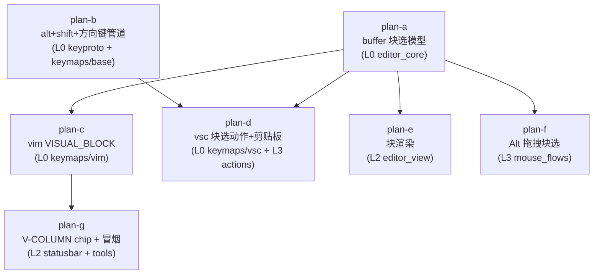
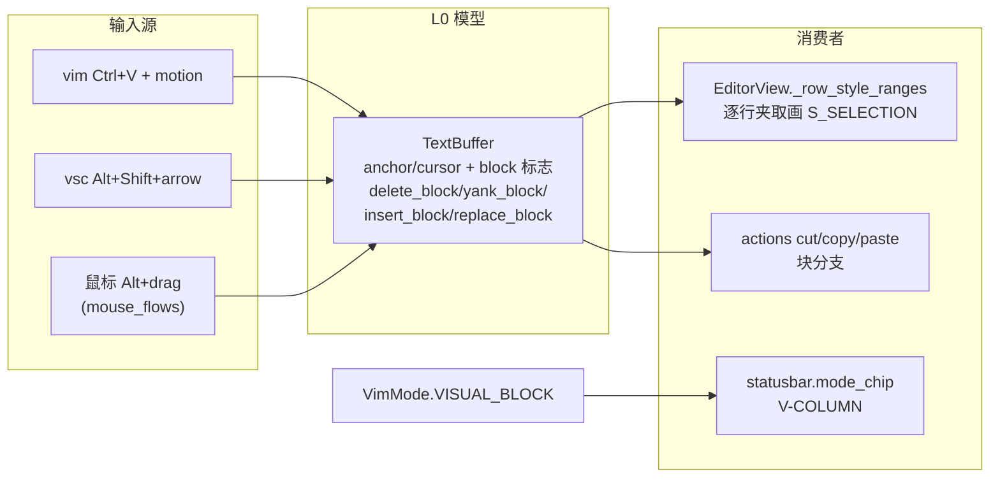

# vim-column-mode 总纲（issue IKJSRW：VIM/VSC 列模式）

> 分支 `feat/vim-column-mode`（worktree）。本文是子计划索引与执行波次的唯一调度依据；
> 各子计划自包含，执行者只读自己名下的子计划 + 本总纲。

## 一、目标

1. **vim 键位**：Normal 模式下 `Ctrl+V` 进入列模式（块选择）；`v`/`V`/`Ctrl+V` 三种
   visual 形态可互相切换；块选择支持 motion 扩展与 `y`/`d`/`x` 块删除/块 yank；
   `p`/`P` 按寄存器类型回贴块。
2. **vsc 键位**：`Alt+Shift+方向键` 扩展列选择；鼠标 `Alt` + 左键拖拽列选择；
   `Ctrl+V` 保持粘贴语义不冲突。
3. **块编辑**：列选择下可删除/复制/粘贴（vsc 剪贴板动作块感知）；打印字符覆盖
   整列（VS Code 语义）；单步撤销。
4. **状态栏**：vim 列模式 chip 显示 `V-COLUMN`。
5. 渲染层按矩形（逐行夹取到行长）画块高亮。

## 二、非目标（显式否决，登记为后续可立项项）

- **vim 块模式 `I`/`A`（逐行插入）**：需要在 `TextBuffer` 之上引入多光标插入会话
  （每行一个活动插入点、统一 `<esc>` 收口），与现有单光标 + 单锚点模型冲突，
  复杂度约为本任务的 2 倍。V1 不做。
- **块模式 `c`（逐行 change）**：同上，依赖多插入点。
- **虚列（virtualedit）**：块选择列边界按各行行长夹取，短行不产生虚拟空白列；
  vim 的 `$` 块（右界随行）不做，右界统一取锚点/光标列的 min/max。
- **`Ctrl+Q`**：已被 vsc 键位 `quit` 占用（`yate/keymaps/vsc.py:91`），本任务不触碰。
- **vsc 列模式的持久"列模式开关"**：vsc 无模式，列选择只是选区的一种形态
  （块标志），不需要独立模式。

## 三、备选方案与否决理由

| 方案 | 内容 | 裁决 |
|---|---|---|
| A. `TextBuffer` 增加 `block` 标志，复用 anchor+cursor 作两角 | 状态最少；渲染/鼠标/键位全部已围绕 cursor+anchor 建立，改动面最小 | **采纳** |
| B. 独立 `block_rect: tuple[Pos, Pos] \| None` 字段 | 与 anchor/cursor 双状态需要同步（谁赢？），`set_cursor`/`clear_selection`/undo 快照全都要双写，状态机复杂 | 否决：双源状态必然漂移 |
| C. 多光标模型（cursors list） | 一劳永逸支持 I/A 与真正的 VS Code 多光标 | 否决：超出 issue 范围，undo 快照 `_Snapshot(lines, cursor, anchor)`（`yate/editor_core/buffer.py:44-48`）与全部选择 API 都要重写；列为非目标 |
| D. 块选状态放 L2 `EditorView` | 渲染近 | 否决：违反分层——选区是文档模型状态，L1/L0 持有（`architecture-boundaries.md` §五自检清单"状态放在正确的层"）；且 keymap（L0）与 mouse_flows（L3）都要读写它 |

## 四、调研关键事实（设计依据，文件:行号）

### 选区模型（L0 `yate/editor_core/buffer.py`）
- 单光标 + 单锚点：`cursor`（:75）、`anchor: Pos | None`（:76）；无多光标、无块选。
- `selection()`（:245-250）返回归一化半开区间 `(min,max)`；`selected_text()`（:252-263）。
- `set_cursor(pos, select=)`（:276-291）是选择/清除的唯一汇聚点：`select=True` 且无
  anchor 时以当前光标作锚；`select=False` 清 anchor。
- `clear_selection()`（:272）、`select_all()`（:293）、`set_text()`（:135）。
- undo：`_snapshot`/`_commit`（:164-201），公开 `snapshot()`/`commit()`（:209-215）。
- `_delete_range`（:301-309）、`insert_text`（:311）、`replace_range`（:341）、
  `type_char` 选区分支（:389-408）。
- 寄存器：`register`（:83）、`named_registers`（:86）；`yank_lines`（:667）、
  `yank_selection`（:685）、`delete_lines`（:701）、`paste`（:788-820）。
- `buffer.py` 820 行，已在体量豁免名单（`tests/test_architecture.py:231-236`
  `SIZE_EXEMPT_FILES`；规则 §三.7）。

### vim 键位（L0 `yate/keymaps/vim.py`）
- 状态机 `VimMode(str, Enum)`：NORMAL/INSERT/VISUAL/VISUAL_LINE（:43-49）。
- `handle_key` 按 mode 路由（:194-222）；Normal `v`→VISUAL（:595-599）、
  `V`→VISUAL_LINE（:600-606）；visual 处理器 `_handle_visual`（:291-394）；
  `drop_visual`（:396-404，鼠标点击退出）；`_fix_linewise`（:406-415）。
- **`Ctrl+V`（raw `\x16`）当前无绑定**（绑定表 :118-189 无 `\x16`；normal 模式
  未知键被吞 :636-640）——无冲突，直接可用。
- 键送达路径（两条都收敛到 raw `\x16`）：Textual key `"ctrl+v"` →
  `event_to_raw`（`yate/keyproto/legacy.py:127-133` ctrl 单字母 C0 映射）；
  win32-input-mode 帧 `"ctrl+v"` → `chord_to_key_name`
  （`yate/keyproto/driver_windows.py:66-77` `_CHORD_VKS` 含 VK_A..VK_Z）。
- `vim.py` 1117 行，已豁免（规则 §三.7）。

### vsc 键位与键名管道
- shift+方向键 raw `\x1b[1;2D/A/B/C` 绑 `select_*`（`yate/keymaps/vsc.py:70-73`）；
  `<ctrl-v>` 绑 paste（:85）——与 vim 的 `\x16` 分属两张绑定表，不冲突。
- **缺口**：`Alt+Shift+方向`（xterm `\x1b[1;4A..D`）三处均无支持——
  `KEY_ALIASES`（`yate/keymaps/base.py:62-85`）无条目、`parse_key` 的 shift 分支
  （:111-127）遇 alt+shift 会产出错误序列（`\x1b\x1b[1;2A`）、
  `_MOD_ARROWS`（`yate/keyproto/legacy.py:38-43`）无 `("alt","shift")` 行 →
  `event_to_raw("alt+shift+up")` 返回 `None`，键根本到不了 keymap。
  win32-input-mode 帧路径已能命名 `"alt+shift+up"`
  （`yate/keyproto/frames.py:159-181` + `NAV_VK_NAMES` :55-67），缺的只是
  name→raw 映射。

### 鼠标链路
- `EditorView.on_mouse_down/move/up/click`（`yate/editor_view/editor.py:258-283`）
  → 构造注入的 `handle_mouse`（:407-415）→ `Editor._on_view_mouse`
  （`yate/editor.py:671-676`）→ `MouseFlows.handle_view_mouse`
  （`yate/flows/mouse_flows.py:39-54`）。
- 拖拽：`_on_down`（mouse_flows.py:65-78，`select=event.shift`）、`_on_move`
  （:80-88）、`_on_up`（:90-98）；vim 模式 MouseDown 先 `drop_visual()`（:69-70）。
- support_mouse 双闸门：`MouseFlows.handle_view_mouse:41-45` +
  `YateApp.on_event`（`yate/app.py:224-245`）——块拖拽复用同一路径，天然受闸门
  管辖（R10/IKJRFK 不新增派发点）。

### 状态栏与渲染
- `mode_chip(prompt, keymaps)`（`yate/editor_view/statusbar.py:32-52`）：vim 模式
  映射 NORMAL/INSERT/VISUAL/V-LINE，色取 `t.mode_visual_bg`；`refresh_status`
  （:89-157）。`Editor.mode_label`（`yate/editor.py:785-791`）委托同一纯函数；
  冒烟脚本经它断言（`tools/smoke_test/scenarios/view.py:146-164`、
  `vim_advanced.py:54-139`）。
- 选区高亮：`EditorView._row_style_ranges`（`yate/editor_view/editor.py:508-557`）
  的 charwise 分支（:523-538），`S_SELECTION` 经 `_cell_style`（:579-599）。
  非活动窗格 cursor/anchor 来自 `ViewState`（`yate/session.py:237-243`，仅
  cursor/anchor 两字段）。

## 五、子计划索引与执行波次

| 波次 | 子计划 | 独占文件 | 依赖 |
|---|---|---|---|
| wave-1 | `vim-column-mode-buffer-block-model-plan-a.md` | `yate/editor_core/buffer.py`、`tests/test_editor_core.py`、`.trae/rules/architecture-boundaries.md`（行数回填） | 无 |
| wave-1 | `vim-column-mode-alt-shift-arrows-plan-b.md` | `yate/keyproto/legacy.py`、`yate/keymaps/base.py`、`tests/test_key_notation.py` | 无 |
| wave-2 | `vim-column-mode-vim-visual-block-plan-c.md` | `yate/keymaps/vim.py`、`tests/test_vim_keymap.py`、`.trae/rules/architecture-boundaries.md`（行数回填） | a |
| wave-2 | `vim-column-mode-vsc-block-select-plan-d.md` | `yate/keymaps/vsc.py`、`yate/actions.py`、`tests/test_vsc_keymap.py`、`tests/test_action_table.py` | a、b |
| wave-2 | `vim-column-mode-block-render-plan-e.md` | `yate/editor_view/editor.py`、`tests/test_app_render.py` | a |
| wave-2 | `vim-column-mode-mouse-block-drag-plan-f.md` | `yate/flows/mouse_flows.py`、`tests/test_app_mouse.py` | a |
| wave-3 | `vim-column-mode-status-chip-plan-g.md` | `yate/editor_view/statusbar.py`、`tests/test_mode_chip.py`（新）、`tools/smoke_test/scenarios/vim_advanced.py` | c |

**波次纪律**：同一波内文件互不重叠，可并行下发（2~3 个一批：wave-2 拆
`{c,d}` + `{e,f}` 两批）；波次间串行，上一波全部验收命令退出码 0 才进入下一波；
每波收尾跑一次该波相关测试 + pyright 定向回归。



### 数据流（实现后的块选状态流）



## 六、架构边界核对（全任务）

- **无新增 `editor_view` 导入**：mouse_flows 已在 `UI_FROZEN_FILES` 冻结面内
  （既有 import），其余改动不引入向上依赖；R1-R8、R11 均不触发新登记。
- **R10（一次派发）**：全部新键路径复用既有 `EditorView.on_key → Editor.handle_key
  → keymap.handle_key` 单次派发与鼠标 `_forward_mouse` 单次转发，无新派发点；
  support_mouse 闸门（`YateApp.on_event`）自动覆盖鼠标块拖拽。
- **R2/R6/R8**：不新增 Protocol、TYPE_CHECKING、EventBus；块状态传具体对象
  （`TextBuffer` 本身）。
- **命名守卫**：无 `*Host/*Ops/*Controller` 新增。
- **`tests/test_architecture.py` 不需要新增守卫用例**（上述条款无新触碰面）；
  但 wave-1/wave-2 各步验收含 `pytest tests/test_architecture.py -q` 回归，
  确认 28 用例持续全绿。
- **体量豁免**：`editor_core/buffer.py`、`keymaps/vim.py` 修改后按 §三.7 要求
  回填规则文本行数（plan-a / plan-c 内完成，`SIZE_EXEMPT_FILES` 集合本身不变）。

## 七、全局风险与回滚

| 风险 | 缓解 |
|---|---|
| 部分老终端对 `\x1b[1;4A..D`（alt+shift+arrow）的 Textual 解析不可用 | Windows Terminal 走 win32-input-mode 帧路径（已确认命名可达）；legacy 路径在 plan-b 验收中用 `event_to_raw` 单测钉住 name→raw 映射。若某终端解析缺失，属已知限制，不阻塞（鼠标 Alt+drag 路径不受影响） |
| `anchor = None` 写点遗漏导致 `block` 标志滞留 | plan-a 枚举 `buffer.py` 内全部 anchor 清除/重设点逐一补 `block = False`；plan-a 用例覆盖标志卫生 |
| 非活动窗格（`ViewState` 无 block 字段）块选退化为 charwise 归一化渲染 | 已接受的 V1 限制（分屏 + 块选并存的边缘场景），plan-e 中显式注释 |
| 行数增长触发体量评审 | 两文件均已豁免，按 §三.7 回填行数即可 |
| 回滚 | 每个子计划独立成 commit（`feat(editor-core): ...` 等，见 `git-commit-message.md`）；单波回滚 `git revert <该波 commit>`，波次间无交叉文件，互不牵连 |

## 八、总门禁（wave-3 收尾，主代理执行）

```powershell
.venv\Scripts\python.exe -m pyright yate/ tests/ tools/
.venv\Scripts\python.exe -m pytest tests/ -q
.venv\Scripts\python.exe -m pytest tests/test_architecture.py -q
```

退出码 0 后按 `task-orchestration.md` 回填文档、提交。手工验证（无自动化替代）：
Windows Terminal 内 `python -m yate`：① vim 键位 `Ctrl+V j l d` 删除矩形块、
`u` 恢复；② `Ctrl+V j l y` 后移动光标 `p` 回贴矩形；③ vsc 键位 `Alt+Shift+↓→`
画块、鼠标 `Alt`+拖拽画块、块上打字整列替换；④ 状态栏显示 `V-COLUMN`。
