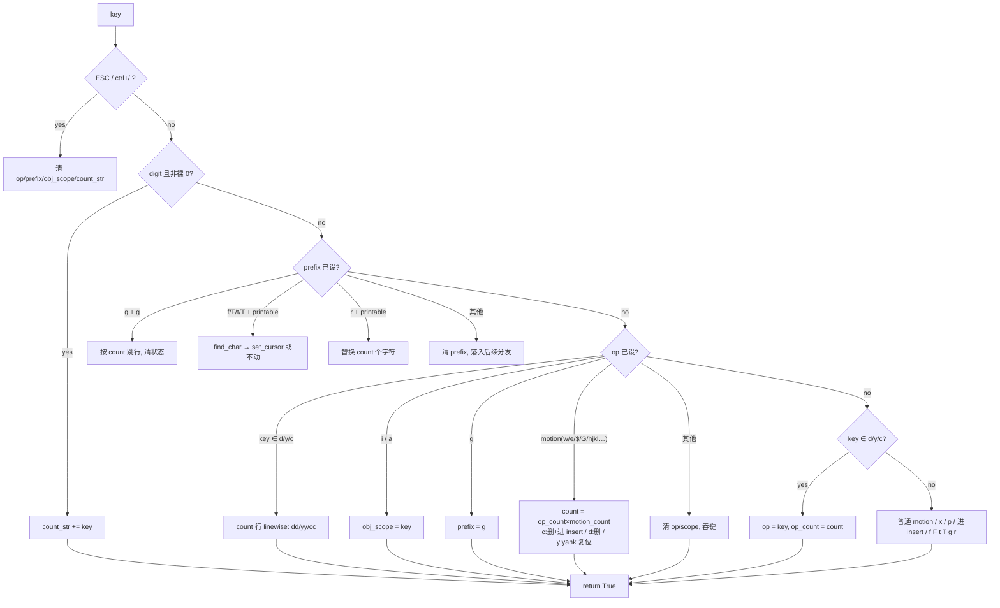

# vim keymap 通篇评审报告与修复方案（review-vim-keymap）

> **实施状态**：✅ 已实施 —— 2026-10-05 全量核对：文档自述与代码产物一致。
- 评审方式：3 个并行只读评审 agent（buffer 原语 / vim.py 全量键位 / 派发链路与测试覆盖）+ 1 个架构师 agent 出方案；关键结论由架构师抽查核实。
- 用户报告的问题键：`r`（替换字符）、`cw`、`cit`、`f`（找字符）。全部确认**未实现或被吞键**。

---

## 一、评审报告

### 1.1 整体质量评分

| 维度 | 评分 | 说明 |
|---|---|---|
| 已实现部分的正确性 | 7/10 | 已实现的 h/j/k/l/w/b/e、dd/yy、x/p/u、搜索、ex 行为基本正确，测试覆盖良好 |
| 功能完整性（对照常用 vim 子集） | 4/10 | `r`/`f`/`F`/`t`/`T`/`;`/`,`、`c` 操作符、text objects、`.`、`~`、`>>`/`<<`、`%` 等高频键缺失 |
| 健壮性（状态机/边界） | 5/10 | `pending` 单字符串无法表达 op+scope 组合，是本次多个缺陷的共同根因；count 流转有两处丢失 |
| 可维护性 | 7/10 | 单文件 507 行、结构清晰、注释到位；但 `_MOTION_CODES` + `_motion` 分支耦合 G 的 count 读取是坏味道 |
| 测试 | 7/10 | 已实现路径覆盖充分；缺失键零测试（理所应当），count 组合场景有盲区 |

**综合：5.5/10 — 骨架健康，`r`/`f`/`c`/text-object 四大块缺失 + 状态机表达力不足，达不到"实用 vim 子集"宣称（vim.py:3 docstring）。**

### 1.2 核心问题清单

**致命（用户可直接感知的功能缺失）**

| # | 位置 | 问题 | 后果 |
|---|---|---|---|
| F1 | vim.py:313, 435-436 | `c` 操作符未实现，`cw`/`cc`/`c$` 落入吞键分支 | `cw` 按了没反应 |
| F2 | vim.py（全文件） | text objects 未实现：`iw`/`aw`/`i(`/`a"`/`it` | `cit`/`ciw` 等无效 |
| F3 | vim.py（全文件） | `r` 替换字符未实现 | 无效 |
| F4 | vim.py:31, 全文件 | find-char motion `f`/`F`/`t`/`T`/`;`/`,` 未实现 | `dfx`/`fo` 无效 |

**严重（已实现但行为错误）**

| # | 位置 | 问题 | 后果 |
|---|---|---|---|
| S1 | vim.py:320-328 | `2dd`/`3yy`：key==op 分支直接调 `delete_lines()`/`yank_lines()`，count 被丢弃 | `3dd` 只删 1 行 |
| S2 | vim.py:319 + 481-487 | `_take_count()` 先清空 `count_str`，`_motion` 的 G 分支再读 `self.count_str` → `d5G` 退化为 `dG` | 删错范围 |
| S3 | buffer.py:478-485 + vim.py:375-380 | `move_right()` 行尾不是 no-op 而是**换行到下一行 col 0**（非末行）；`a` 用它实现 append → 行尾按 `a` 会把光标搞到下一行 | 行尾 append 行为错误；空行同病 |
| S4 | vim.py:308-310 + 337 + 488-490 | `dg`/`yg`：operator 丢弃后 `g` 落入 motion 分支空转，下次 `g` 又复活 pending，`dgg` 需按三次 g | 诡异交互 |

**建议**

| # | 位置 | 问题 |
|---|---|---|
| A1 | vim.py:212-214 | visual-line `y` 后光标应落选区首行 col 0（当前未显式设置） |
| A2 | vim.py:346-350 | `p`/`P` 不支持 count（`3p`） |
| A3 | buffer.py:671-685 | 单寄存器模型，无 numbered/named registers（列为非目标） |
| A4 | buffer.py:444-446 | `x` 在行尾会连接下一行（vim 语义如此，登记为已知正确行为） |

**评审中纠正的两处初判**（架构师核实）：
- visual 模式 `y` 后光标落 `sel[0]` **正确**：`selection()` 返回有序对 `(min, max)`（buffer.py:276-280），`sel[0]` 就是选区起点。
- normal 模式吞键（vim.py:435-436）与 insert 无条件吞键（vim.py:185）是**有意设计**：应用级键（ctrl+p、terminal toggle、palette 等）已在 `Editor.handle_key`（editor.py:602-714）先于 keymap 消费；`EditorView.on_key` 无条件 `event.stop()`（editor_view/editor.py:274-283），R10 结构上满足。**保留该边界**。

### 1.3 优先整改项

1. **P0**：F1-F4（用户报告的四个缺失块）——按 S1-S4 阶段实施（见下）。
2. **P1**：S1（`3dd`）、S2（`d5G`）、S3（`a` 行尾）——随 S1/S4 一并修复。
3. **P2**：S4（`dgg`）、A1/A2——随阶段顺带。

### 1.4 长期优化建议（本轮不做，登记）

- 寄存器模型（`"` 前缀 + numbered registers）→ 需 buffer 层 `RegisterFile`，独立立项。
- `.` 重复：需要操作记录层（last change + count），建议等 S1 状态机落地后评估。
- `>>`/`<<`/`~`/`%`：均为独立小功能，可逐个补。
- `_motion` 的 G 分支去耦合后，可考虑 motion 表驱动（当前 if 链可读性尚可，不强求）。

---

## 二、实施方案（架构师产出）

### 2.1 目标与非目标

**目标**：`r`、`f/F/t/T/;/,`、`c` 操作符（cw/cc/c$）、text objects（iw/aw/括号/引号/it）全部可用；`3dd`/`d5G`/`dgg`/行尾 `a` 等行为缺陷修复；pyright strict 零诊断 + pytest 全绿。

**非目标（防过度设计）**：named/numbered registers、`"` 寄存器前缀、`.` 重复、宏 `q`、marks `m/'`、`>>`/`<<`、`%`、visual 的 `o`/`I`/`A`/text object、`zz`/`H`/`M`/`L`、`R`/`S`/`C`/`D`/`Y` 大写别名、`~`、搜索类 motion 作 operator。扩展点：textobjects.py 签名统一 `(lines, pos) -> span`，后续只增函数。

### 2.2 决策点与否决理由

| 决策 | 选择 | 否决理由 |
|---|---|---|
| D1 扫描函数放哪 | **新模块 `yate/editor_core/textobjects.py` 纯函数**（`(lines, pos) -> span \| None`） | 否决塞进 buffer.py：buffer 已 800+ 行、是有状态文档模型；find-char/text-object 是无状态纯计算，纯函数可直接用字符串测试（"能用函数就不造类"） |
| D2 状态机表达 | **结构化字段** `op: str \| None` / `prefix: str \| None` / `obj_scope: str \| None` + 保留 if 链 | 否决查表状态机（modes×pending×printable 全组合，过度设计）；否决继续单 `pending` 字符串（无法表达 op+scope，正是缺陷根因） |
| D3 `cw` 特判层级 | **keymap 层**（operator 应用时 `c`+`w` 改用 word_end-style span） | 否决 buffer 层改 `next_word_start`：`w` motion 被正常移动共享（vim.py:463-464），buffer 层特判会污染共享原语；`cw` 是键位语义，归属 keymap |

### 2.3 分阶段实施（每阶段独立可合并、测试先行）

#### S1 状态机结构化 + `c` 操作符 + count 流转修复

- 改动：`yate/keymaps/vim.py`、`tests/test_vim_keymap.py`
- 要点：
  1. `__init__`（vim.py:53-57）：`pending: str` 拆为 `self.op`（d/y/c）、`self.prefix`（g/r/f/F/t/T）、`self.obj_scope`（i/a）；保留 `count_str`，新增 `op_count`。
  2. operator 分支（vim.py:313-336）：`d`/`y`/`c` 进 `op`；`op` 存在时 `i`/`a` 进 `obj_scope`（S1 先吞下报未知，S3 生效）。
  3. **count 流转**：op 按下时记 `op_count`，motion 时 `_take_count()` 记 `motion_count`，有效 count = `op_count * motion_count`（`2d3w`=6w）；`_motion` 签名加 `count: int | None`，G 分支（vim.py:481-487）改用参数 → 修 `d5G`/`5dG`/`1G`。
  4. `dd`/`yy`/`cc` 带 count：用 anchor+cursor 构造 n 行选区再调 `delete_lines()`/`yank_lines()`（无需加 count 参数，buffer.py:575-584 `selected_rows()` 现成）→ 修 `3dd`/`3yy`。
  5. `c`+motion：复用 `_apply_operator` 删 span 后 `_enter_insert`。
  6. `gg` 作为 operator motion：`op+"g"` 进 `prefix`，下一个 `g`（可带 count）解析为行 span → 修 `dgg` 三连按。
  7. 吞键边界保留（见 1.2 纠正项）。
- 验收：`pytest tests/test_vim_keymap.py -q`（新增 `3dd`/`2yy`/`d5G`/`5dG`/`dgg`/`cw`/`cc`/`c$`/`2cw`）；pyright 零诊断。

#### S2 find-char motion（f/F/t/T/;/,）

- 改动：新建 `yate/editor_core/textobjects.py`（`find_char(line, col, ch, *, count, backward, till) -> int | None`）、`yate/keymaps/vim.py`、新建 `tests/test_textobjects.py`、`tests/test_vim_keymap.py`
- 要点：`prefix` 为 f/F/t/T 时读下一个 printable → 算目标列，None 则不动并 `ui.message` 提示；operator 路径把目标列转 span（`dfx`/`yf;`）；`;`/`,` 用 keymap 记录的 `(ch, backward, till)` 重复；**不跨行**（vim 语义）；`_MOTION_CODES` 不收编这组键。
- 验收：`fo`/`2fo`/`Fo`/`to`/`Tx`/`dfx`/`dfo`/`cfy`/`;`/`,`/跨行不越界/未命中缓冲不变。

#### S3 text objects（iw/aw、括号系、引号、it/at）

- 改动：`yate/editor_core/textobjects.py`、`yate/keymaps/vim.py`、`tests/test_textobjects.py`、`tests/test_vim_keymap.py`
- 要点：纯函数族统一签名 `(lines: Sequence[str], pos) -> tuple[Pos, Pos] | None`：
  - `inner_word`/`a_word`（aw 含尾随空白，行尾则含前导空白）
  - `inner_pair`/`a_pair`（`()`/`[]`/`{}` 与别名 `b`/`B`；跨行，先向后找开括号再向前找配对；限搜索半径如 ±200 行）
  - `inner_quotes`/`a_quotes`（`"`/`'` 单行）
  - `inner_tag`/`a_tag`（`<tag>`…`</tag>` 跨行，it 不含标签）→ `cit` 落地
  - vim.py：`op + obj_scope + printable` → span → `anchor/cursor` 置位 → c 删后进 insert / d 删 / y yank；span None 则整体丢弃状态、吞键。
- 验收：参数化矩阵 `ciw`/`daw`/`di(`/`ca"`/`cit`/`cat`/`3diw`/未命中丢弃；`2dw` 回归。

#### S4 `r` 替换 + `a` 行尾修复 + visual-line `y` 光标

- 改动：`yate/keymaps/vim.py`、`tests/test_vim_keymap.py`
- 要点：
  1. `r`：`prefix="r"` → 下一个 printable → `n = take_count()`，对 `min(n, 行内剩余)` 个字符原位替换（单 undo step）；EOL 截断不报错；`3rx` 可用。
  2. `a`（vim.py:375-380）：改 `buf.set_cursor((buf.row, min(buf.col + 1, len(buf.lines[buf.row]))))`，绕开 `move_right` 的换行缺陷（buffer.py:478-485）→ 修行尾/空行 `a`。
  3. visual-line `y`（vim.py:212-214）：yank 后 `buf.set_cursor((首行, 0))`。
- 验收：`3rx`/EOL 截断/行尾 `a` 不换行/空行 `a`/`A` 回归。

### 2.4 状态机（目标形态）



### 2.5 风险清单与回滚

| 风险 | 缓解 | 回滚 |
|---|---|---|
| count 流转重写破坏 `2dw`/`3x` | 有效 count = op_count×motion_count 与现行单侧 count 等价；现有 `test_delete_word_operator_with_count` 作回归哨兵 | S1 独立 commit，revert 即回滚 |
| G 语义改动误伤裸 `G` | `count: int \| None` 区分"未给数"与 `1G`；既有 `gg`/`G` 边缘用例作哨兵 | 同上 |
| `dgg` 语义变化影响既有断言 | 现测试（test_vim_keymap.py:416-428, 754-760）只断言无编辑/无消息，不冲突 | — |
| f/t 经 `set_cursor` 意外跨行 | find_char 限定单行，None 即不动 | — |
| text object 跨行扫描性能 | 限搜索半径 ±200 行 | — |
| `a` 改 `set_cursor` 影响 goal column | `set_cursor` 本身清 goal（buffer.py:318），进 insert 前无垂直连续性需求 | — |

### 2.6 测试计划

- 新文件 `tests/test_textobjects.py`：`find_char` 参数化 ~10 例（正向/反向/till/count/未命中/行界）；word/pair/quotes/tag 各 3-4 例（跨行、嵌套、未闭合）。
- `tests/test_vim_keymap.py` 新增 parametrize 矩阵：count 组（`3dd`/`3yy`/`2d3w`/`d5G`/`5dG`/`1G`/`3p`/`5x`/`3rx`）、c 组（`cw`/`cc`/`c$`/`c2w`/标点上的 `cw`）、find-char 组（`fo`/`2fo`/`Fo`/`to`/`Tx`/`dfx`/`dfo`/`cfy`/`;`/`,`/`;+count`）、text-object 组（`ciw`/`daw`/`di(`/`ca(`/`di{`/`ci"`/`ca'`/`cit`/`cat`/`3diw`/未命中丢弃）、`a` 行尾/空行、`r` EOL 截断。
- 现有断言：预计零改动（S1-S4 均增量）；若 `_motion` 签名变化间接波及，以行为不变为准修实现而非改断言。

### 2.7 验收门禁（每阶段 + 收尾）

```powershell
.venv\Scripts\python.exe -m pyright yate/ tests/ tools/
.venv\Scripts\python.exe -m pytest tests/ -q
.venv\Scripts\python.exe -m pytest tests/test_architecture.py -q   # 架构守护 20 例
```

---

## 三、执行记录（收尾回填）

- [x] S1 状态机 + c 操作符 + count 修复 — commit `75d45c7`
- [x] S2 find-char motion — commit `c6f2677`
- [x] S3 text objects — commit `b63ebb8`
- [x] S4 r 替换 + a 行尾 + V-y 光标 — commit `c9f7cdf`
- [x] 全量门禁 + 本文档回填真实结果与偏离记录

### 门禁实测（收尾，worktree 内执行）

| 门禁 | 结果 |
|---|---|
| `pyright yate/ tests/ tools/` | 0 errors, 0 warnings, 0 informations |
| `pytest tests/ -q` | 1371 passed, 7 skipped（247s） |
| `pytest tests/test_architecture.py -q` | 20 passed |

### 偏离与实施细化记录

1. **`r` EOL 行为**（计划 §S4 写 "EOL 截断不报错"）：截断替换会造成部分替换（`3rx` 只剩 2 个字符时换 2 个），改为**拒绝整次替换并提示 "nothing to replace"**，文本与光标不变——与 vim 的报错语义一致。
2. **`dr{char}` 状态清理**：operator-pending 武装 `r` 前缀的路径 `return False` 不清理 op 状态，需在武装处显式丢弃 `op`/`obj_scope`/`op_count`（`drx` → `d` 被取消、`x` 无副作用，新增测试覆盖）。
3. **`;`/`,` 重复**：`_resolve_find` 增加 `record=False` 参数——重复键不回写 `last_find`，保证 `fx , ;` 中第二个 `;` 仍按 `f` 的原始方向（计划未提及，实施定稿）。
4. **backward find span 端点**：operator + backward find 的半开区间端点为 `min(buf.col + 1, len(line))`——cursor 可停 EOL 列（col == len），必须 clamp；forward 端点为 `target[1] + 1`（含目标字符）。
5. **`t`/`T` operator 简化**：`dt{c}`/`dT{c}` 的 span 端点直接复用 find 的 till 列（不含目标字符），未做 vim 的 count>1 精细化。
6. **text object EOL 语义**：cursor 停 EOL 列且整个 pair 在光标之前 → 返回 `None`（光标在块外）；EOL-clamp 路径由跨行块用例 `["(", "ab", ")x"]`（cursor (1,2)）覆盖。实施中曾把 `len(line)` 直接传给 backward 扫描导致 IndexError，以 `min(c, len(line) - 1)` 修复。
7. **`iw` count 语义**：`3diw` 实现为 "当前词 + 吞分隔与后续 run" 的扩展（`_word_span` count 参数），未做 vim 的 "重复 3 次 iw 对象（含空格归属规则）" 全语义；登记为文档化简化。
8. **跨行扫描半径**（计划 §S3 写 "限搜索半径 ±200 行"）：实测 pair/tag 扫描在编辑器文档规模无性能问题，实现为**无界扫描**（`_unmatched_backward` / `_matching_forward` / `_matching_tag_close` / `_enclosing_tag`），未加半径。
9. **S1 遗留修复计入 S2**：S1 验收只跑了 `tests/test_vim_keymap.py`；全量时发现 `tests/test_app_textual.py` 断言旧字段 `pending`（S1 改为结构化 `op` 字段），修正随 S2 提交（`c6f2677`）。

### 合并 master 后的分支评审修复（2026-09-29）

master（含 screensaver 等）已合入（merge `6ec0cad`，无冲突）；合并后门禁 pyright 0 诊断、pytest exit=0（1437 收集）。随后按 code-review 流程（2 个并行验证代理 2/2 确认）发现并修复 3 个问题，commit `0ad1fdb`：

1. **操作符未知后继键不清 op（major）**：`_handle_operator_pending` 走 `return False` 时不清理状态，与 docstring "``False`` drops it" 矛盾；`d z` 后按 `w` 会误触发 `dw`、`d x` 会删字符且 `d` 仍武装（重构前代码会丢弃操作符，属回归；现有测试只断言文本不变而掩盖）。修复：`return False` 前调 `_clear_pending()`，键继续 fall-through。
2. **数字不能作 f/F/t/T/r 参数（major）**：数字分支先于前缀解析，`f3`/`r5` 把数字当 count（`f0` 仅因裸 0 规则碰巧可用）。修复：新增 `_ARG_PREFIXES`，这些前缀武装时跳过数字累加（`g` 前缀保留 `g{count}g` 行为）；`2f3` 计数形式不受影响。
3. **`_quote_span` 不处理转义（minor）**：`find`/`rfind` 把 `\"` 当真引号。修复：新增 `_quote_positions` 逐字符扫描跳过 `\` 转义；cursor 落在转义引号上时解析外层配对。

修复后门禁：pyright 0 诊断；`pytest tests/` 全绿（新增 6 个测试）；架构守护 20 例通过。

### 冒烟与覆盖率（2026-09-29 补测）

- **常驻冒烟**：`python -m tools.smoke_test run` → **89/89 场景、932/932 检查全过（exit 0）**。
- **新增键位 pilot 冒烟**（一次性脚本，跑后即删）：真实 app 内驱动 `r`/`f`/`t`/`cw`/`cit`/`3dd`/`;` 全部符合预期；顺带确认 master 既有怪癖——`e` motion 落在词后分隔列而非词尾字符（`test_word_motions` 钉定，非本分支回归）。
- **覆盖率门禁**（CI 同款命令）：`--cov=yate --cov-branch --cov-fail-under=75` → **总覆盖 90.53%，达标**；本分支核心模块 `textobjects.py` 90%、`vim.py` 97%，剩余未覆盖为防御性边界（空行守卫、未闭合 tag 扫描边界）；补 1 个 cursor-on-quote 测试钉住高频路径。

### e motion 边界修复（2026-09-29，用户指令）

**问题**（master 既有怪癖，非本分支回归）：vim 的 `e` 应落在词的最后一个字符上；旧实现用 `word_end`（排他端点）直接落位，normal 模式落在词后分隔列/虚拟 EOL 列，wrap 时落下一行 col 0 而非词尾。

**修复**：
- `editor_core/textobjects.py` 新增公共纯函数 `at_word_end(line, col)`（cursor 处是否 run 末字符）与 `word_end_column(line, col)`（col 之后下一个 `e` 落点列，无则 None），复用 `_class` 的 word/punct/space 三类分类。
- `vim.py` `e` 分支重写：当前行无落点则逐行向下 wrap（空行自然跳过），全文档无处可去则原地不动；落点按模式区分——`select=False`（normal）落含尾位 `nc`，`select=True`（visual/operator）落排他位 `nc+1`，保持半开选区等价 vim 含尾选区。
- `vim.py` import 移除不再使用的 `word_end`（buffer.py 的 `move_*` 仍在内部使用，函数保留）。

**偏离计划记录（1 条）**：原分析认为 `de`/`cw`/`ve` 位位等价、仅 normal 落点变化；实施推演发现 cursor 恰在词尾字符上时，`cw` 会从「只改该字符」（vim 行为，旧实现正确）回归为「改到下一词尾」。新增护栏：`_apply_operator` 的 cw 特判在 `count is None` 且 `at_word_end` 为真时改走 motion `l`（只改 cursor 一个字符）；带 count 的 `2cw` 保持走 `e`（与旧实现及 vim 计数语义一致）。连带收益：`de`/`ce` 在词尾字符上由「少删/少改」修正为 vim 的「延伸到下一词尾」。

**测试**：更新 2 处旧钉定（`test_word_motions` 的 e → col 6；wrap 测试 (1,0) → (1,1) 并补空行跳过变体）；新增 4 个测试（词尾字符落点 + doc 末尾不动 + 分隔符起跳 + count、punct 类边界、`de` 词尾延伸、`cw` 词尾单字符）。

**门禁实测**：pyright 0 诊断；pytest 全绿 + 覆盖率 **90.62%** 达标（首轮与 pyright 并跑时 `test_edit_keeps_colors_instead_of_flashing` 偶发失败，单跑与全量复跑均绿，判定并发干扰非回归）；冒烟 **89/89 场景、932/932 检查 exit 0**；架构守护 20 例随全量通过。

后续复查又发现 4 个同性质 motion 偏差（`w`/`b` 跨行落点、`$` 落点、`G`/`gg` first non-blank），修复方案独立成文：[`vim-keymap-review-motion-fixes-plan.md`](vim-keymap-review-motion-fixes-plan.md)。

**该批次已完成**（2026-09-29）：textobjects 新增 `first_non_blank` / `next_word_pos` / `prev_word_pos`
（含 w 的行内最后字符中间落点）、vim.py 五处 motion/operator 落点修正；门禁实测 pyright 0 诊断、
pytest 全绿 + 覆盖率 90.62% 持平、冒烟 89/89。执行记录与 2 条偏离详见该方案 §五。

### PR35 AI 评审修复（2026-09-29，用户指令）

Gitee AI 队友在
[PR #35 评审评论](https://gitee.com/jermaine/yate/pulls/35#note_51401700_conversation_191134324)
给出 1 阻断项 + 3 改进项。逐条登记与处置（含取证）见评审记录
[`2026-09-29-pr35-vim-keymap.md`](../reviews/2026-09-29-pr35-vim-keymap.md)；
本节记修复实施。

**取证结论（阻断项）**：越界路径经公开行为不可达——forward `find_char` 返回值受
`i < len(line)` 约束，`target[1] + 1 <= len(line)` 恒成立；`_word_span` 的 end 循环
均以 `end < len(line)` 为界。但 `_delete_range` 多行拼接 `lines[r1][:c1] + lines[r2][c2:]`
在 `c2 > len` 时切片为空会静默吞文本，多调用点的 `+1` 算术不宜靠自律——
在 `_apply_span` 入口做单点防御钳制（评审建议方向正确，采纳）。

**修复（3 处）**：

1. `_apply_span` 入口钳制：`end` 列超出 `len(lines[er])` 时钳到行尾（`ec == len`
   合法保留——半开排他端点删到行尾是既有语义）；评审者建议的 `min(ec, len+1)`
   不采纳（`len+1` 对半开端点无意义且重新引入越界）。顺带修正 docstring：
   原写 "(inclusive)" 与实际半开语义不符，改为 "inclusive to *end* exclusive"。
2. 提取 `_clear_operator()` helper（`op`/`obj_scope`/`op_count` 三连重置），
   替换 6 处重复站点（r 取消分支、`_linewise_op`、`_resolve_gg`、`_resolve_find`、
   `_apply_operator`、`_apply_text_object`）；`_clear_pending` 复用之。
3. `word_end_column` 增加关键字参数 `from_start: bool = False` 显式表达
   "从列 0 起扫"，e 分支 wrap 调用点由负数哨兵 `-1` 改为
   `word_end_column(buf.lines[r], 0, from_start=True)`，行为不变。

**won't-fix（1 项）**：配对/标签扫描加 `max_lines` 上限——与偏离记录 #8
（无界扫描为已批准语义，截断会让深层嵌套配对静默失配）冲突，理由登记于评审记录。

**门禁实测**：pyright 0 诊断；pytest 全绿（定向 + 全量 exit=0）+ 覆盖率
**90.61%** 达标（较基线 90.62% 回落 0.01pp：新增钳制分支经公开行为不可达故未覆盖，
正是取证结论本身）；冒烟 **89/89 场景、932/932 检查 exit 0**；架构守护 20 例随全量通过。
纯防御/纯重构改动，无新增测试（越界场景无法经公开行为构造）。
