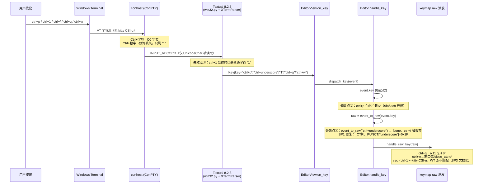
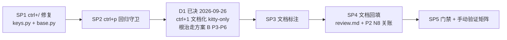

# Windows Terminal 键位失效修复计划（IKH1RA）

> 状态：**止血切片已执行（SP1–SP3，commit `b03e40f`/`ff3cfc0`/`678c02c`/`f26e65d`），真机复测 vim 键位仅 ctrl+q 恢复 —— 后续路线移交 [`keybinding-fix-wt/PLAN_B_v2_key_reachability.md`](keybinding-fix-wt/PLAN_B_v2_key_reachability.md)**
> 分支：`issues/keybinding-fix-wt`（worktree `d:/Programming/yate-keybinding-fix-wt`，
> 基线 `issues/refine-arch` f2a0e45；原分支指针 673b077 是该基线的祖先，重置无历史丢失）
> Issue：[Gitee IKH1RA — 部分 KeyBinding 在 Windows Terminal 下失效](https://gitee.com/jermaine/yate/issues/IKH1RA)
> 关联：`.trae/documents/code-review-fix-plans/P2_nice_to_have_plan.md` N8（ctrl+digit kitty CSI-u，暂缓备注"待 KeyBinding 在 WT 重构后彻底修复"——本计划即其落地）；
> 根治（`Ctrl+1` 等无 legacy 编码的键）走 `win_keybinding_plan.md` 方案 B（P3–P6），本计划不重复其内容
> 计划评审：2026-09-26 —— 与恢复的 `win_keybinding_*` 两份计划（同目录）合并校准，锚点为重构后（L0–L4）现状

---

## 一、问题定义

### 1.1 现象（Issue 原文）

Windows Terminal 下 `ctrl+p`、`ctrl+1`、`ctrl+/` 等失效；`ctrl+q`、`ctrl+w` 正常。

### 1.2 用户补充线索

- **vsc 键位下（历史上）是起作用的，vim（默认键位）下失效**；
- **只在真实终端环境浮现**——pilot/无头测试中 Textual 合成规范的 `Key` 事件，键名永远正确，因此全部测试绿灯，无法暴露终端侧字节形态差异。

---

## 二、根因分析（全部为实测证据）

### 2.1 终端侧：Textual 8.2.8 Windows 输入管线

1. `textual/drivers/win32.py` 的 `EventMonitor`（L267-277）用 `ReadConsoleInputW` 读取输入记录，
   **只取 `uChar.UnicodeChar`，完全忽略 `dwControlKeyState` / `wVirtualKeyCode` 修饰状态**；
   全仓无 `?9001`（win32-input-mode）支持。修饰键信息只能依赖 conhost 预转义进 `UnicodeChar` 的 C0 字节。
2. Windows Terminal **不支持 kitty keyboard protocol（不发送 CSI-u）**；conhost 对 Ctrl+字母
   预转义为 C0（`UnicodeChar = \x00..\\x1f`），**Ctrl+数字无 C0 编码**，修饰丢失。
3. `XTermParser` 实测输出（本仓库 venv，textual 8.2.8）：

| 实际输入字节 | Textual `event.key` | 结论 |
|---|---|---|
| `\x10`（ctrl+p） | `ctrl+p` | 正常 |
| `\x11`（ctrl+q） | `ctrl+q` | 正常 |
| `\x17`（ctrl+w） | `ctrl+w` | 正常 |
| `\x1f`（ctrl+/ 与 ctrl+_） | **`ctrl+underscore`** | 不是 `ctrl+slash` |
| Ctrl+1（WT 丢修饰） | `1`（或 NUL→`ctrl+@`） | **ctrl 修饰丢失** |
| `\x1b[49;5u`（kitty CSI-u） | `ctrl+1` | 仅 kitty 终端可达 |
| `\x1b1`（alt+1，ESC 前缀） | `inverted_exclamation_mark`（字符 `¡`） | alt+digit 不可用作替代键 |
| `\x05`（ctrl+e / ctrl+shift+e） | `ctrl+e` | 两者在 legacy 终端不可区分 |

### 2.2 yate 侧：按键分发链与失效点

分发链：`EditorView.on_key` → `Editor.handle_key`（`yate/editor.py` L554）→
event.key 快速分支 → `event_to_raw`（`yate/editor_view/keys.py` L30）→ `handle_raw_key` → keymap raw 派发。

| 键 | 重构后现状 | 根因 |
|---|---|---|
| `ctrl+q` | ✅ 正常 | `\x11` 命名正确，vsc/vim 均有 raw 绑定 |
| `ctrl+w` | ✅ 正常 | `\x17` 命名正确；vim 走 `try_window_prefix`，vsc 绑 close_tab |
| `ctrl+p` | ✅ **已修复**（重构副产品） | `9fa5ac8` 起在 `Editor.handle_key` 增加 `event.key == "ctrl+p"` 分支（L624），先于 keymap 分发，与键位无关 |
| `ctrl+/` | ❌ **仍失效**（vim/vsc 双键位、WT 与 Linux xterm 等所有 legacy 终端） | WT 发 `\x1f` → Textual 命名 `ctrl+underscore` → `textual_key_to_raw("ctrl+underscore")` 返回 `None` → 键被丢弃。现有映射表只登记了 `ctrl+/`（`_CTRL_PUNCT["/"]`），而真实终端永远不会产生这个名字（`tests/test_app_textual.py:74` 断言的名字恰是终端不发的那一个） |
| `ctrl+1` | ❌ **仍失效**（WT） | 修饰在 conhost/Textual 双双丢失，物理不可达；vsc `<ctrl-1>` 经 `parse_key` 编码为 kitty CSI-u `\x1b[49;5u`，仅 kitty 终端可用 |
| help 面板显示（附带） | ❌ 乱码 | `key_name("\x1f")` 返回原始控制字符（无 KEY_ALIASES 条目），vsc/vim 的 ctrl+/ 绑定在帮助面板显示为乱码 |

### 2.3 对"vsc 键位有效"线索的解释（历史行为）

Issue 提交时点（2026-09-19，`8cd80b2` 时代）`event.key == "ctrl+p"` 分支尚不存在（`9fa5ac8` 才引入）：
`\x10` 走 raw 派发——vsc 键位有 `<ctrl-p>` raw 绑定（quick_open），vim 键位无绑定且
`_handle_insert`/normal 未绑定路径吞键（`vim.py` L185 `return True`）→ **vsc 可用、vim 失效**，与线索吻合。
重构后该分支先于 keymap 分发，ctrl+p 在两种键位下均已恢复。

### 2.4 结论：重构后是否仍有问题

- `ctrl+p`：**已修复**（架构重构把 ctrl+p 提升为 L3 event.key 分支的副产品），只需补回归守卫；
- `ctrl+/`：**仍失效**，纯 yate 侧映射缺陷，可修；
- `ctrl+1`：**仍失效**，受 Textual（不读修饰状态）与 WT（无 kitty 协议）双重限制，yate 侧无法真正修复，只能文档化。

---

## 三、按键流转与修复点（Mermaid）

---

## 四、决策点（已于 2026-09-26 评审关闭）

| 编号 | 决策 | 选项与理由 | 结论 |
|---|---|---|---|
| D1 | `ctrl+1` 的处理 | A. 保留现有 kitty CSI-u 绑定 + manual/help 标注"仅 kitty/CSI-u 终端可用"；B. patch Textual 上游读 `dwControlKeyState`（**已否**：恢复的 `win_keybinding_plan.md` 已决策自建输入通道，不等上游）；C. 换替代键——**实测无干净替代**（alt+digit 被 Textual 映为 `¡`，ctrl+shift+digit 同样丢修饰） | **A**（立即止血）；根治交方案 B P3–P6（win32-input-mode 帧携带 VK/修饰键，`Ctrl+1` 真正可达） |
| D2 | "未映射键"诊断日志 | 在 `Editor.handle_key` 的 `raw is None` 分支（`yate/editor.py:630`）加 `log.debug("unmapped key: %s", event.key)`（tracing 默认关闭，零运行时成本）；方案 B P7 的 `:keys` 面板是其可视化延伸 | **采纳**（可观测性，5 行内改动） |

---

## 五、实施步骤（不执行，仅计划）

> **➡️ 可执行版本已拆分至子文件夹 [`keybinding-fix-wt/`](keybinding-fix-wt/README.md)**：
> `README.md`（总纲：串行铁律 + 每 SP 测试门禁 + commit 规范）+ SP1–SP5 各含精确文件行号锚点、
> 测试命令与验收标准。本节保留为概览，实施以子计划为准。

### SP0 — 勘察补证（可选，约 20min）

- **输入**：本计划 §2 的事实表。
- **改动**：无产品代码；如采纳 D2，本步骤改为 SP1 内一并落地。
- **动作**：在真实 WT 下启用 `YATE_TRACE`，按 `ctrl+1` / `ctrl+/` / `ctrl+p`，确认实际到达的 `event.key` 形态，回填 §2.1 表格的"WT 实测"列。
- **输出**：诊断记录追加至本文档附录。
- **验收**：三个键的实测键名与 §2.1 推断一致；如有出入，以实测修订 SP1/SP3。

### SP1 — `ctrl+/` 全平台修复 + help 显示修复（约 30min）

- **输入**：§2.2 失效点③。
- **改动**（2 个产品文件，各 1 行 + 测试）：
  - `yate/editor_view/keys.py`：`_CTRL_PUNCT` 增加 `"underscore": 0x1F` —— Textual 对 `\x1f` 字节的规范命名；
  - `yate/keymaps/base.py`：`KEY_ALIASES` 增加 `"\x1f": "ctrl-/"` —— `key_name()` 修复 help 面板乱码。
- **输出**：`event_to_raw("ctrl+underscore") == "\x1f"`；`key_name("\x1f") == "<ctrl-/>"`。
- **测试落点**：`tests/test_app_textual.py`（`textual_key_to_raw` 断言组，L62-81 附近）新增
  `textual_key_to_raw("ctrl+underscore") == "\x1f"`；`tests/test_key_notation.py` 新增
  `key_name("\x1f") == "<ctrl-/>"`。
- **验收**：新增断言全绿；pilot 用 `pilot.press` 无法直接发 C0，故以单元断言 + 冒烟 harness 键位切换场景为准；vim/vsc 下 ctrl+/ 均触发 `toggle_keymap`（raw 绑定已存在，`vim.py:113`、`vsc.py:102`）。
- **架构**：不新增导入方向（`keys.py → keymaps.base` 为既有依赖）；L2 内部映射表 + L1 别名表，无分层变化。

### SP2 — `ctrl+p` 回归守卫（约 20min）

- **输入**：§2.4 "已修复"结论——防未来重构回退（本次正是重构把它顺手修好的）。
- **改动**：仅测试。
- **测试落点**：`tests/test_app_textual.py`：构造 `Key(key="ctrl+p")` 直呼 `Editor.handle_key`（monkeypatch `open_file_palette`），断言被调用且返回 `True`；同法覆盖 `ctrl+1`（kitty 形态，断言 `focus_editor`）与 `ctrl+shift+e`。
- **输出**：3 条守卫测试。
- **验收**：`pytest tests/test_app_textual.py -q` 全绿；故意注释掉 `editor.py` L624 分支时守卫变红（手动演练一次后还原）。

### SP3 — `ctrl+1` 文档化落地（D1=A，约 30min）

- **输入**：D1 决策。
- **改动**（仅文档/资源）：
  - `yate/resources/manual.en.md` / `manual.zh.md`：键位表中 `ctrl+1`（focus editor）、`ctrl+p` 等标注终端兼容性——`ctrl+1` 注明 "CSI-u/kitty terminals only; not delivered by Windows Terminal/conhost"；
  - README 键位速览（如列出该键）同步；
  - help 面板无需改代码：`key_name("\x1b[49;5u")` 经 CSI-u 正则显示 `<ctrl-1>`，已正常。
- **输出**：中英文 manual 一致的兼容性标注。
- **验收**：文档评审通过；`tools/changelog` 若对 manual 有校验场景，跑对应冒烟场景。

### SP4 — 文档回填 + N8 关账（约 30min）

- **输入**：SP1-SP3 的实施结果。
- **改动**：
  - `.trae/issues/review.md`：历史问题区新增「Windows Terminal 键位失效（IKH1RA）」条目，标注 `ctrl+p` 已随重构修复、`ctrl+/` 由本计划修复、`ctrl+1` 受终端限制文档化；
  - `.trae/documents/code-review-fix-plans/P2_nice_to_have_plan.md`：N8 状态从 ⏸ 改为 ✅（ctrl+/ 修复落地 + ctrl+1 kitty-only 说明），撤销"待 KeyBinding 在 WT 重构后彻底修复"备注；
  - 本文档状态改为"已实施"，附实测数字（pyright/pytest/冒烟）与偏离校准。
- **输出**：三处文档与代码状态一致。
- **验收**：交叉引用检查——review.md、P2、本计划、Gitee issue 回复草稿四方口径一致。

### SP5 — 门禁与手动验证矩阵（约 40min）

- **门禁**（全部必须通过）：
  1. `python -m pyright yate/ tests/ tools/` → 0 诊断；
  2. `python -m pytest tests/ -q` → 全绿；
  3. 冒烟 harness 全场景通过。
- **手动矩阵**（真实终端，vim/vsc 两键位 × 5 键）：

| 键 | WT | conhost | VS Code 终端 |
|---|---|---|---|
| ctrl+p（文件面板） | ☐ | ☐ | ☐ |
| ctrl+/（键位切换） | ☐ | ☐ | ☐ |
| ctrl+q / ctrl+w（回归） | ☐ | ☐ | ☐ |
| ctrl+1（预期：WT 失效、文档化） | ☐ | ☐ | ☐ |

- **输出**：矩阵勾选结果回填本文档。
- **验收**：除 ctrl+1（已文档化的终端限制）外全部可用。

---

## 六、模块设计自检（四大维度）

- **健壮性**：`_CTRL_PUNCT`/`KEY_ALIASES` 均为纯查表扩展，无新增失败路径；D2 诊断日志走既有 `tracing`（默认关闭，零开销）；不触碰按键消费语义（R10：未消费键继续 fall-through，`ctrl+underscore` 从"静默丢弃"变为"映射后消费"，不产生二次派发）。
- **可维护性**：修复点即根因点（映射表缺项），无绕行逻辑；测试与既有断言组同文件同风格；文档四处口径统一。
- **性能**：查表项 +1，无热路径变化。
- **扩展性**：canonical 名与别名归一的长期形态由方案 B `yate/keyproto/aliases.py` 承担（P1），本计划的两张表（`_CTRL_PUNCT`/`KEY_ALIASES`）届时按 P1.2 迁入并保留薄包装；D2 的未映射键日志是方案 B P7 `:keys` 排障面板的数据前身；kitty CSI-u 形态由 Textual 解析为规范键名，yate 只面向 `event.key` 名字，天然支持协议差异。

## 七、架构合规校验

- 改动文件：`yate/editor_view/keys.py`（L2）、`yate/keymaps/base.py`（L1）、`yate/resources/manual.*.md`（资源）、tests、`.trae` 文档——**不新增任何 import 方向**（`keys.py → keymaps.base` 为既有依赖）；
- 不新增 `Protocol` / `TYPE_CHECKING` / `Any` / `# type: ignore`；不涉及 widget id（R9）、按键二次派发（R10）、表单装载（R7）；
- pyright strict 零诊断为合并门槛（SP5 门禁 1）。

## 八、风险与回滚

| 风险 | 等级 | 缓解 |
|---|---|---|
| `ctrl+_` 与 `ctrl+/` 在 legacy 终端同为 `\x1f`，映射修复后 ctrl+_ 也触发键位切换 | 低 | 两者本就不可区分，vim 语义中 ctrl+_ 亦少用；help 面板标注 `<ctrl-/>` |
| WT 实测形态与推断不符（SP0 出入） | 低 | SP0 先行取证，以实测修订后续步骤 |
| `textual_key_to_raw("ctrl+/")` 既有断言（test_app_textual.py:74）与新增 `ctrl+underscore` 并存 | 无 | 两个名字都映射到 `\x1f`，keep both（Textual 各版本命名差异兜底） |

## 九、本计划不覆盖（显式排除）

- `Ctrl+1` 等无 legacy 编码键的根治：`win_keybinding_plan.md` 方案 B（自建 Windows 输入通道 + win32-input-mode/kitty 协商，P3–P6）；
- `yate/keyproto/` 子包与名字层（canonical 索引）整体接入：方案 B P1/P2 剩余项（P2.1/P2.2/P2.5/P2.6/P2.7）；
- `ctrl+e` / `ctrl+shift+e` 在 legacy 终端不可区分的既有行为（vsc 键位两者同义，无用户可见缺陷）；
- vim normal 模式下 `ctrl+1` 到达为字符 `1` 进入 count 前缀——与真实 vim 行为一致，属终端限制的正确降级。
