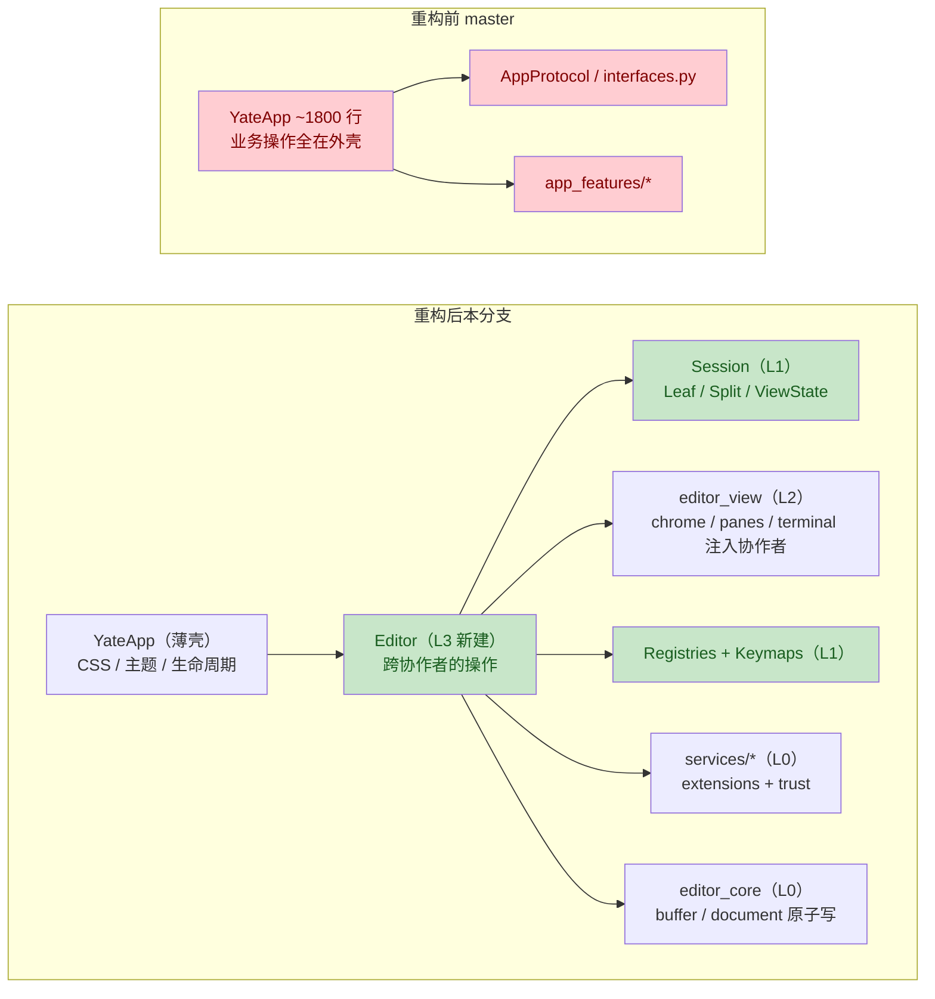
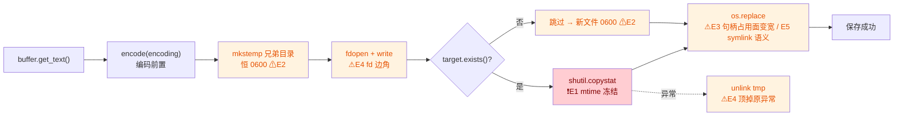

# Code Review 报告 — `issues/appprotocol-refactoring`（2026-09-24 00:58）

> 审查对象：分支 `issues/appprotocol-refactoring` 相对 `master`（merge-base `673b077`），
> HEAD = `33584e6`（工作区变更已随该提交落盘）。
> 规模：54 个提交，132 个文件，+16655 / −4469 行（其中 `yate/` 源码 52 文件 +4101 / −3260）。
> 方法：5 个分组审查子代理（L3/L4 外壳、L1 会话注册表、L2 组件、服务与流程、L0 内核与测试）
> → 2 个独立验证员全量复核 41→43 条 → 主代理对全部 Major 逐一现场核实。
> 门禁（主代理实跑）：`pyright yate/ tests/ tools/` **0 errors**；`pytest tests/ -q` **全绿**。

---

## 一、变更意图

本分支完成「去 AppProtocol」分层重构：删除 `AppProtocol` / `interfaces.py` / `app_features/*`，
把 ~1800 行的 `YateApp` 拆薄为纯 Textual 外壳（CSS、主题桥、生命周期），全部编辑器状态与操作
下沉到新建的 L3 `Editor`；新建 L1 `session.py`（`Leaf`/`Split`/`ViewState` 窗格树纯操作）与
`registries.py`（`ActionRegistry` / `CommandRegistry`）；L2 组件全部改为构造注入具体协作者；
新增 `trust.py`（工作区信任存储，防陌生仓库自动执行其 `./extensions` 代码）；`Document.save`
改造为 mkstemp + `os.replace` 原子写；扩展系统经 `ExtensionContext` 暴露具体注册表。

**总体结论**：迁移忠实于分层方案，R1–R11 架构边界全部落实（无 Protocol 倒退、无 TYPE_CHECKING、
R7/R9/R10 经调用链核实合规），门禁全绿。但重构过程引入了 **4 处可复现的功能回归**（下述 Major），
另有若干存量缺陷在本次大改文件中未顺手消除。

### 变更总览

**架构迁移（技术流）：**

**原子写保存链（本次改动核心路径，标注缺陷位置）：**

---

## 处置摘要（2026-09-24）

**Major（4 条）**：全部修复并附守卫（逐条标注见下）。其中 M2 / M3 经 `git blame` 校准为**存量缺陷**
（`ecadd41` / `bcd0426` 引入，`2ee2586` / `9fa5ac8` 仅搬运），原报告"均为本次引入"的归类对这两条不成立。

**Minor 中本轮已处理（13 条）**：

- `run_worker` 传裸协程 → 改 `partial(...)`（`editor.py::only_pane` / `close_pane`）
- `Editor.message()` 恢复 `mounted` 守卫并调 `status_bar.refresh_status()`
- `new_buffer` / `insert_char` / `close_completion` 补 docstring（规范 §2.1）
- `registries.py` 遗留 `Dict` / `List` → 内置泛型（规范 §3.2）
- 行宽超限：`vim.py` 的 F5 绑定、`actions.py` 三处 `reg(...)` 折行
- `trust` 权限：已存在的 `~/.yate` 也收紧为 `0700`、store 文件 `0600`（POSIX；修掉"注释与保证不符"）
- rc 声明路径即 bundled 目录时的**假 shadowed 警告** → 先比较两侧 `resolve()` 再告警
  （守卫 `test_rc_declaring_the_bundled_dir_does_not_warn_shadow` 于同日补齐——`cf889b5`
  提交信息声称的 5 组守卫中此组实测缺位）
- `explorer.py` 新增签名的 `X | None` → `Optional[X]`（统一风格）
- `palette.py` 提示列对齐改用 `theme.cell_len()`（CJK 文件名不再逐行左移）
- `document.py`：新文件按 umask 落盘（不再 owner-only `0600`）；`fdopen` 失败不再泄漏 fd；清理失败不覆盖原异常；
  `except BaseException` 补理由注释；docstring 注明 symlink/硬链接与 Windows 句柄语义

**Minor 中第二轮已处理（此前建议单独立项的 2 条，2026-09-24 补做）**：

- `--version` 拖入整个 TUI 栈 → `version_lines` 下沉到 `cli.py`（叶子模块），`--version`
  不再导入 `yate.editor` / `textual`（守卫 `test_version_never_imports_the_tui_stack`；
  实测含解释器启动共 142ms）。
- F 键 dispatch 失败行为不一致 → 与扩展绑定失败路径统一为「报告未知 action 后吞键」
  （vim 语义：F 键由 keymap 持有、未绑定也吞）；测试重写为
  `test_binding_to_an_unknown_action_is_reported_and_consumed`。

**存量 Minor（报告 L200 起）**：未在本轮范围内（操作符删除不写寄存器、PTY 复活、渲染热路径 LSP 双查询等）。

---

## 二、问题清单

严重级定义：**Critical** = 数据丢失/安全漏洞；**Major** = 可复现的功能缺陷（多为本次引入）；
**Minor** = 边界/兼容/风格问题；**Suggestion** = 改进建议。
标注「存量」= 非本分支引入（重构保留/沿袭），标注平台限定。

### 🔴 Critical — 无

### 🟠 Major（4 条，均为本次引入，主代理逐一现场核实）

- [x] **M1（A1）`cycle_tab` 丢失搜索状态重置，`:bn`/`:bp` 后搜索串扰** — ✅ 已修复：`cycle_tab` 补 `session.reset_search()`；守卫 `tests/test_app_textual.py::test_cycle_tab_resets_the_previous_search`（真实搜索 → `:bn` → 断言 `matches == []`、`query == ""`、`n` 不越界）
  [editor.py:475-483](../../yate/editor.py#L475-L483)
  旧 `app.py` 的 `cycle_tab` 在切换后重建 `SearchEngine`；重构后只调 `session.cycle(delta)`，
  对比 `open_path`/`close_tab`/`new_buffer` 均有重置。`SearchEngine.matches` 缓存的是**旧文档**
  的 `(row, start, end)`，`next()` 不重扫直接设置新 buffer 光标。
  **复现**：文件 A 中 `/pattern` 多行匹配 → `:bn` 切到文件 B → 高亮按 A 的坐标画在 B 上；
  `n` 跳转坐标越界。**修复**：`show_doc` 后补 `self.session.reset_search()`。

- [x] **M2（B1）`remove_node` 收缩 split 时 sizes 按位置错配** — ✅ 已修复：按 `(child, size)` 成对过滤后再归一化；守卫 `test_remove_node_keeps_each_survivor_fraction` / `test_remove_node_renormalizes_nested_survivors`。**归属校准**：该行自 `ecadd41` 起即存在（`2ee2586` 仅搬运），属**存量缺陷**而非本次引入
  [session.py:303-321](../../yate/session.py#L303-L321)
  `node.sizes[: len(new_children)]` 取的是**前** N−1 个 size，而非**存活子节点**的 size
  （children 与 sizes 按下标平行）。**复现**：三分栏 sizes `[0.5, 0.25, 0.25]`，关闭第一个窗格
  → 存活者被归一化为 `[0.667, 0.333]`，正确应为 `[0.5, 0.5]`；关闭中间窗格同理错配，
  `panes.apply_sizes` 直接消费该错误比例。
  **修复**：先按索引过滤 `(child, size)` 对，再用存活 size 列表做 `_normalized`。

- [x] **M3（D1）路径补全对尾分隔符前缀产出损坏候选** — ✅ 已修复：尾分隔符时 `parent = Path(expanded)`、`base = ""`（prefix 本体就是要列出的目录）；守卫 `test_path_prefix_with_trailing_separator_lists_the_directory`。**归属校准**：自 `bcd0426` 起存在（`9fa5ac8` 仅搬运），属**存量缺陷**
  [prompt_completion.py:107-138](../../yate/prompt_completion.py#L107-L138)
  `Path("src/")` 被 pathlib 规范化吞掉尾斜杠 → `p.name == "src"`，走父目录分支；
  `dir_part = prefix[: len(prefix) - len(base)]` = `"src/"[:1]` = `"s"`，
  候选变成 `"s" + entry.name`（如 `ssrc`），且匹配范围错到父目录。
  **复现**：工作区根输入 `:e src/` 触发补全，得到以 `s` 开头的乱串而非 `src/` 内条目。
  **修复**：入口检测 `expanded.endswith(("/", os.sep))`，尾分隔符时令 `parent = Path(expanded)`、
  `base = ""`、`dir_part = prefix`。

- [x] **M4（E1）`copystat` 把旧 mtime 带到新文件，保存后时间戳冻结** — ✅ 已修复：`copystat` 后 `os.utime(tmp)` 把时间戳复位为当前时间（权限位/xattr 仍继承）；守卫 `tests/test_editor_core.py::test_save_writes_a_fresh_mtime`
  [document.py:140-152](../../yate/editor_core/document.py#L140-L152)
  `shutil.copystat(target, tmp)` 复制 mode 之外还复制 atime/mtime，`os.replace` 后文件的
  mtime = **上次保存**时间而非 now。docstring 把「复制时间戳」写成了特性，但对外部消费者
  （`make`、轮询型文件监视器、mtime 比对的备份工具）是真实功能缺陷；旧实现（write_bytes）
  mtime = 保存时刻。**修复**：只复制 mode（`os.chmod(tmp, stat.S_IMODE(...))`），或
  `copystat` 后 `os.utime(tmp)` 复位时间戳。

### 🟡 Minor（27 条）

**本次引入：**

- [x] **`run_worker` 传裸协程对象，与模块自身约定相悖** —
  [editor.py:667-682](../../yate/editor.py#L667-L682)
  `only_pane`/`close_pane` 传 `self.panes.only_active()` 协程对象；同文件 `_split_pane` 用
  `partial(...)`，且 `_lsp_documents_closed` docstring 明确「绝不传协程，worker 未启动时泄漏
  never-awaited coroutine」。**修复**：改 `partial(self.panes.only_active)` 等。
  *✅ 已修复（2026-09-24）。*

- [x] **`--version` 拖入整个 TUI 栈** — ✅ 已修复（2026-09-24 补做）：`version_lines` 下沉到
  `cli.py`（叶子模块，仅需 `platform` 与包级 `__version__` / `__description__`）；`diagnostics.py`
  删除该函数、import 收窄为 `__version__`。守卫：`tests/test_cli.py::test_version_never_imports_the_tui_stack`
  （子进程断言 `yate.editor` / `textual` 均不在 `sys.modules`）；内容用例迁至 `test_version_lines_content`。

- [x] **`Editor.message()` 相比旧版丢两处行为** — [editor.py:303-305](../../yate/editor.py#L303-L305)
  旧版写消息后调 `status_bar.refresh_status()` 且有 `mounted` 守卫；新版仅 `prompt_bar.write`，
  扩展经 `api.message` 提示时 mode chip 可能短暂过期、未挂载时直接写入。
  **修复**：恢复 `refresh_status()` 并按 `self.mounted` 分流缓冲。*✅ 已修复（2026-09-24）。*

- [x] **三个公共方法缺 docstring** —
  [editor.py:439](../../yate/editor.py#L439)、[621](../../yate/editor.py#L621)、[1190](../../yate/editor.py#L1190)
  `new_buffer` / `insert_char` / `close_completion`，违反规范 §2.1。*✅ 已补（2026-09-24）。*

- [x] **新建代码用遗留 `Dict`/`List` 泛型** — [registries.py:17,38,58](../../yate/registries.py#L17-L58)
  违反 §3.2「新代码不使用 Dict/List」；同文件 62/71/79 行已是小写泛型，风格自相矛盾。
  *✅ 已修复（2026-09-24）。*

- [x] **行宽超 100 上限** — [vim.py:106](../../yate/keymaps/vim.py#L106)（102 字符）、
  [actions.py:38](../../yate/actions.py#L38)、[70-71](../../yate/actions.py#L70-L71)（105/108 字符）
  *✅ 已折行（2026-09-24）。*

- [x] **F 键 dispatch 失败时行为不一致** — ✅ 已修复（2026-09-24 补做）：统一为「报告后吞键」——
  `dispatch()` 仍报 `unknown action: ...`，但 vim 模式下 F 键由 keymap 持有（未绑定也吞，
  不向 Textual 冒泡普通键），与 `_extension_binding` 失败被吸收的行为一致。
  测试重写：`test_binding_to_an_unknown_action_is_not_swallowed` →
  `test_binding_to_an_unknown_action_is_reported_and_consumed`（断言返回 True 且消息仍显示）。

- [x] **trust 存储权限保证与注释不符** — [trust.py:61-68](../../yate/services/trust.py#L61-L68)
  `0o700` 仅在目录**新建**时生效，已存在的宽松目录不收紧；store 文件本身按默认 umask（0644）
  创建，信任列表对同机其他用户可读；Windows 忽略 mode（平台限定）。
  **修复**：已存在目录时 `os.chmod`（POSIX），或修正注释。*✅ 已修复（2026-09-24，POSIX 侧收紧）。*

- [x] **rc 声明路径即 bundled 目录时产生假 shadowed 警告** —
  [extensions.py:489-499](../../yate/services/extensions.py#L489-L499)
  同一 resolved path 去重返回自身记录，`owner == record` 仍触发「shadowed by the bundled default」。
  **修复**：比较 `owner.path.resolve() != record.path.resolve()` 再告警。
  *✅ 已修复（2026-09-24）；守卫 `tests/test_app_textual.py::test_rc_declaring_the_bundled_dir_does_not_warn_shadow`
  （同日补齐——`cf889b5` 提交信息声称该组有守卫，实测缺位，已补）。*

- [x] **explorer 混用 `X | None` 与 `Optional[X]`** —
  [explorer.py:124,146-148,157,163](../../yate/editor_view/explorer.py#L124-L163)
  新增签名用 `| None`，同文件 prompt 流用 `Optional`，违反 §3.2。**修复**：统一 `Optional[...]`。
  *✅ 已修复（2026-09-24）。*

- [x] **palette 提示列对齐用 `len()` 而非 cell 数，CJK 文件名错位** —
  [palette.py:266](../../yate/editor_view/palette.py#L266)
  `pad = max(1, 30 - len(display))`，宽字符占 2 cell 导致 hint 列逐行左移。
  **修复**：改 `theme.cell_len(display)`。*✅ 已修复（2026-09-24）。*

- **Windows `os.replace` 对外部占用句柄的兼容面变窄** —
  [document.py:149](../../yate/editor_core/document.py#L149)
  需 `FILE_SHARE_DELETE`；杀软/预览器持句柄时旧版能存、新版抛 `PermissionError`（错误路径安全，
  无数据丢失，Windows 限定）。

- [x] **首次保存的新文件权限 0600（POSIX 限定）** —
  [document.py:140-148](../../yate/editor_core/document.py#L140-L148)
  mkstemp 恒 0600 且 `copystat` 仅在目标存在时调用；新文件落盘 owner-only，旧实现走 umask(0644)。
  **修复**：目标不存在时 `os.chmod(tmp, 0o666 & ~umask)`。
  *✅ 已修复（2026-09-24）；守卫 `test_save_resets_the_timestamp_and_keeps_permission_bits`（timestamp/mode 一并覆盖）。*

- [x] **保存路径两个罕见边角** — [document.py:144-152](../../yate/editor_core/document.py#L144-L152)
  ① `os.fdopen(fd)` 本身抛错时 fd 泄漏；② except 内 `tmp.unlink` 若抛错会顶掉原始异常
  （`__context__` 仍留痕）。**修复**：fdopen 移入 try；unlink 包 try/except OSError。
  *✅ 已修复（2026-09-24）。*

- [x] **symlink/硬链接语义变化未声明** —
  [document.py:147-149](../../yate/editor_core/document.py#L147-L149)
  `os.replace` 把符号链接**本体**替换为普通文件（旧实现写穿透到目标），硬链接分叉。
  **修复**：保存前 resolve，或文档注明行为变化。*✅ 按「文档注明」处置（2026-09-24，docstring 注明两类语义）。*

- **过时注释与已落地行为矛盾** —
  [test_app_textual.py:3781-3786](../../tests/test_app_textual.py#L3781-L3786)
  注释仍称原子写是「separate hardening change」，实际已实现。
  **修复**：更新注释并断言磁盘字节完好。

- **`except BaseException:` 缺理由注释** —
  [pty_proc.py:78](../../yate/editor_term/pty_proc.py#L78)、
  [document.py:150](../../yate/editor_core/document.py#L150)
  同文件其他宽捕获均有理由注释，这两处没有（re-raise 不吞异常，纯风格）。

**存量（非本分支引入，大改文件中未顺手消除）：**

- [ ] **操作符删除（`dw`/`d$`）不写寄存器，`p` 粘贴旧内容** —
  [vim.py:477-490](../../yate/keymaps/vim.py#L477-L490)
  `buf.delete_selection()` 返回值被丢弃且该方法不自设 register；对照 visual 路径
  （vim.py:217-219）显式写 `buf.register`。复现：`yy` → 移动 → `dw` → `p` 粘出旧行。
  **修复**：同 visual 路径捕获返回值写寄存器。*存量（旧 vim.py 相同），验证员一致建议降级。*

- [ ] **PTY 启动失败后终端永久空白无法复活** —
  [terminal.py:104-121](../../yate/editor_view/terminal.py#L104-L121)
  `self.proc = proc` 在 `await proc.start()` **之前**赋值；spawn 失败只 settle future 不调
  `_on_exit`，`dead` 恒 False → `started` 恒 True → 重生分支永不触发，只能重启应用。
  *存量（旧 terminal.py 逻辑相同）；本分支把 spawn 生命周期收进新写的 `TerminalPanel`，
  恢复契约已是新代码职责。**修复**：`spawn_shell` 失败分支复位 `proc=None`/`dead=True`。*

- [ ] **`add_binding` 覆盖 `_index` 但旧 binding 残留，help 双条目** —
  [keymaps/base.py:229-240](../../yate/keymaps/base.py#L229-L240)
  modals 帮助遍历 `bindings` 列表，同 raw key 展示两条。*存量。*

- [ ] **visual 模式 `gg` 永不跳转，条件为死代码** —
  [vim.py:240-245](../../yate/keymaps/vim.py#L240-L245)
  `pending` 恒空且 `"g"` ∈ `_MOTION_CODES`，第二分支不可达。*存量。*

- [ ] **渲染热路径每行重复查询 LSP 诊断两次** —
  [editor_view/editor.py:424,576](../../yate/editor_view/editor.py#L424-L576)
  `render_line` 与 `_diagnostic_underlines` 对同一行各查一次（每次遍历全诊断）。
  *存量；本轮大改该文件，可顺手把结果传参消除。*

- [ ] **文档搜索每按键全量重渲染所有块 widget，无防抖** —
  [manual.py:341-379](../../yate/editor_view/manual.py#L341-L379)
  大文档输入卡顿。*存量。* **修复**：仿 `EditorView._HIGHLIGHT_DEBOUNCE_S` 用 `call_later` 防抖。

- [ ] **失败扩展模块残留 `sys.modules`** —
  [extensions.py:389-423](../../yate/services/extensions.py#L389-L423)
  `exec_module` 抛异常后不清理。*存量。*

- [ ] **`bind_key` 的 keymap 名拼写错误静默无绑定** —
  [extensions.py:290-301](../../yate/services/extensions.py#L290-L301)
  `keymaps.get(target)` 返回 None 直接跳过无提示。*存量。*

- [ ] **L0 config 惰性 import L2 `editor_view.theme`，层级方向违规** —
  [config.py:171-173](../../yate/config.py#L171-L173)
  存量耦合仅改为惰性；建议后续下沉或注入回调，并在架构规则中登记（类似 R11 冻结）。

- [ ] **`visible_tree` 递归无 symlink 环防护** —
  [workspace.py:255-272](../../yate/services/workspace.py#L255-L272)
  同轮已修 `walk_files`，此递归路径未覆盖，展开指向祖先的链接可栈溢出。*存量，Windows 影响有限。*

### 💡 Suggestion（12 条）

- [ ] **`KeymapSet` 空字典时抛裸 `StopIteration`** —
  [keymaps/registry.py:19-21](../../yate/keymaps/registry.py#L19-L21)
  显式 `raise ValueError(...)` 更可定位。
- [ ] **两个无关类型同名 `Action`**（callable 别名 vs dataclass）—
  [base.py:160](../../yate/keymaps/base.py#L160) / [registries.py:26](../../yate/registries.py#L26)，
  扩展作者易混淆；别名可改 `ActionFunc`。
- [ ] **`if key == "o": pass` 死代码** — [vim.py:372-373](../../yate/keymaps/vim.py#L372-L373)。*存量。*
- [ ] **`dg`/`yg` 空 motion 仍报 "deleted"/"yanked"** —
  [vim.py:303-321](../../yate/keymaps/vim.py#L303-L321)：`"g"` 应排除出操作符 motion。
- [ ] **`handle_key` docstring「every check is pure」不实** —
  [editor.py:529-535](../../yate/editor.py#L529-L535)：
  `try_window_prefix` 变更 `_window_pending`、popup 分支执行 `accept_completion`；当前无双重派发，
  但该表述会误导后续维护者。
- [ ] **`PromptBar.on_cancel` 属性名落入 Textual `on_*` 反射命名空间** —
  [commandline.py:213](../../yate/editor_view/commandline.py#L213)
  实例属性非类方法、当前无冲突消息，纯命名隐患；可改 `cancel_hook`。
- [ ] **`score += 0  # consecutive: best` 死语句** —
  [palette.py:58-59](../../yate/editor_view/palette.py#L58-L59)。
- [ ] **删除最后选中项后 `_last_selected` 悬挂** —
  [explorer.py:107,119-123](../../yate/editor_view/explorer.py#L107-L123)
  `_restore_cursor` 未命中时清 `None`。
- [ ] **内部导入组非字母序** — [extensions.py:49-53](../../yate/services/extensions.py#L49-L53)。
- [ ] **trust.py 全用 `Path | None`**（[trust.py:27,50,71](../../yate/services/trust.py#L27-L71)）
  与规范 `Optional[X]` 不一致（与 Minor 的 explorer 条目同类，合并修）。
- [ ] **dirty 状态下每次 `modified` 查询 O(N) tuple 分配** —
  [document.py:86-88](../../yate/editor_core/document.py#L86-L88)
  状态栏每键查询；可按 `content_edits` 缓存上次判定（代码注释已自认知该权衡）。
- [ ] **harness 重写行沿用 `# type: ignore`** —
  [harness.py:274-283](../../tools/smoke_test/harness.py#L274-L283)
  工具代码沿旧模式；若属既定豁免，补理由注释归档。

---

## 三、四维度结论

| 维度 | 结论 |
|---|---|
| **功能正确性** | 4 处 Major 回归（M1–M4）+ 2 处存量功能缺陷（操作符寄存器、PTY 失败卡死）；其余逻辑与旧 app.py 逐段比对忠实：`close_tab` LSP 通知经 session 回调等价、`content_edits` 记账推演自洽、search clamp 正确、补全防抖与按键分工无吞键回归。 |
| **性能** | 无新增深循环/重复计算。`modified` O(N) 兜底与 `manual` 无防抖为存量；`render_line` 重复查诊断为存量可顺手消；fc-cache 带 timeout 不阻塞。 |
| **可读性可维护性** | docstring 质量整体高（散文式 + Sphinx 引用）；日志全部 `%` 占位、无裸 except 漏注释（除 2 处 BaseException）；瑕疵集中在缺 docstring ×3、遗留泛型、行宽、死代码 ×3、过时注释 ×1。 |
| **设计质量** | R1–R11 全部合规：app.py 薄壳、R7 装载点正确、R9 id 全由 Editor 传入、R10 无二次派发（含新增的「未知 action 报错 fall-through」路径经调用链核实安全）、R2/R6 零违规、`__init__.py` 惰性达成。原子写方向正确、失败恢复完整；缺口为 mtime/权限/句柄三个边角。存量方向违规仅 config→editor_view 一处（已登记）。 |

## 四、验证与置信度说明

- 每条问题经 **2 个独立验证员**复核（存在性 + 严重级 + 误报排除）；分歧处理：
  B2/C1 因属存量由 Major 降级 Minor（保留，因影响真实且触及新代码契约）；E2 因 POSIX-only
  降级 Minor；C5 因实例属性不进 Textual 类扫描保持 Suggestion；B6 中 vim.py:106 行宽
  由主代理实测 102 字符裁定成立。
- 全部 4 条 Major 由主代理**亲自读码核实**（非仅引用子代理结论）。
- 排除项：验证中发现但不足以成条的表达问题（如「同文件他处均有 noqa」对 document.py
  不准确）已修正表述，无整条剔除。
