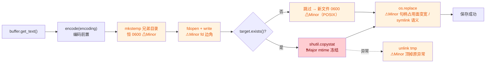

# yate Code Review

## 历史问题

- [x] 输入时候，屏幕会闪烁，影响输入体验，加入放抖动机制。
- [x] yate 输入一个不存在的文件名，进程会卡住无任何输出，希望和vim一样，直接进入enew新建一个bug。

---

## 全量代码审查 — 2026-09-16

> **2026-09-23 复核**：对照当前代码逐条核实（其间完成 L4→L0 分层重构，原
> `app_features/*` 路径已迁移）。已修复的条目标记 `[x]` 并附证据；经核实
> 不再成立的条目收录在文末「已失效条目」章节。
>
> **修复计划**（位于
> `.trae/documents/code-review-fix-plans/`；2026-09-24 起随状态复核更新，
> 已修复 / 方案变更 / 补入条目均标注在各计划内）：
>
> - Critical → [P0_critical_fixes_plan.md](../documents/code-review-fix-plans/P0_critical_fixes_plan.md)
> - Suggestion → [P1_suggestions_plan.md](../documents/code-review-fix-plans/P1_suggestions_plan.md)
> - Nice-to-have → [P2_nice_to_have_plan.md](../documents/code-review-fix-plans/P2_nice_to_have_plan.md)

### 🔴 Critical（必须修复）→ 计划：[P0](../documents/code-review-fix-plans/P0_critical_fixes_plan.md)

- [x] **`:wq` 保存失败时仍退出，导致数据丢失** — `app_features/commands.py:54`
  `_wq` 调用 `save_document()` 后无条件 `quit(force=True)`。若保存失败（无路径、用户取消、权限错误），`force=True` 跳过未保存检查直接退出，丢失工作内容。
  **修复：** 保存失败时检查 `doc.modified` 或让 `save_document` 返回成功标志，仅在保存成功时退出。

- [x] **补全弹窗过期检查仅比较行号，可能导致文本损坏** — `app_features/completion.py:121`
  LSP await 返回后仅检查 `buf.row != row`。若用户在同一行继续输入（列号变化），过期补全仍显示，接受后 `replace_range` 使用过时坐标。
  **修复：** 同时比较 `col` 和/或前缀文本。

- [x] **文件夹删除关闭标签时未通知 LSP** — `app_features/explorer.py:107`
  删除文件夹导致已打开标签关闭时，文档从 `app.docs` 移除但未调用 `lsp.on_document_closed()`，LSP 服务器保留过时的 `didOpen` 状态。
  **修复：** 遍历被关闭的文档并调用 `lsp.on_document_closed()`。

- [x] **LSP `_read_loop` 未捕获所有异常，导致请求永久挂起** — `editor_lsp/client.py:345`
  意外错误（OSError、ValueError 等）会静默终止读取循环，而客户端仍保持 `READY` 状态，所有待处理请求永久挂起。
  **修复：** 在 `_read_loop` 中添加 `except Exception` 捕获，触发客户端状态转为 `FAILED`。
  *✅ 已修复（2026-09-24，提交 `e5a3001`）— [client.py:429-465](../../yate/editor_lsp/client.py) 失败收尾
  提取为 `_fail_pending()`，`_read_loop` 增加 `except Exception` 兜底（`log.exception` + fail pending）
  并在 `finally` 对非 STOPPED 退出统一置 `FAILED`；`start_request` 在 FAILED 态直接拒绝新请求。
  守卫 `test_malformed_frame_marks_failed_and_fails_requests`（畸形帧 → FAILED、在途请求以异常
  结束、后续请求立即失败）。*

- [x] **LSP `register_server` 竞态条件** — `editor_lsp/manager.py:118`
  取消正在进行的启动任务是 fire-and-forget 方式。被取消任务的 `finally` 块可能稍后移除新替换任务在 `_starting` 中的条目，导致其失去跟踪。
  **修复：** 在取消前检查任务是否为当前活跃任务，或使用取消安全的方式清理。
  *✅ 已修复（2026-09-24，提交 `dc1f3ac`）— [manager.py:227-235](../../yate/editor_lsp/manager.py)
  `ensure_client` 收尾改为 identity 条件弹出（「谁跟踪谁清」），被取消路径的清理仍由
  `register_server` 同步过滤完成。守卫 `test_register_replace_race_keeps_new_starting_task_tracked`
  （慢启动中途替换配置：旧任务被取消、新任务条目不被旧收尾弹掉、并发只产生一个 client）。*

- [x] **`replace_all` 修改行后未钳制光标位置** — `editor_core/search.py:148-170`
  批量替换后光标列号可能超出新的（更短的）行长度。在下次重绘前读取 `buffer.col` 的代码会看到无效位置。
  **修复：** 替换循环结束后钳制光标：`c = min(c, len(buffer.lines[r]))`。
  *✅ 已修复（核实 2026-09-24）— [search.py:143-151](../../yate/editor_core/search.py) 替换循环结束
  后、记录 undo 前做 `min(col, len(line))` 钳制；守卫为冒烟 harness 的全局 `invariant:cursor_col`。*

- [x] **补全弹窗拦截所有按键，包括 Ctrl+S、Ctrl+Z** — `editor_view/editor.py:163`
  补全弹窗打开时所有按键被消费，用户无法保存或撤销。
  **修复：** 对高优先级命令（Ctrl+S、Ctrl+Z、Ctrl+Q 等）放行到 keymap 分发。
  *已修复（2026-09-23）— [editor.py:551-570](../../yate/editor.py) 现在只消费 `tab` / `enter` / `up` / `down` / `escape`，
  其余按键 fall-through 到正常分发（`event_to_raw` → `handle_raw_key` → `CompletionController.after_editor_key`）：
  字符继续写入缓冲区并按新前缀重新查询候选，`Ctrl+S` / `Ctrl+Z` / `Ctrl+P` 等全局快捷键恢复可用。
  守卫见 `tests/test_app_textual.py::test_completion_popup_keeps_typing_and_filters`、冒烟场景 `regress_completion_staleness`（字符落盘且弹窗按新前缀重查）
  与 `regress_completion_popup_keys`（键位分工：可打印字符与全局键 fall-through，`tab`/`down`/`escape` 仍归弹窗）。
  *归因（2026-09-23 复核修正）：吞键代码由 `e70dd15`（2026-09-12）引入，但当时 `EditorView.on_key` 对未识别键不 `stop()`，
  事件会冒泡到 `YateApp.on_key` 的 fallback 路由，因此 **master（`673b077`）实测无此问题**：弹窗打开时输入 `p`/`h` 正常进缓冲区（`alp`/`alph`）、`Ctrl+Z` 正常撤销。
  本轮分层重构（Plan D）把 `EditorView.on_key` 改为无条件 `stop()` 并把弹窗分支搬进 `Editor.handle_key`，未消费的键不再冒泡，该缺陷才首次真正显现。*

- [x] **命令面板 CJK 字符对齐错误** — `editor_view/palette.py:178`
  使用 `len(display)` 而非 `theme.cell_len(display)` 计算填充。CJK 字符（2 单元格宽）导致提示列错位。
  **修复：** 改用 `cell_len()` 计算显示宽度。
  *✅ 已修复（2026-09-24）— [palette.py:266-268](../../yate/editor_view/palette.py) 已改用
  `theme.cell_len(display)`（同记录于下文 2026-09-24 审查 Minor 段）。*

- [x] **发布工具硬编码 `"master"` 分支** — `tools/release/cli.py:~186`
  `git_push(repo, "master")` 在使用 `main` 或其他默认分支的仓库上会失败——且此时所有昂贵操作（bump、changelog、gate、tag）已经完成。
  **修复：** 动态检测默认分支，或接受 `--branch` 参数。
  *✅ 已修复（2026-09-24）— [cli.py:188-201](../../tools/release/cli.py) 新增 `_default_branch()`
  （symbolic-ref 检测 `origin/HEAD`，`GitError` → None 不猜测）；[cli.py:262-267](../../tools/release/cli.py)
  push 前 `branch or _default_branch(repo)`，不可判定则 RuntimeError `cannot determine the default
  branch; pass --branch`；`main()` 暴露 `--branch`。守卫 `tests/test_release_tool.py` 四条
  （检测 / 无 origin / 中止不 push / 透传）。*

- [x] **Changelog `check` 和 `zh-commit` 忽略 `overrides_path`** — `tools/changelog/cli.py`
  这两个子命令始终使用 `DEFAULT_OVERRIDES_PATH`，`--overrides` 参数被静默忽略。
  **修复：** 将 `overrides_path` 一致地传递给所有子命令函数。
  *✅ 已修复（2026-09-24）— [cli.py:270-294](../../tools/changelog/cli.py) generate / check /
  zh-commit 三个子命令 parser 均暴露 `--overrides`，main() 统一解析并透传 `overrides_path`
  （实测 generate 的 parser 同样缺失，按本条目「所有子命令」口径一并补齐）。守卫：
  `test_check_overrides_flag_is_honored` / `test_zh_commit_overrides_flag_writes_custom_file` /
  `test_generate_overrides_flag_renders_translations`。*

---

### 🟡 Suggestion（建议修复）→ 计划：[P1](../documents/code-review-fix-plans/P1_suggestions_plan.md)

- [x] **正则模式每次 tokenize 重新编译** — `editor_syntax/regex_backend.py:570`
  每次 `tokenize_document` 调用都重新构建并编译主正则。spec 不可变，结果始终相同。
  **建议：** 按 filetype 缓存编译后的模式。
  *复核：仍存在 — [regex_backend.py:412-431](../../yate/editor_syntax/regex_backend.py) `_code_line_pattern(spec)` 每次调用重建并 `re.compile`，无缓存。*
  *✅ 已修复（2026-09-24）— [regex_backend.py](../../yate/editor_syntax/regex_backend.py) `_code_line_pattern` 加 `@lru_cache(maxsize=None)`（`LangSpec` 为 frozen dataclass 全不可变字段，specs 注册表单例无泄漏风险）；守卫 `test_code_line_pattern_is_cached_per_spec`。*

- [x] **配置模式布尔值正则每行编译 7 次** — `editor_syntax/regex_backend.py:647`
  `_tokenize_config_line` 中为 7 个布尔值单词各编译一次正则。
  **建议：** 预编译为单一交替模式 `_CONFIG_BOOL_RE`。
  *复核：仍存在 — [regex_backend.py:674-676](../../yate/editor_syntax/regex_backend.py) 仍在循环内逐词构造模式。*
  *✅ 已修复（2026-09-24）— [regex_backend.py](../../yate/editor_syntax/regex_backend.py) 模块级 `_CONFIG_BOOL_RE` 预编译交替模式替换循环内编译；守卫 `test_config_bool_words_match_on_word_boundaries_only`（on/off/yes/no 命中、`only` 词内不命中）。*

- [x] **`Document.modified` 每次访问执行 O(n) 字符串比较** — `editor_core/document.py:82`
  每次访问调用 `get_text()` 并比较全文。UI 可能在每个渲染周期读取此属性。
  **建议：** 使用 `_dirty` 标志或按 `content_version` 缓存结果。
  **已修复（2026-09-23，提交 `05106d5` + `5190225`）：** 改为 `content_edits` 编辑计数 O(1) 快路径 + 行元组精确回退，跨 undo/redo 恒精确；`_Edit.weight` 保证合并打字场景计数对齐。

- [x] **`create()` 同步打开新文件** — `app_features/explorer.py:82`
  应使用 `open_path_later()` 保持一致性。
  *复核：仍存在 — [explorer.py:385-387](../../yate/editor_view/explorer.py) 仍同步调用 `self.open_path(target)`。*
  *✅ 已修复（核实 2026-09-24，免实施）— explorer 的 `open_path` 协作者在接线层已注入异步形态（[editor.py:156](../../yate/editor.py)、:214、:1348 三处均为 `open_path=self.open_path_later`），explorer.py 内 `self.open_path(target)` 调用点保持原样即正确形态，无需改动。*

- [x] **`_original_excepthook` 在导入时捕获** — `crash.py:32`
  应在 `install()` 内部捕获，避免导入顺序问题。
  *复核：仍存在 — [logs.py:278-280](../../yate/logs.py) `CrashService` 构造时捕获 `sys.excepthook`，注释标明 import time。*
  *✅ 已修复（2026-09-24）— [logs.py](../../yate/logs.py) `CrashService.__init__` 不再触碰 `sys.excepthook`（初始 `None`），捕获延迟到 `install()` 首次调用、`uninstall()` 恢复 install 时刻值；守卫 `test_install_chains_to_and_restores_a_hook_installed_after_import`。*

- [x] **宽字符（CJK）在最后一列被静默丢弃** — `editor_term/emulator.py:315`
  应换行到下一行显示，而非丢弃。
  *复核：仍存在 — [emulator.py:426-430](../../yate/editor_term/emulator.py) 宽字符到达最后一列仅设 autowrap 标记即返回，未实际换行。*
  *✅ 已修复（2026-09-24）— [emulator.py](../../yate/editor_term/emulator.py) 宽字符到达末列且 DECAWM 开时：末列写空占位 → `_index()` 立即换行 → 新行 col 0 完整放置（宽字符物理放不进末列，无法延迟换行；DECAWM 关闭与行中间路径不变）；守卫 `test_wide_character_at_the_last_column_is_drawn_on_the_next_line` 等三条。*

- [x] **`fc-cache` 使用 `shell=True`** — `services/fonts.py:230`
  不必要且可移植性差。
  **建议：** 使用列表参数直接调用。
  *✅ 已修复（2026-09-24，PR #13 审查修复）— [fonts.py:267-283](../../yate/services/fonts.py)
  改列表参数 + `timeout=10`，失败记 `log.debug`（守卫见下文 PR #13 段）。*

- [x] **补全解析器中存在未使用变量** — `editor_lsp/manager.py:520`
  `kind_raw` / `sort_raw` 未使用。
  **已修复（核实 2026-09-23）：** [manager.py:537-544](../../yate/editor_lsp/manager.py) 两个变量现已参与 `kind=` / `sort_text=` 的类型窄化。

- [x] **Vim `e` 动作不跳过词间空白** — `keymaps/vim.py:295`
  与真实 vim 行为不一致。
  **已修复（核实 2026-09-23）：** [buffer.py:56-69](../../yate/editor_core/buffer.py) `word_end()` 先跳过空白再找词尾，vim `e` 动作基于该实现。

- [x] **`_exit_code` 对"仍活跃"和"API 失败"均返回 `None`** — `editor_term/pty_proc.py:495`
  语义模糊，应区分两种状态。
  *复核：仍存在 — [pty_proc.py:557-566](../../yate/editor_term/pty_proc.py) `STILL_ACTIVE` 与 `GetExitCodeProcess` 失败均返回 `None`。*
  *✅ 已修复（2026-09-24）— [pty_proc.py](../../yate/editor_term/pty_proc.py) 新增 `ExitState = Union[int, Literal["running", "failed"]]` 与三态方法 `_exit_code_or_failed()`，公开 `_exit_code()` 改为兼容包装（`Optional[int]` 签名不变）；校准：计划所称「L533 状态栏轮询」实为 `read_loop` 收尾的退出码查询；守卫为 ConPTY 三态各一条（Windows-only skip）。*

- [x] **递归 `walk_files` 可能超出递归限制** — `services/workspace.py:185`
  极深目录树会触发 `RecursionError`。
  **建议：** 改用迭代方式（`os.walk` 或显式栈）。
  *复核：部分修复 — 符号链接环已防护（2026-09-23，提交 `a89a720`，[workspace.py:244-248](../../yate/services/workspace.py)）；但实现仍为嵌套递归函数，极深目录的递归深度风险未变。*
  *✅ 已修复（2026-09-24）— [workspace.py](../../yate/services/workspace.py) `walk_files` 与 `visible_tree` 均改显式栈迭代（严格保持原 DFS 前序：目录优先、`name.lower()`），`visible_tree` 补齐 symlink 环防护；守卫：1500 层深链不炸（合成虚拟链构造，跨平台可跑）+ 真实 symlink 环用例。*

- [x] **`diagnostics_on_line` 每行渲染调用两次** — `editor_view/editor.py:440`
  一次用于 gutter 标记，一次用于下划线。
  **建议：** 计算一次并作为参数传递。
  *复核：仍存在 — [editor.py:424-427](../../yate/editor_view/editor.py) 与 [editor.py:571-590](../../yate/editor_view/editor.py) 各调一次。*
  *✅ 已修复（2026-09-24）— [editor.py](../../yate/editor_view/editor.py) `render_line` 行内查一次 `line_diags` 后下传 gutter 与 `_diagnostic_underlines`（单行渲染 2 次→1 次，按降级策略落地——widget 层无逐帧钩子）；守卫 `test_render_line_queries_diagnostics_once_per_row`。*

- [x] **`_welcome_lines()` 每次渲染重建** — `editor_view/editor.py:506`
  内容仅在 keymap 变化时改变，应缓存。
  *复核：仍存在 — [editor.py:495-510](../../yate/editor_view/editor.py) 无缓存。*
  *✅ 已修复（2026-09-24）— [editor.py](../../yate/editor_view/editor.py) `_welcome_lines` 改实例方法并按 `(theme.name, vim_keys)` 缓存（缓存键较原策略多一维主题，防主题切换返回旧色）；守卫 `test_welcome_rows_cached_per_theme_and_keymap`。*

- [x] **丢弃后未清除过期 highlight keys** — `editor_view/editor.py:365`
  导致即使没有待处理编辑也强制 80ms 防抖延迟。
  *复核：仍存在 — [editor.py:346-357](../../yate/editor_view/editor.py) discard 路径只清 scheduled key，未清 `_hl_tokens/_hl_doc/_hl_version/_hl_filetype`。*
  *✅ 已修复（2026-09-24）— [editor.py](../../yate/editor_view/editor.py) discard 分支 `refresh()` 后追加 `_schedule_highlight(0.0)` 立即重排、跳过多余防抖窗口（旧 `_hl_tokens` 继续上色的防闪白设计保留，未清缓存）；守卫 `test_discarded_highlight_pass_reschedules_immediately`（不等 0.08s）。*

- [x] **`_cursor_anchor()` 每行渲染调用 3+ 次** — `editor_view/editor.py:131`
  每次调用重新遍历 pane 树评估 `is_active_view`。
  **建议：** 计算一次并传递。
  *复核：仍存在 — [editor.py:151-158](../../yate/editor_view/editor.py) 渲染路径多处各自调用。*
  *✅ 已修复（2026-09-24）— [editor.py](../../yate/editor_view/editor.py) `render_line` 行内 cursor/anchor 算一次，下传 `_selection` 与 `_row_style_ranges`（每行 3 次→1 次，与 S12 同模式）；守卫 `test_render_line_computes_cursor_anchor_once_per_row`。*

- [x] **死条件分支** — `editor_view/terminal.py:251`
  `cell.char if cell.char != ' ' else ' '` 两个分支相同——重构残留。
  *复核：仍存在 — [terminal.py:280](../../yate/editor_view/terminal.py) 恒等分支原样保留。*
  *✅ 已修复（2026-09-24）— [terminal.py](../../yate/editor_view/terminal.py) 简化为 `cell.char`，删除恒等分支；终端渲染用例全绿。*

- [x] **冗余滚动恢复** — `editor_view/panes.py:415`
  `reconcile` 为活动叶子恢复滚动，但 `apply_doc`（调用方）已经做过。
  *复核：仍存在 — [panes.py:474-483](../../yate/editor_view/panes.py)。*
  *✅ 已修复（2026-09-24；缺口与二次竞态补全 2026-09-25）— [panes.py](../../yate/editor_view/panes.py) reconcile 恢复循环跳过 focus 叶子（split/close/only 调用方均随后 `apply_doc` 恢复活动叶子，重复仅此一份），守卫 `test_split_close_restores_scroll_for_focus_and_inactive_leaves`；守卫探明的 mount 期存量缺口（首次 layout 前 `scroll_to` 被 Textual 钳回原点）已修复：新增 `PaneHost.restore_scroll` 重试至落点到位，reconcile 与 `apply_doc` 统一走它；同日全量验证抓到的二次竞态（视图已测得但延迟 `_scroll_to` 未落地时 `capture_active` 回写占位 0）以 `PaneManager.pending_restores` 登记在途叶子修复；守卫升级为直接断言 close 后 `scroll_offset.y == saved`，连跑 3 遍无抖动。*

- [x] **`id(document)` 作为字典键存在风险** — `editor_view/panes.py:32`
  若文档被 GC 且地址复用，会取到过期状态。
  **已修复（核实 2026-09-23）：** [pane_types.py:47-52](../../yate/editor_view/pane_types.py) 已改用稳定的 `Document.uid` 作为 view state 字典键。

- [x] **`_FakePtyImpl.instances` 是类级可变状态** — `tests/test_terminal.py`
  测试间可能泄漏。
  **建议：** 使用 fixture 作用域列表或 `monkeypatch.setattr`。
  **已修复（核实 2026-09-23）：** [test_terminal.py:268-311](../../tests/test_terminal.py) fixture 已在每个测试前重置 `instances` 并 monkeypatch PTY 实现，泄漏路径已消除。

- [x] **测试生成 30 秒 sleep 子进程** — `tests/test_lsp.py`
  清理失败时有孤儿进程风险。
  **建议：** 使用更短的 sleep 或自终止脚本。
  *复核：仍存在 — [test_lsp.py:847](../../tests/test_lsp.py) 仍 `time.sleep(30)`。*
  *✅ 已修复（2026-09-24）— [test_lsp.py](../../tests/test_lsp.py) 改 `time.sleep(2)` 自终止脚本，等 STARTING 上限收窄至 1.5s、`wait_for(proc.wait(), 4.0)`；清理失败路径的暴露窗口从 30s 收窄到 ~2s（目标用例实测 0.23s）。*

- [x] **硬编码版本号 `"0.2.4"`** — `tests/test_theme_palettes.py`
  每次发版需手动更新。
  **建议：** 添加 semver 可解析断言，或交叉引用发布工具。
  *复核：仍存在 — [test_theme_palettes.py:271](../../tests/test_theme_palettes.py) 仍 `assert yate.__version__ == "0.2.4"`。*
  *✅ 已修复（2026-09-24）— [test_theme_palettes.py](../../tests/test_theme_palettes.py) 改 `re.fullmatch(r"\d+\.\d+\.\d+", yate.__version__)` + 非空校验，与发版解耦；`test_pyproject_keeps_the_single_dynamic_version_source` 保留。*

- [x] **`generate()` 使用 `date.today()` 导致输出不可复现** — `tools/changelog/cli.py`
  **建议：** 接受可选 `date` 参数。
  *复核：仍存在 — [cli.py:92](../../tools/changelog/cli.py) 仍 `datetime.date.today()`，CLI 无 `--date`。*
  *✅ 已修复（2026-09-24）— [cli.py](../../tools/changelog/cli.py) `generate(..., date: Optional[str] = None)` + CLI `--date YYYY-MM-DD`，未给时保持 `today()`（行为不变）；守卫 `test_generate_date_option_stamps_generated_notes` / `test_generate_cli_date_flag_is_honored`。*

- [x] **`--limit` 标志无测试** — `tests/test_changelog_tool.py`
  *复核：仍存在 — CLI 已有 `--limit`（[cli.py:251](../../tools/changelog/cli.py)），测试文件无对应用例。*
  *✅ 已修复（2026-09-24）— 守卫 `test_generate_limit_1_keeps_only_the_newest_commit`（并断言两次 `read_commits` 均转发 limit=1）、`test_generate_limit_zero_and_negative_forwarded_verbatim`（实测固化：`limit=0` → 空条目文档、`limit=-1` → 全部条目，git log -n 语义）。*

- [x] **大小写不敏感匹配机制未文档化** — `tests/test_workspace_filter.py`
  **已修复（核实 2026-09-23）：** [test_workspace_filter.py:160-164](../../tests/test_workspace_filter.py) 已有专门用例 `test_matching_is_case_insensitive` 固化该行为。

- [x] **`position` 变量名用于两个不同概念** — `tools/changelog/segments.py`
  **建议：** 重命名循环变量为 `seg_index`。
  *复核：仍存在 — [segments.py:102](../../tools/changelog/segments.py)（段序号）与 [segments.py:122](../../tools/changelog/segments.py)（commit 位置）同名。*
  *✅ 已修复（2026-09-24）— [segments.py](../../tools/changelog/segments.py) 循环变量改名 `seg_index`（L102-114），commit 拓扑位置 `position` 保持；纯重命名零行为变化，changelog 53 用例全绿。*

- [x] **subject 字段可能包含嵌入的字段分隔符** — `tools/changelog/gitdata.py`
  理论上的问题，实际极不可能。
  *复核：仍存在（理论性）— body 经 `maxsplit` 保留杂散分隔符，subject 字段本身无防护。*
  *✅ 已修复（2026-09-25，P2 波次一 SP4）：按实现固化——`maxsplit=4` 处补一行注释说明边界（subject 内嵌 `\x1f` 被截断进 body），一条固化用例 `test_parse_log_output_subject_with_stray_separator_truncates_into_body`；零解析逻辑变更。*

- [x] **`files_dirty` 路径解析可能误处理前导空格** — `tools/release/cli.py`
  *复核：仍存在 — [cli.py:63-75](../../tools/release/cli.py) 解析逻辑未变。*
  *✅ 已修复（2026-09-24）— [cli.py](../../tools/release/cli.py) `files_dirty` 改 `git status --porcelain -z` NUL 分隔解析（路径 verbatim，R/C 记录消耗第二 NUL 字段，实测新路径在前），返回签名不变；守卫 `test_files_dirty_returns_verbatim_paths_from_a_real_repo` / `test_files_dirty_consumes_z_rename_records_and_keeps_quotes`。*

- [x] **测试深度访问私有 highlight 属性** — `tests/test_app_textual.py`
  与实现紧耦合，重构时易碎。
  **建议：** 暴露窄接口（如 `HighlightProbe` protocol）。
  *复核：仍存在 — [test_app_textual.py:204-314](../../tests/test_app_textual.py) 仍直接断言 `_hl_tokens` 等私有属性。*
  *✅ 已修复（2026-09-24）— [editor.py](../../yate/editor_view/editor.py) 新增公开 `highlight_probe()`（`HighlightProbe` frozen dataclass 只读快照，含 tokens/doc/version/filetype/scheduled_key/timer）与公开 `tokens_for(row)`；[test_app_textual.py](../../tests/test_app_textual.py) 全部 30 处私有访问迁移至探针，`cast(Any, editor)` 已删除（无 Protocol，合规 R2）。*

- [x] **`_FakeApp` 未实现所有 app hooks** — `tests/test_editor_core.py`
  新增 keymap action 调用未实现方法时会抛 `AttributeError`。
  *复核：仍存在 — [test_editor_core.py:394-406](../../tests/test_editor_core.py) 仍为最小 stand-in（已有 docstring 说明边界）。*
  *✅ 已修复（2026-09-24）— [test_editor_core.py](../../tests/test_editor_core.py) `_FakeApp` 加 `__getattr__`（非下划线名返回记录调用的 no-op，`_`/dunder 抛 AttributeError 防递归），docstring 注明「新 action 默认 no-op」；守卫：未实现 hook 可调且被记录、`_private` 仍抛 AttributeError。*

---

### 🟢 Nice-to-have（锦上添花）→ 计划：[P2](../documents/code-review-fix-plans/P2_nice_to_have_plan.md)

- [x] **保存始终使用 LF，忽略原始/平台换行符** — `editor_core/document.py:97`
  *复核：仍存在 — [document.py:50-53](../../yate/editor_core/document.py) 打开时统一归一为 LF，保存按 LF 写出。*
  *✅ 已修复（2026-09-25，P2 波次一 SP1）：Document 打开时记录主导 EOL（crlf/lf/cr，并列偏 CRLF），保存按其写回；新文件一律 LF。守卫：`test_save_round_trips_a_crlf_file_with_crlf_endings` 等 3 条；行为变更待用户在真实 CRLF 文件上人工确认。*

- [x] **配置模式 tokenizer 可能产生重叠 token** — `editor_syntax/regex_backend.py:636`
  *复核：仍存在 — `_tokenize_config_line` 各 `finditer` 独立发射，字符串内的数字/布尔词会重复着色。*
  *✅ 已修复（2026-09-25，P2 波次一 SP2）：`_CONFIG_TOKEN_RE` 单次交替扫描（string|number|bool，首字符互斥），消费式扫描天然不重叠；键名内数字/布尔词不再双着色。守卫：`test_config_number_inside_string_is_not_double_colored` 等 3 条。*

- [x] **共享库缺少符号时错误无上下文** — `editor_syntax/ts_backend/languages.py:172`
  *复核：仍存在（部分改善）— 依赖缺失已有清晰提示（[languages.py:218-221](../../yate/editor_syntax/ts_backend/languages.py)），但缺符号时 `getattr(dll, symbol)` 仍抛裸 `AttributeError`。*
  *✅ 已修复（2026-09-25，P2 波次一 SP2）：`getattr` 包 `try/except AttributeError`，`raise RuntimeError`（含库路径与符号名）`from exc`；`_FAILED` 缓存语义不变。守卫：`test_missing_symbol_error_includes_library_path_and_symbol`。*

- [x] **`_to_char` 中间字符字节偏移边界情况缺注释** — `editor_syntax/ts_backend/backend.py:115`
  *✅ 已补（2026-09-25，P2 波次一 SP2）：`_to_char` 补 docstring——多字节中间偏移经 `errors="ignore"` 丢弃不完整尾字符、映射到所切字符首列（纯注释，与既有用例实测行为逐字核对）。*

- [x] **Outdent 移除 `tab_width` 个空格而非回到上一个 tab stop** — `editor_core/buffer.py:277`
  *复核：基本仍存在 — [buffer.py:510-525](../../yate/editor_core/buffer.py) 已支持整 Tab 剥离，但空格缩进仍按 `tab_width` 移除而非对齐上一个 stop。*
  *✅ 已修复（2026-09-25，P2 波次一 SP1）：空格缩进改 `rrem = removed % tab_width` 对齐上一个 stop（3 空格→0、8 空格→4）；整 Tab 剥离不变。守卫 2 条。附带效应（符合策略本意）：1~3 空格从无操作变为归零。*

- [x] **`replace_current` 可用 `replace_range` 简化** — `editor_core/search.py:126`
  *复核：仍存在 — [search.py:102](../../yate/editor_core/search.py) 独立实现保留。*
  *✅ 已修复（2026-09-25，P2 波次一 SP1）：`replace_current` 改调 `buffer.replace_range`，重复实现删除；单步 undo 契约有守卫。语义校准：替换为空串从静默 no-op 变为删除匹配（与 `replace_all` 对齐；`replace_current` 无产品调用方，差异不可达）。*

- [x] **`_soft_reset`（ESC c）不退出备用屏幕** — `editor_term/emulator.py:250`
  *复核：仍存在 — [emulator.py:387-397](../../yate/editor_term/emulator.py) 未切换回主屏幕。*
  *✅ 已修复（2026-09-25，P2 波次一 SP3）：`_soft_reset` 入口调 `_set_alt_screen(False, save_cursor=False)` 回主屏（计划提名的 `_exit_alt_screen` 不存在，采用预授权的等价复位路径）。守卫：`test_soft_reset_in_alternate_screen_returns_to_primary`。*

- [ ] **ctrl+digit 绑定使用 kitty 协议，大多数终端不支持** — `keymaps/base.py:105`
  *复核：仍存在 — [base.py:118-121](../../yate/keymaps/base.py) 仍编码为 CSI-u。*
  *⏸ 暂缓（2026-09-25，P2 决策门 G1）：保留 kitty 现状，备注「待 KeyBinding 在 WT 重构后彻底修复」；届时与 N19 落地的 `FOCUS_EDITOR_KEY` 单点常量一并处理。*

- [x] **`cycle_tab` 允许空操作循环** — `app.py:453`
  *复核：仍存在 — [editor.py:476-484](../../yate/editor.py) 单 tab 时仅提示。*
  *✅ 已修复（2026-09-25，P2 波次二 SP6）：`cycle_tab` 入口判 `len(session.docs) <= 1` 静默 return（`session.cycle` 返回 None 仅此一种情形，改写等价）；多 tab 循环不变。守卫：`test_cycle_tab_with_single_tab_is_silent_noop`（原「断言有提示」用例按新行为改写）。*

- [x] **smoke test 工具自身无测试** — `tools/smoke_test/`
  *复核：仍存在 — `tests/` 下无 smoke 工具自测。*
  *✅ 已修复（2026-09-25，P2 波次一 SP4）：新建 [test_smoke_tool.py](../../tests/test_smoke_tool.py) 14 条——`select_scenarios` 5、`Reporter` 4、`extract_svg_rows` 4、场景超时 1（harness 端到端按约定不测）。*

- [x] **SVG 提取正则脆弱，依赖 Textual 版本** — `tools/smoke_test/testsuite.py`
  *复核：仍存在 — 提取仍基于 SVG 文本解析（[harness.py:130](../../tools/smoke_test/harness.py) `extract_svg_rows`）。*
  *✅ 已修复（2026-09-25，P2 波次一 SP4）：正则收紧至 Textual 8.2.8 实测格式并注释版本；新增 `SvgDriftError`——`<text` 出现数与匹配数不符时抛错并附 SVG 头部片段；收紧前做过新旧正则等价性验证（真实 SVG 17k 字符提取结果一致）。守卫 4 条。*

- [x] **单个场景执行无超时** — `tools/smoke_test/testsuite.py`
  *复核：仍存在 — 断言轮询有 5s 超时（`wait_until`），但场景整体执行无超时保护。*
  *✅ 已修复（2026-09-25，P2 波次一 SP4）：`RunOptions.timeout`（默认 60s）+ CLI `--timeout`；`asyncio.wait_for` 包裹场景，超时记 error 继续跑后续场景；`--repeat` 下 `_worse()` 保证 error 结果不被好结果覆盖。守卫：`test_run_scenarios_timeout_fails_scenario_and_continues`；`--timeout 0.001` 端到端实测 exit 1。*

- [x] **`check_commit_pushed` 仅支持 `gitee.com`** — `tools/changelog/gitee.py`
  *复核：仍存在 — [gitee.py:61-85](../../tools/changelog/gitee.py) 其他 host 返回 `None`。*
  *✅ 已修复（2026-09-25，P2 波次一 SP4）：按 host 分派（gitee OpenAPI v5 / github REST / 其它 None）；新增 `check_supported`，调用方 `cli.py` 对不支持 host 打印 `cannot verify pushes ... skipping gate` 并跳过（不再静默空过）。守卫 6 条（monkeypatch，零网络）。*

- [x] **`strip_unreleased` 边界情况（仅有 Unreleased 段）未测试** — `tools/changelog/render.py`
  *复核：仍存在 — 测试文件无 `strip_unreleased` 直接用例。*
  *✅ 已修复（2026-09-25，P2 波次一 SP4）：三条边界用例（仅有 Unreleased 段 → 只剩 header；空 Unreleased 段 → 标题连同空行剔除；Unreleased 在末尾 → 整段丢弃）。*

- [x] **文档提到 e2e git 测试但实际不存在** — `tests/test_changelog_tool.py`
  **已修复（核实 2026-09-23）：** [test_changelog_tool.py:689](../../tests/test_changelog_tool.py) 已有「real git end-to-end」测试段（真实临时 git 仓库，无 git 环境时跳过）。

---

## 全量代码审查 — 2026-09-23

> 7 项全部修复，方案与验证记录见
> [`.trae/documents/code_review_fixes_plan.md`](../documents/code_review_fixes_plan.md)
> （提交 `05106d5` / `5190225` / `b0d154d` / `a89a720`）。

- [x] **`Document.save()` 非原子写入（High，数据完整性）** — 崩溃/磁盘满可毁原文件。
  已改 temp + `os.replace` 原子替换（`05106d5`）。
- [x] **undo 栈无深度上限（Medium）** — 全量快照无界增长。
  新增 `MAX_UNDO_STEPS = 1000` 淘汰最旧步骤（`05106d5`）。
- [x] **`doc.modified` 每键 O(n) 全文对比（Medium）** — 即上文 Suggestion 第 3 条。
  `content_edits` 计数 + 精确回退（`05106d5`，回归由 `5190225` 修复）。
- [x] **垂直移动丢失期望列（Medium）** — 短行截断后列永久丢失。
  `_goal_col` 追踪，编辑/水平移动/undo 等全路径清除（`b0d154d`）。
- [x] **扩展从 CWD 静默自动加载（Medium，供应链）** — 打开仓库即执行仓库自带代码。
  工作区信任门控：`~/.yate/trusted_workspaces` + `:trust` 显式确认（`a89a720`）。
- [x] **6 处 `except Exception: pass` 静默吞异常（Low）** — 违反规则 §4.5。
  保留隔离语义，全部补 `log.exception`（`05106d5`）。
- [x] **`walk_files` 不防符号链接环（Low）** — `ln -s . loop` 无限递归。
  不再进入符号链接目录（`05106d5`，即上文 Suggestion 第 11 条的环部分）。

---

## 已失效条目

> 审查条目经核实后不再成立的记录，仅存档。复核基准：2026-09-23 当前代码
> （分层重构 L4→L0 完成后）。

| 原条目 | 原位置 | 失效原因 |
|---|---|---|
| `is_relative_to()` 需要 Python 3.9+ | 原 `app_features/explorer.py:104` | 项目已要求 Python 3.10+（`pyproject.toml`），兼容性顾虑不复存在；代码现位于 `yate/editor_view/explorer.py` |
| 中文 docstring 与英文代码库不一致 | 原 `app.py:1690` | 分层重构随文档英文化一并清除；当前 `yate/app.py` 已检索不到中文 docstring |
| 未使用的导入 `replace`（from dataclasses） | 原 `editor_view/panes.py:11` | 该导入已不存在；panes.py 现从 `pane_types` 导入的 `replace_node` 在 [panes.py:235](../../yate/editor_view/panes.py) 有实际调用（被误判） |

---

## 冒烟补场景调查 — 2026-09-23

> 来源：按 `run --coverage` 缺口补冒烟场景（计划 §7.10，提交 `0984361`）。仅记录，未修产品源码。

- [x] **action `quit` 注册后在 UI 上不可达（Low，注册冗余）** — [`keymaps/vsc.py:87`](../../yate/keymaps/vsc.py)
  两条独立原因：① vsc 的 `<ctrl+q>` 绑定被 Textual App 级 priority binding 遮蔽
  （`App.BINDINGS` 内置 `('ctrl+q','quit', priority=True)`，[`app.py`](../../yate/app.py) 覆写 `action_quit` 直接调 `Editor.quit()`）；
  ② 命令面板刻意去重与同名 `:command` 重名的 action（[`palette.py:186-190`](../../yate/editor_view/palette.py)），
  `quit` 命令存在 → 同名 action 条目被丢弃。用户可见的退出路径（ctrl+q 键、`:quit` 命令）均正常，无用户可见症状；
  只有 `execute_action("quit")`（扩展/测试路径）能触达该注册条目。
  **可选修法（三选一）：** ① `YateApp.action_quit` 改调 `editor.execute_action("quit")`；② 面板保留同名 action；③ 删除冗余的 vsc `<ctrl+q>` 绑定。
  冒烟侧已由 [`scenarios/files.py::quit_action_dispatch`](../../tools/smoke_test/scenarios/files.py) 覆盖，`--coverage` 达 65/65。
  *✅ 已修复（2026-09-25，P2 决策门 G2 拍板选①）：`YateApp.action_quit` 改调 `editor.execute_action("quit")`（[app.py](../../yate/app.py)），ctrl+q 与 palette/扩展走同一注册表条目；冒烟两个 quit 场景 docstring 同步更新；守卫 `test_ctrl_q_routes_through_the_registered_quit_action`（spy 重注册 `quit` 证明键路径过注册表）。*

- [x] **终端面板显示时无法用按键把焦点交回编辑器（Nice-to-have）** — [`terminal.py:193-204`](../../yate/editor_view/terminal.py)
  面板获得焦点后 `TerminalView.on_key` 吞掉除 `ctrl+`` 之外的所有按键（`ctrl+1`、`Esc`、F5 等均被 stop 并转发给 shell），
  关闭/回焦只能靠 toggle 键。这是"终端独占键盘"的设计选择且有明确出路（`ctrl+`` 关闭），但对 vscode 习惯（`ctrl+1`）不友好。
  **可选修法：** 在 `TOGGLE_KEYS` 之外放行 `ctrl+1`（`focus_editor`）；`Esc` 需先确认 shell 是否依赖。
  *✅ 已修复（2026-09-25，P2 波次二 SP6）：新增 `FOCUS_EDITOR_KEY = "ctrl+1"` 分支（stop+prevent_default 后调 `panel.focus_editor`，置于 dead-shell 复活分支之前——焦点切换不复活 shell）；`Esc` 本轮不动。R10 自检：放行键不二次派发。守卫：`test_terminal_focused_ctrl1_returns_focus_to_editor`（含 shell 输入流未收到该键断言）。*
  *✅ 收尾批补做冒烟场景（2026-09-25）：`terminal_focus_editor`（integration.py，内存 fake PTY 不起真 shell，未标 slow；断言焦点回编辑区 + ctrl+1 字节未进 shell 流）——补齐 P2 原文要求的冒烟验收面。*

---

## 补全弹窗按键放行修复的附带发现 — 2026-09-23

> 来源：修复「补全弹窗吞掉所有按键」（提交 `bbeb5f6`）期间实测到的相邻竞态，本轮**未修**、仅登记。
> 冒烟 [`regress_completion_popup_keys`](../../tools/smoke_test/scenarios/regression.py) 用 0.3s 落定等待规避它，
> 是为了让断言只测"键位分工"，并未掩盖该现象本身。

- [x] **Esc 关闭补全弹窗后，在途的自动补全 worker 会把它重新显示（Low，UX 抖动）** — [`completion.py:128`](../../yate/completion.py)
  `popup.close()` 只改弹窗状态、不取消已排队的请求：`CompletionController._stale()`
  （[`completion.py:202-219`](../../yate/completion.py)）只比较文档 / 行 / 列 / 前缀与挂载状态，
  不检查弹窗是否被用户显式关闭，因此 worker 落地后仍会调用 `popup.show()`。
  按键触发的 0.12s 防抖查询（`_DEBOUNCE_S`，[`completion.py:38`](../../yate/completion.py)）
  恰好落在 Esc 之后时，弹窗会在约 0.1s 后重新出现：探针实测 Esc 后立即 `is_open=False`，
  在途 worker 落地后回到 `True`（临时探针脚本已删除，未落盘）。
  **修复：** 关闭时记录"用户已忽略"标记（或递增 generation / 取消在途 worker），
  `_worker` 与 `_stale()` 一并检查；用户再次主动触发（`Ctrl+Space`，或继续输入使前缀变化）时清除。
  注意与 `after_editor_key` 的 `schedule()` 区分：后者属于主动输入路径的 guarded re-query，应保留。
  *✅ 已修复（2026-09-24）— [completion.py](../../yate/completion.py) 三状态标记（`_dismissed`/`_scheduled_open`/`_inflight_open`）：`close()` 记录已忽略、`schedule()` 主动输入重 arm、非手动 `request()` 遇已忽略或「调度时开着、触发前已被关闭」放弃、`_stale()` 增在途关闭抑制子句；校准：Esc 分支在 editor.py widget 级直调 `popup.close()` 不经过控制器，配合 `is_open` 差分检测（`_scheduled_open` + `_inflight_open`）；守卫 `test_esc_keeps_the_popup_closed_until_retriggered` 及防抖抑制、gated LSP stub 在途抑制共 3 条。*

---

## 测试 mock 目标核对 — 2026-09-23

> 来源：分层重构后的大规模机械改路径（`app.doc` → `app.editor.session.doc`）可能造成 mock 目标漏改而**静默失效**
> （patch 目标仍可解析，但被测代码已不从那里查找）。核对判据因此不是"目标是否存在"，而是"**使用点是否经该模块查找**"。

- [x] **22 处 mock 目标（15 个不同目标）全部核对，无静默失效** — `tests/`
  - `yate.app.YateApp` / `yate.config.load_config` / `yate.editor_view.manual.load_changelog_markdown`：
    使用方 `yate/cli.py` 全是**函数内 lazy import**（[`cli.py:155`](../../yate/cli.py) / `:178` / `:229` / `:279`），
    绑定发生在 patch 生效期间 ✓；
  - `yate.logs.crash.install` / `.uninstall`：patch 的是 `CrashService` **实例属性**，cli 经同一实例调用
    （[`cli.py:157`](../../yate/cli.py) / `:216`）✓；
  - `yate.editor.run_shell`：`editor.py` 以模块全局调用（[`editor.py:1081`](../../yate/editor.py) / `:1112`）✓
    —— 即本次评审建议的 `yate.app.run_shell` → `yate.editor.run_shell` 的正确形态，已迁移到位；
  - `yate.diagnostics._section_fonts` / `format_report`：`sections` 列表是 `format_report` 的**函数内局部变量**
    （[`diagnostics.py:84-97`](../../yate/diagnostics.py)），运行时按模块全局解析；`print_report` 同理（`:126`）✓；
  - `yate.editor_syntax.ts_backend.ts_available` / `yate.editor_syntax.resolve_filetype` / `available_filetypes`：
    被测方 [`diagnostics.py:313-316`](../../yate/diagnostics.py) 为**函数内 import** ✓；
  - `yate.editor_lsp.manager.CHANGE_DEBOUNCE_S`：同模块全局使用（[`manager.py:330`](../../yate/editor_lsp/manager.py)）✓；
  - `yate.editor_view.manual.files`：`manual.py` 内 `files(...)` 模块全局 ✓；
  - `yate.editor_term.shells.shutil.which` / `yate.extensions.python_lsp.sys.executable`：
    属"patch 打到真实模块对象"（`shutil` / `sys`），生效但影响面是**全局**，依赖 mock 的自动恢复兜底 ✓；
  - 另有 12 处 `patch.object(<运行期对象>, ...)`（`ts_langs._LANGS`、`app.editor.lsp`、`Workspace.walk_files` 等），
    不依赖字符串路径，天然无重构漂移风险 ✓。
  - 证据：`pytest tests/test_cli.py tests/test_diagnostics.py tests/test_shell.py tests/test_changelog_view.py
    tests/test_lsp.py tests/test_python_lsp_ext.py tests/test_ts_backend.py -q` → **exit 0 全绿**。
  - 结论：`tests/` **无需改动**；核对脚本为临时文件、已删除。

---

## PR #13 审查修复 — 2026-09-24

> 来源：Gitee PR [!13](https://gitee.com/jermaine/yate/pulls/13) 的 AI 审查（`/review` 于 2026-09-23 23:09 与 23:56 两次触发，
> 第二份为 2026-09-24 00:07 的复评）。第一份的阻断项「补全弹窗按键吞噬」已由 `bbeb5f6` 修复并附回归场景；
> 本条目记录其后修复的 **2 个阻断项 + 4 个改进项**（含第一份审查中未处理的 trust 目录权限建议）。

### 🚫 阻断项

- [x] **原子写丢失原文件权限与元数据** — [`editor_core/document.py`](../../yate/editor_core/document.py)
  `os.replace` 交换的是 inode：原文件的权限位（如 `0600`）、时间戳与以 xattr 承载的 POSIX ACL 会随旧 inode 一起丢失；
  固定名 `.yate-tmp` 还存在并发保存冲突。
  现改为 `tempfile.mkstemp(dir=parent, prefix="<name>.yate-tmp-")` 生成唯一临时文件，写完后
  `shutil.copystat(target, tmp)` 继承目标元数据（POSIX 上同时复制 xattr，即 ACL 载体），再 `os.replace`。
  守卫：`test_save_preserves_the_existing_permission_bits`（POSIX，Windows skip）、
  `test_save_creates_a_missing_path_without_leaving_a_temp_file`（跨平台，断言无 `*.yate-tmp-*` 残留）。
- [x] **信任检查与扩展加载的路径不一致（TOCTOU）** — [`services/extensions.py`](../../yate/services/extensions.py)
  此前用 `Path.cwd()`（resolve 后）判定信任、却用未 resolve 的 `cwd / "extensions"` 加载：符号链接的 cwd 可以"以 A 通过校验、以 B 被加载"。
  现统一为 `cwd = Path.cwd().resolve()`，判定与加载共用同一路径。
  守卫：`test_startup_resolves_a_symlinked_cwd_for_trust_and_loading`（加载路径 `== real.resolve()`）、
  `test_startup_reports_the_resolved_path_when_skipping_a_symlinked_cwd`。

### ⚠️ 改进项

- [x] **信任列表读取未处理编码错误** — [`services/trust.py`](../../yate/services/trust.py)
  非法 UTF-8 字节此前抛 `UnicodeDecodeError`（可能让编辑器启动失败）；现用 `errors="replace"`，坏字节降级为 U+FFFD、合法行照常加载。
  守卫：`test_load_tolerates_invalid_utf8_bytes`。
- [x] **未知 action 名绑定静默吞键** — [`keymaps/base.py`](../../yate/keymaps/base.py)
  `dispatch` 现检查 `KeyUi.execute_action` 的返回值；未注册时向消息行写 `unknown action: <name>` 并返回 `False`，按键落到后续处理器。
  联动把 `KeyUi.execute_action` / `Editor.execute_action` / `PaletteScreen.execute_action` 改为返回 `bool`（palette 调用点、
  smoke harness 的覆盖率包装器与 3 处测试替身同步）。
  守卫：`test_binding_to_an_unknown_action_is_not_swallowed`、`test_binding_to_a_registered_action_is_dispatched`。
- [x] **`modified` 回退比较的 O(N) 成本未说明** — [`editor_core/document.py`](../../yate/editor_core/document.py)
  按审查建议的"注释说明"选项处理：属性 docstring 明确写出快路径 O(1)、回退路径 **O(N) in the line count**。
- [x] **字体缓存命令 `shell=True` + 硬编码路径** — [`services/fonts.py`](../../yate/services/fonts.py)
  改为列表参数 `[fc_cache, "-f", str(Path.home() / ".local" / "share" / "fonts")]`（无 shell、无重定向字符串），
  补 `timeout=10`，失败记 `log.debug` 而不打断安装。
  守卫：`test_install_unix_refreshes_the_cache_when_available`（含 `"shell" not in kwargs`）、
  `test_install_unix_survives_a_failing_cache_refresh`（timeout / OSError 两变体）。
- [x] **（第一份审查）信任文件目录权限** — [`services/trust.py`](../../yate/services/trust.py)
  首次创建 `~/.yate` 时用 `mkdir(parents=True, mode=0o700)`，避免宽松 umask 或预置目录让其他用户注入受信路径。
  守卫：`test_trust_workspace_creates_owner_only_directory`（POSIX）。

### 门禁（实测）

- `pytest tests/ -q` → exit 0 全绿（POSIX-only 用例在 Windows 上按预期 skip，共 2 条）
- `pyright yate/ tests/ tools/` → **0 errors, 0 warnings, 0 informations**
- `tools.smoke_test run --fail-only` → **87/87 场景、907/907 checks**，exit 0
- 修复前置状态：3 个测试成员并行补守卫（`test_fonts` / `test_trust` + `test_editor_core` / `test_vim_keymap` + `test_extensions`），
  产物均由主代理独立重跑复核

### 实施注记（两处任务前提与实现不符，已校准）

- **vim 普通模式仍吞未映射键**：`VimKeymap._handle_normal` 末尾无条件 `return True`（*swallow unmapped normal keys*，
  既有 `test_unmapped_normal_key_is_swallowed` 依赖此语义）。因此普通模式下若扩展绑定指向未注册 action，
  `dispatch` 会写 `unknown action: <name>` 提示、但按键最终仍被 vim 吞掉——这与"未映射键不插入也不冒泡"一致，
  故**不改** `yate/keymaps/vim.py`；守卫改用唯一把 dispatch 结果直接上抛的功能键路径（`<f7>`）。
- **信任条目在读取时逐条 resolve**：`load_trusted_workspaces` 对每条记录做 `Path(entry).resolve()`（既有行为），
  所以 store 里写 symlink 路径与其目标等价，无法构造"只记录字面 link → 不被信任"的断言。
  守卫因此改用两个真实可观测点：**被加载的目录**与 **skipped 消息**都必须使用 resolve 后的拼写
  （`test_startup_resolves_a_symlinked_cwd_for_trust_and_loading`、`test_startup_reports_the_resolved_path_when_skipping_a_symlinked_cwd`），
  并单列 `test_startup_treats_a_literal_symlink_entry_as_its_resolved_root` 显式记录该归一化行为。

- [x] **（附带发现，Low/中）symlink 重定向即可改变信任对象** — [`services/trust.py`](../../yate/services/trust.py)
  信任按"读取时 resolve 后的路径"匹配：若 store 中某条目本身是 symlink 路径，链接被重定向后**无需重新 `:trust`** 即信任到新目标。
  彻底修复需改存储策略（落盘真实路径 / inode 校验，或在 `:trust` 时拒绝写入 symlink 路径），改动面超出本轮审查范围，**未修**。
  *✅ 已修复（2026-09-24，最小加固方案——用户决策）— [trust.py](../../yate/services/trust.py) 新增 `_has_symlink_component()`，`trust_workspace` 写入前拒绝含 symlink 成分的条目（`log.warning` + 不落盘），store 只收 yate 自己写入的无链接 resolved 根，读取侧归一化行为保持全绿未动；遗留观察项同日处理：`trust_workspace` 改返回 `bool`（拒绝=False），`:trust` 被拒时报 error 消息并中止加载扩展，不再显示误导性 "trusted ..."；守卫：symlink 根 `:trust` 被拒、重定向后重启不信任须重新 `:trust`，`test_trust_refuses_a_symlinked_root` 增 `is False` 断言、roundtrip 增 `is True` 断言。*

---

## 全量代码审查 — 2026-09-24（issues/appprotocol-refactoring 分支）

> 审查对象：分支相对 `master` 的全部改动（merge-base `673b077`，HEAD = `33584e6`，
> 工作区变更已随该提交落盘）。规模：54 个提交，132 个文件，+16655 / −4469 行
> （其中 `yate/` 源码 52 文件 +4101 / −3260）。
> 方法：5 个分组审查子代理（L3/L4 外壳、L1 会话注册表、L2 组件、服务与流程、L0 内核与测试）
> → 2 个独立验证员全量复核 43 条 → 主代理对全部 Major 逐一现场核实。
> 门禁（主代理实跑）：`pyright yate/ tests/ tools/` **0 errors**；`pytest tests/ -q` **全绿**。

### 变更总览

**架构迁移（技术流）：**

```mermaid
flowchart TB
    subgraph BEFORE["重构前 master"]
        OLD["YateApp ~1800 行<br/>业务操作全在外壳"] --> AP["AppProtocol / interfaces.py"]
        OLD --> AF["app_features/*"]
    end
    subgraph AFTER["重构后本分支"]
        APP["YateApp（薄壳）<br/>CSS / 主题 / 生命周期"] --> ED["Editor（L3 新建）<br/>跨协作者的操作"]
        ED --> SE["Session（L1）<br/>Leaf / Split / ViewState"]
        ED --> EV["editor_view（L2）<br/>chrome / panes / terminal 注入协作者"]
        ED --> RG["Registries + Keymaps（L1）"]
        ED --> EX["services/*（L0）<br/>extensions + trust"]
        ED --> CO["editor_core（L0）<br/>buffer / document 原子写"]
    end
    BEFORE -.->|分层重构| AFTER
    style OLD fill:#ffcdd2,color:#7f0000
    style AP fill:#ffcdd2,color:#7f0000
    style AF fill:#ffcdd2,color:#7f0000
    style ED fill:#c8e6c9,color:#1a5e20
    style SE fill:#c8e6c9,color:#1a5e20
    style RG fill:#c8e6c9,color:#1a5e20
```



**原子写保存链（本次改动核心路径，标注缺陷位置）：**



**变更意图**：完成「去 AppProtocol」分层重构——删除 `AppProtocol` / `interfaces.py` / `app_features/*`，
把 ~1800 行的 `YateApp` 拆薄为纯 Textual 外壳（CSS、主题桥、生命周期），全部编辑器状态与操作下沉到
新建的 L3 `Editor`；新建 L1 `session.py`（`Leaf`/`Split`/`ViewState` 窗格树纯操作）与 `registries.py`
（`ActionRegistry` / `CommandRegistry`）；L2 组件全部改为构造注入具体协作者；新增 `trust.py`
（工作区信任存储，防陌生仓库自动执行其 `./extensions` 代码）；`Document.save` 改造为
mkstemp + `os.replace` 原子写；扩展系统经 `ExtensionContext` 暴露具体注册表。

**总体结论**：迁移忠实于分层方案，R1–R11 架构边界全部落实（无 Protocol 倒退、无 TYPE_CHECKING、
R7/R9/R10 经调用链核实合规），门禁全绿。但重构过程引入 **4 处可复现的功能回归**（下述 Major），
另有若干存量缺陷在本次大改文件中未顺手消除。

### 处置摘要（2026-09-24 回填）

**Major（4 条）**：全部修复并附守卫。其中 M2 / M3 经 `git blame` 校准为**存量缺陷**
（`ecadd41` / `bcd0426` 引入，`2ee2586` / `9fa5ac8` 仅搬运），原报告「均为本次引入」的归类
对这两条不成立。

**Minor**：本次引入的 17 条中 **15 条已处理**（`run_worker` 改 `partial`；`--version` 版本行下沉
`cli.py`；`Editor.message()` 恢复 `refresh_status()` 与 `mounted` 守卫；三处补 docstring；
`registries.py` 内置泛型；行宽折行；F 键未知 action 统一吞键；trust 权限收紧；假 shadowed 警告；
explorer `Optional[X]`；palette 用 `cell_len`；`document.py` 新文件按 umask 落盘、fd 不泄漏、
清理不顶掉原异常、docstring 注明 symlink/硬链接语义）；**2 条明确未修**（Windows `os.replace`
兼容面＝既定取舍；`test_app_textual.py` 过时注释），1 条部分（`except BaseException` 注释仅
`document.py` 侧补齐）。存量 10 条不在本轮范围。

**守卫有效性变异校验（2026-09-24）**：本轮 7 组修复的 8 个守卫全部做了**变异校验**——临时把修复
回退后对应用例必须失败，恢复后 8 个用例全绿，以此排除「撤销修复仍通过」的假守卫：

| 修复 | 守卫 | 回退方式 | 结果 |
|---|---|---|---|
| `cycle_tab` 搜索重置 | `test_cycle_tab_resets_the_previous_search` | 删掉 `reset_search()` | ❌ 失败 ✅ |
| `remove_node` 存活比例 | `..._keeps_each_survivor_fraction` / `..._renormalizes_nested_survivors` | 改回 `sizes[: len(kept)]` 位置切片 | ❌ 均失败 ✅ |
| 尾分隔符路径补全 | `test_path_prefix_with_trailing_separator_lists_the_directory` | 禁用尾分隔符分支 | ❌ 失败 ✅ |
| 保存复位 mtime | `test_save_resets_the_timestamp_and_keeps_permission_bits` | 删掉 `os.utime(tmp)` | ❌ 失败 ✅ |
| 假 shadowed 警告 | `test_rc_declaring_the_bundled_dir_does_not_warn_shadow` | 删掉两侧 `resolve()` 比较 | ❌ 失败 ✅ |
| `--version` 不拖 TUI 栈 | `test_version_never_imports_the_tui_stack` | 在 `--version` 分支 `import yate.editor` | ❌ 失败 ✅ |
| F 键未知 action 吞键 | `test_binding_to_an_unknown_action_is_reported_and_consumed` | 改回 `return self.dispatch(...)` | ❌ 失败 ✅ |

**门禁（主代理实测）**：`pytest tests/ -q` exit 0 全绿；`pyright yate/ tests/ tools/`
**0 errors, 0 warnings, 0 informations**；`tools.smoke_test run --fail-only`
**87/87 场景、907/907 checks**（exit 0）。

### 🔴 Critical — 无

### 🟠 Major（4 条；M2 / M3 经 `git blame` 校准为存量缺陷）

- [x] **M1 `cycle_tab` 丢失搜索状态重置，`:bn`/`:bp` 后搜索串扰** —
  [`editor.py:475-483`](../../yate/editor.py#L475-L483)
  旧 `app.py` 的 `cycle_tab` 在切换后重建 `SearchEngine`；重构后只调 `session.cycle(delta)`，
  对比 `open_path`/`close_tab`/`new_buffer` 均有重置。`SearchEngine.matches` 缓存的是**旧文档**
  的 `(row, start, end)`，`next()` 不重扫直接设置新 buffer 光标。
  **复现**：文件 A 中 `/pattern` 多行匹配 → `:bn` 切到文件 B → 高亮按 A 的坐标画在 B 上；
  `n` 跳转坐标越界。**修复**：`show_doc` 后补 `self.session.reset_search()`。
  *✅ 已修复（2026-09-24）：`cycle_tab` 在 `show_doc` 后补 `self.session.reset_search()`；守卫 `test_cycle_tab_resets_the_previous_search`。*

- [x] **M2 `remove_node` 收缩 split 时 sizes 按位置错配** —
  [`session.py:303-321`](../../yate/session.py#L303-L321)
  `node.sizes[: len(new_children)]` 取的是**前** N−1 个 size，而非**存活子节点**的 size
  （children 与 sizes 按下标平行）。**复现**：三分栏 sizes `[0.5, 0.25, 0.25]`，关闭第一个窗格
  → 存活者被归一化为 `[0.667, 0.333]`，正确应为 `[0.5, 0.5]`；关闭中间窗格同理错配，
  `panes.apply_sizes` 直接消费该错误比例。
  **修复**：先按索引过滤 `(child, size)` 对，再用存活 size 列表做 `_normalized`。
  *✅ 已修复（2026-09-24）：先按 `(child, size)` 成对过滤，再用存活 size 做 `_normalized`。*
  *归属校准（`git blame`）：该行自 `ecadd41` 起即存在，`2ee2586` 仅搬运——属**存量缺陷**，
  非本次引入。守卫：`test_remove_node_keeps_each_survivor_fraction`、
  `test_remove_node_renormalizes_nested_survivors`。*

- [x] **M3 路径补全对尾分隔符前缀产出损坏候选** —
  [`prompt_completion.py:107-138`](../../yate/prompt_completion.py#L107-L138)
  `Path("src/")` 被 pathlib 规范化吞掉尾斜杠 → `p.name == "src"`，走父目录分支；
  `dir_part = prefix[: len(prefix) - len(base)]` = `"src/"[:1]` = `"s"`，
  候选变成 `"s" + entry.name`（如 `ssrc`），且匹配范围错到父目录。
  **复现**：工作区根输入 `:e src/` 触发补全，得到以 `s` 开头的乱串而非 `src/` 内条目。
  **修复**：入口检测 `expanded.endswith(("/", os.sep))`，尾分隔符时令 `parent = Path(expanded)`、
  `base = ""`、`dir_part = prefix`。
  *✅ 已修复（2026-09-24）：尾分隔符时令 `parent = Path(expanded)`、`base = ""`、`dir_part = prefix`。*
  *归属校准：自 `bcd0426` 起存在，`9fa5ac8` 仅搬运——属**存量缺陷**。守卫：
  `test_path_prefix_with_trailing_separator_lists_the_directory`。*

- [x] **M4 `copystat` 把旧 mtime 带到新文件，保存后时间戳冻结** —
  [`document.py:140-152`](../../yate/editor_core/document.py#L140-L152)
  `shutil.copystat(target, tmp)` 复制 mode 之外还复制 atime/mtime，`os.replace` 后文件的
  mtime = **上次保存**时间而非 now，破坏外部消费者（`make`、轮询型文件监视器、mtime 比对的备份工具）；
  旧实现（write_bytes）mtime = 保存时刻。
  *本条是上文「PR #13 审查修复」copystat 保留元数据方案的附带产物；docstring 把「复制时间戳」写成了
  特性，但该论证只对权限位/ACL 成立，对 mtime 不成立。*
  **修复**：只复制 mode（`os.chmod(tmp, stat.S_IMODE(...))`），或 `copystat` 后 `os.utime(tmp)` 复位时间戳。
  *✅ 已修复（2026-09-24）：`copystat` 后 `os.utime(tmp)` 把时间戳复位为 now
  （权限位 / xattr 仍继承）。守卫：`test_save_resets_the_timestamp_and_keeps_permission_bits`。*

### 🟡 Minor（27 条）

**本次引入（17 条）：**

- [x] **`run_worker` 传裸协程对象，与模块自身约定相悖** —
  [`editor.py:667-682`](../../yate/editor.py#L667-L682)
  `only_pane`/`close_pane` 传 `self.panes.only_active()` 协程对象；同文件 `_split_pane` 用
  `partial(...)`，且 `_lsp_documents_closed` docstring 明确「绝不传协程，worker 未启动时泄漏
  never-awaited coroutine」。**修复**：改 `partial(self.panes.only_active)` 等。
  *✅ 已修复（2026-09-24）：改 `partial(self.panes.only_active)` 等。*

- [x] **`--version` 拖入整个 TUI 栈** — [`diagnostics.py:24`](../../yate/diagnostics.py#L24)
  模块顶部 `from yate.editor import Editor` 使 `cli.py --version` 的「stays instant」承诺失效
  （textual/editor_view/keymaps/services 全量加载）。受 R6 约束不能走 TYPE_CHECKING 老路。
  **修复**：把 `version_lines` 下沉到叶子模块，或接受代价并在 docstring 说明。
  *✅ 已修复（2026-09-24）：`version_lines` 下沉到 `cli.py`（叶子模块），`--version` 不再导入
  `yate.editor` / `textual`；守卫 `test_version_never_imports_the_tui_stack`（子进程断言）。*

- [x] **`Editor.message()` 相比旧版丢两处行为** — [`editor.py:303-305`](../../yate/editor.py#L303-L305)
  旧版写消息后调 `status_bar.refresh_status()` 且有 `mounted` 守卫；新版仅 `prompt_bar.write`，
  扩展经 `api.message` 提示时 mode chip 可能短暂过期、未挂载时直接写入。
  **修复**：恢复 `refresh_status()` 并按 `self.mounted` 分流缓冲。
  *✅ 已修复（2026-09-24）：恢复 `status_bar.refresh_status()` 并按 `self.mounted` 分流。*

- [x] **三个公共方法缺 docstring** —
  [`editor.py:439`](../../yate/editor.py#L439)、[621](../../yate/editor.py#L621)、[1190](../../yate/editor.py#L1190)
  `new_buffer` / `insert_char` / `close_completion`，违反规范 §2.1。
  *✅ 已补（2026-09-24）：`new_buffer` / `insert_char` / `close_completion`。*

- [x] **新建代码用遗留 `Dict`/`List` 泛型** — [`registries.py:17,38,58`](../../yate/registries.py#L17-L58)
  违反 §3.2「新代码不使用 Dict/List」；同文件 62/71/79 行已是小写泛型，风格自相矛盾。
  *✅ 已修复（2026-09-24）：`registries.py` 改用内置泛型。*

- [x] **行宽超 100 上限** — [`vim.py:106`](../../yate/keymaps/vim.py#L106)（102 字符）、
  [`actions.py:38,70-71`](../../yate/actions.py#L70-L71)（102/105/108 字符）
  *✅ 已折行（2026-09-24）：`vim.py` F5 绑定、`actions.py` 三处 `reg(...)`。*

- [x] **F 键 dispatch 失败时行为不一致** — [`vim.py:122-128`](../../yate/keymaps/vim.py#L122-L128)
  扩展绑定的 F 键 action 失效时 `return dispatch(...)` 让 False 上抛冒泡，而
  `_extension_binding` 同类 False 在 421 行被 `return True` 吸收。影响面小（仅扩展失效场景）。
  *✅ 已修复（2026-09-24）：统一为「报告未知 action 后吞键」，与 `_extension_binding` 失败被吸收一致；
  守卫 `test_binding_to_an_unknown_action_is_reported_and_consumed`。*

- [x] **trust 存储权限保证与注释不符** — [`trust.py:61-68`](../../yate/services/trust.py#L61-L68)
  `0o700` 仅在目录**新建**时生效，已存在的宽松目录不收紧；store 文件本身按默认 umask（0644）
  创建，信任列表对同机其他用户可读；Windows 忽略 mode（平台限定）。
  **修复**：已存在目录时 `os.chmod`（POSIX），或修正注释。
  *✅ 已修复（2026-09-24）：已存在目录也收紧为 `0700`、store 文件 `0600`（POSIX）。*

- [x] **rc 声明路径即 bundled 目录时产生假 shadowed 警告** —
  [`extensions.py:489-499`](../../yate/services/extensions.py#L489-L499)
  同一 resolved path 去重返回自身记录，`owner == record` 仍触发「shadowed by the bundled default」。
  **修复**：比较 `owner.path.resolve() != record.path.resolve()` 再告警。
  *✅ 已修复（2026-09-24）：告警前比较 `owner.path.resolve() != record.path.resolve()`；
  守卫 `test_rc_declaring_the_bundled_dir_does_not_warn_shadow`（同日补齐——`cf889b5` 提交信息
  声称该组有守卫，实测缺位）。*

- [x] **explorer 混用 `X | None` 与 `Optional[X]`** —
  [`explorer.py:124,146-148,157,163`](../../yate/editor_view/explorer.py#L124-L163)
  新增签名用 `| None`，同文件 prompt 流用 `Optional`，违反 §3.2。**修复**：统一 `Optional[...]`。
  *✅ 已修复（2026-09-24）：新增签名统一为 `Optional[X]`。*

- [x] **palette 提示列对齐用 `len()` 而非 cell 数，CJK 文件名错位** —
  [`palette.py:266`](../../yate/editor_view/palette.py#L266)
  `pad = max(1, 30 - len(display))`，宽字符占 2 cell 导致 hint 列逐行左移。
  **修复**：改 `theme.cell_len(display)`。
  *✅ 已修复（2026-09-24）：改用 `theme.cell_len(display)`。*

- [ ] **Windows `os.replace` 对外部占用句柄的兼容面变窄** —
  [`document.py:149`](../../yate/editor_core/document.py#L149)
  需 `FILE_SHARE_DELETE`；杀软/预览器持句柄时旧版能存、新版抛 `PermissionError`
  （错误路径安全，无数据丢失，Windows 限定）。
  *⏸ 不修（2026-09-24 复核）：既定取舍，错误路径安全、无数据丢失（Windows 限定）。*

- [x] **首次保存的新文件权限 0600（POSIX 限定）** —
  [`document.py:140-148`](../../yate/editor_core/document.py#L140-L148)
  mkstemp 恒 0600 且 `copystat` 仅在目标存在时调用；新文件落盘 owner-only，旧实现走 umask(0644)。
  **修复**：目标不存在时 `os.chmod(tmp, 0o666 & ~umask)`。
  *✅ 已修复（2026-09-24）：目标不存在时 `os.chmod(tmp, 0o666 & ~umask)`；
  守卫 `test_save_resets_the_timestamp_and_keeps_permission_bits`（timestamp/mode 一并覆盖）。*

- [x] **保存路径两个罕见边角** — [`document.py:144-152`](../../yate/editor_core/document.py#L144-L152)
  ① `os.fdopen(fd)` 本身抛错时 fd 泄漏；② except 内 `tmp.unlink` 若抛错会顶掉原始异常
  （`__context__` 仍留痕）。**修复**：fdopen 移入 try；unlink 包 try/except OSError。
  *✅ 已修复（2026-09-24）：`fdopen` 移入 try；清理 `unlink` 包 try/except OSError。*

- [x] **symlink/硬链接语义变化未声明** —
  [`document.py:147-149`](../../yate/editor_core/document.py#L147-L149)
  `os.replace` 把符号链接**本体**替换为普通文件（旧实现写穿透到目标），硬链接分叉。
  **修复**：保存前 resolve，或文档注明行为变化。
  *✅ 按「文档注明」处置（2026-09-24）：docstring 注明 symlink / 硬链接与 Windows 句柄语义。*

- [x] **过时注释与已落地行为矛盾** —
  [`test_app_textual.py:3781-3786`](../../tests/test_app_textual.py#L3781-L3786)
  注释仍称原子写是「separate hardening change」，实际已实现。
  **修复**：更新注释并断言磁盘字节完好。
  *✅ 已修复（2026-09-24）— 注释更正为「保存本身是原子的（临时文件 + `os.replace`，编码先于写盘）」，并新增断言 `target.read_bytes() == "café".encode("cp1252")` 固化磁盘字节完好。*

- [x] **`except BaseException:` 缺理由注释** —
  [`pty_proc.py:78`](../../yate/editor_term/pty_proc.py#L78)、
  [`document.py:150`](../../yate/editor_core/document.py#L150)
  同文件其他宽捕获均有理由注释，这两处没有（re-raise 不吞异常，纯风格）。
  *✅ 已修复（2026-09-24）— [pty_proc.py:78](../../yate/editor_term/pty_proc.py#L78) 补理由注释（re-raise 不吞异常，settle 仅保 shutdown 不永久阻塞；document.py 侧此前已补）；:501 观察项（`_ConPty.spawn` 同类宽捕获）也已同日补齐理由注释（re-raise 清理 ConPTY/管道句柄，任何失败路径不泄漏）。*

**存量（非本分支引入，大改文件中未顺手消除）（10 条）：**

- [x] **操作符删除（`dw`/`d$`）不写寄存器，`p` 粘贴旧内容** —
  [`vim.py:477-490`](../../yate/keymaps/vim.py#L477-L490)
  `buf.delete_selection()` 返回值被丢弃且该方法不自设 register；对照 visual 路径
  （vim.py:217-219）显式写 `buf.register`。复现：`yy` → 移动 → `dw` → `p` 粘出旧行。
  **修复**：同 visual 路径捕获返回值写寄存器。*存量（旧 vim.py 相同），影响真实故保留登记。*
  *✅ 已修复（2026-09-24）— [vim.py](../../yate/keymaps/vim.py) 删除分支捕获 `buf.delete_selection()` 返回值写 `buf.register`（与 visual 路径一致）；守卫：`dw`→`p` 粘出被删词、`yy`→`d$` 寄存器被替换共 3 条。*

- [x] **PTY 启动失败后终端永久空白无法复活** —
  [`terminal.py:104-121`](../../yate/editor_view/terminal.py#L104-L121)
  `self.proc = proc` 在 `await proc.start()` **之前**赋值；spawn 失败只 settle future 不调
  `_on_exit`，`dead` 恒 False → `started` 恒 True → 重生分支永不触发，只能重启应用。
  *存量（旧 terminal.py 逻辑相同）；本分支把 spawn 生命周期收进新写的 `TerminalPanel`，
  恢复契约已是新代码职责。**修复**：`spawn_shell` 失败分支复位 `proc=None`/`dead=True`。*
  *✅ 已修复（2026-09-24）— [terminal.py](../../yate/editor_view/terminal.py) `await proc.start(...)` 包 `try/except Exception`，失败分支复位 `proc=None`、`dead=True` 后 re-raise（故意不捕 BaseException——取消时保留 spawn 线程已建子进程的引用供 `shutdown()` 回收）；守卫 `test_spawn_failure_marks_the_view_dead_and_revivable`（二次 start 成功，重生端到端可达）。*

- [x] **`add_binding` 覆盖 `_index` 但旧 binding 残留，help 双条目** —
  [`keymaps/base.py:229-240`](../../yate/keymaps/base.py#L229-L240)
  modals 帮助遍历 `bindings` 列表，同 raw key 展示两条。*存量。*
  *✅ 已修复（2026-09-25，P2 波次二 SP5）：覆盖同 raw key 时同步从 `bindings` 列表移除旧条目（`_index`/列表双写一致）；docstring 补 replace-in-place 语义。守卫（Keymap 层）：`test_add_binding_twice_for_a_key_keeps_one_list_entry` / `test_add_binding_over_a_built_in_key_keeps_one_list_entry`。*

- [x] **visual 模式 `gg` 永不跳转，条件为死代码** —
  [`vim.py:240-245`](../../yate/keymaps/vim.py#L240-L245)
  `pending` 恒空且 `"g"` ∈ `_MOTION_CODES`，第二分支不可达。*存量。*
  *✅ 已修复（2026-09-25，P2 波次二 SP5）：按子计划默认策略删除死分支（条件收敛为 `key in _MOTION_CODES`；实现 visual gg 属新功能不做）；删后语义不变（visual 下 `g` 命中 motion 表后 `code == "g"` 直接 break）。守卫：`test_visual_gg_presses_change_nothing` 固化删后行为。*

- [x] **渲染热路径每行重复查询 LSP 诊断两次** —
  [`editor_view/editor.py:424,576`](../../yate/editor_view/editor.py#L424-L576)
  `render_line` 与 `_diagnostic_underlines` 对同一行各查一次（每次遍历全诊断）。
  *存量；本轮大改该文件，可顺手把结果传参消除。*
  *✅ 已修复（2026-09-24）— 同 S12（2026-09-16 Suggestion 段同条已回填）；守卫 `test_render_line_queries_diagnostics_once_per_row`。*

- [x] **文档搜索每按键全量重渲染所有块 widget，无防抖** —
  [`manual.py:341-379`](../../yate/editor_view/manual.py#L341-L379)
  大文档输入卡顿。*存量。* **修复**：仿 `EditorView._HIGHLIGHT_DEBOUNCE_S` 用 `call_later` 防抖。
  *✅ 已修复（2026-09-24）— [manual.py](../../yate/editor_view/manual.py) 搜索改尾沿防抖（`_SEARCH_DEBOUNCE_S = 0.12`，`asyncio.get_running_loop().call_later` 窗口期合并查询），Enter 提交先 flush 保持命中语义、回调带 `is_mounted` 守护；守卫 `test_doc_search_debounce_merges_rapid_typing` / `test_doc_search_enter_flushes_pending_query_immediately`。*

- [x] **失败扩展模块残留 `sys.modules`** —
  [`extensions.py:389-423`](../../yate/services/extensions.py#L389-L423)
  `exec_module` 抛异常后不清理。*存量。*
  *✅ 已修复（2026-09-24）— [extensions.py](../../yate/services/extensions.py) except 分支先 `sys.modules.pop(mod_name, None)` 再记录错误；守卫：import 即抛错的扩展 → 模块名不在 `sys.modules`。*

- [x] **`bind_key` 的 keymap 名拼写错误静默无绑定** —
  [`extensions.py:290-301`](../../yate/services/extensions.py#L290-L301)
  `keymaps.get(target)` 返回 None 直接跳过无提示。*存量。*
  *✅ 已修复（2026-09-24）— [extensions.py](../../yate/services/extensions.py) 未命中时 `log.warning` 列出可用 keymap 名；守卫：不存在名字 → 有警告且不抛异常（守卫自带 handler 捕获——`yate` 根 logger `propagate=False`，caplog 不可见）。*

- [ ] **L0 config 惰性 import L2 `editor_view.theme`，层级方向违规** —
  [`config.py:171-173`](../../yate/config.py#L171-L173)
  存量耦合仅改为惰性；建议后续下沉或注入回调，并在架构规则中登记（类似 R11 冻结）。
  *⏸ 暂缓（2026-09-25，P2 决策门 G3）：备注「下次做重构方案」；届时按下沉 / 注入回调二选一单独立项 + 架构规则登记。*

- [x] **`visible_tree` 递归无 symlink 环防护** —
  [`workspace.py:255-272`](../../yate/services/workspace.py#L255-L272)
  同轮已修 `walk_files`，此递归路径未覆盖，展开指向祖先的链接可栈溢出。*存量，Windows 影响有限。*
  *✅ 已修复（2026-09-24）— 同 S11：`visible_tree` 随 S11 一并改显式栈迭代并补与 `walk_files` 相同的 symlink 环防护。*

### 💡 Suggestion（12 条）

- [x] **`KeymapSet` 空字典时抛裸 `StopIteration`** —
  [`keymaps/registry.py:19-21`](../../yate/keymaps/registry.py#L19-L21)
  显式 `raise ValueError(...)` 更可定位。
  *✅ 已修复（2026-09-24）— [registry.py](../../yate/keymaps/registry.py) 空注册表显式 `raise ValueError("no keymaps registered")`；守卫：空注册表 `pytest.raises(ValueError)` 两条。*
- [x] **两个无关类型同名 `Action`**（callable 别名 vs dataclass）—
  [`base.py:160`](../../yate/keymaps/base.py#L160) / [`registries.py:26`](../../yate/registries.py#L26)，
  扩展作者易混淆；别名可改 `ActionFunc`。
  *✅ 已修复（2026-09-25，P2 波次二 SP5）：base.py 内别名改名 `ActionFunc`（定义 + `KeyBinding.action` + `add_binding` 参数）；全仓 grep 核实无外部引用（`keymaps/__init__` 不 re-export、`docs/` 目录不存在），`registries.py` dataclass 不动。*
- [x] **`if key == "o": pass` 死代码** — [`vim.py:372-373`](../../yate/keymaps/vim.py#L372-L373)。*存量。*
  *✅ 已修复（2026-09-25，P2 波次二 SP5）：删除（`entry` 仅含 `i/I/a/A`，分支恒不可达）。*
- [x] **`dg`/`yg` 空 motion 仍报 "deleted"/"yanked"** —
  [`vim.py:303-321`](../../yate/keymaps/vim.py#L303-L321)：`"g"` 应排除出操作符 motion。
  *✅ 已修复（2026-09-24）— [vim.py](../../yate/keymaps/vim.py) 操作符等待态排除 `"g"`（`gg` 属位置跳转），落入既有 unknown-motion 丢弃路径；守卫：`dg`/`yg` 后无消息、缓冲与寄存器不变（核实 `yg` 原会经 `yank_selection()` else 分支误写整行进 register）。*
- [x] **`handle_key` docstring「every check is pure」不实** —
  [`editor.py:529-535`](../../yate/editor.py#L529-L535)：
  `try_window_prefix` 变更 `_window_pending`、popup 分支执行 `accept_completion`；当前无双重派发，
  但该表述会误导后续维护者。
  *✅ 已修复（2026-09-25，P2 波次二 SP6）：docstring 对照现实现重写——如实写明 `try_window_prefix` 会 arm/clear `ctrl+w` pending chord、popup 分支会 `accept_completion`，并注明 `True` 返回要求调用方 stop 事件（R10）。*
- [x] **`PromptBar.on_cancel` 属性名落入 Textual `on_*` 反射命名空间** —
  [`commandline.py:213`](../../yate/editor_view/commandline.py#L213)
  实例属性非类方法、当前无冲突消息，纯命名隐患；可改 `cancel_hook`。
  *✅ 已修复（2026-09-25，P2 波次二 SP6）：`on_cancel` → `cancel_hook`（commandline.py 定义/属性/`cancel()` 调用点 + editor.py 构造 kwarg）；全仓 grep 代码 0 残留（仅历史规划文档提及）。*
- [x] **`score += 0  # consecutive: best` 死语句** —
  [`palette.py:58-59`](../../yate/editor_view/palette.py#L58-L59)。
  *✅ 已修复（2026-09-25，P2 波次二 SP6）：死语句不可直接删（首分支置空会改变 consecutive 语义），改三分支赋 `penalty` 后统一 `score += penalty`（逐值等价：+0/+1/+2+gap）。*
- [x] **删除最后选中项后 `_last_selected` 悬挂** —
  [`explorer.py:107,119-123`](../../yate/editor_view/explorer.py#L107-L123)
  `_restore_cursor` 未命中时清 `None`。
  *✅ 已修复（2026-09-24）— [explorer.py](../../yate/editor_view/explorer.py) `_restore_cursor` 未命中时 `_last_selected = None`；守卫 `test_restore_cursor_forgets_vanished_selection`。*
- [x] **内部导入组非字母序** — [`extensions.py:49-53`](../../yate/services/extensions.py#L49-L53)。
  *✅ 已修复（2026-09-25，P2 波次二 SP7）：组内调整为完全字母序（`registries` 前移、`trust` 移至 `shell` 后），diff 仅导入顺序。*
- [x] **trust.py 全用 `Path | None`**（[`trust.py:27,50,71`](../../yate/services/trust.py#L27-L71)）
  与规范 `Optional[X]` 不一致（与 Minor 的 explorer 条目同类，合并修）。
  *✅ 已修复（2026-09-25，P2 波次二 SP7）：三处签名改 `Optional[Path]`（实测行号 45/68/115，补 `from typing import Optional`）；不改运行时逻辑。*
- [x] **dirty 状态下每次 `modified` 查询 O(N) tuple 分配** —
  [`document.py:86-88`](../../yate/editor_core/document.py#L86-L88)
  状态栏每键查询；可按 `content_edits` 缓存上次判定（代码注释已自认知该权衡）。
  *✅ 已修复（2026-09-24）— [document.py](../../yate/editor_core/document.py) `modified` 按 `content_edits` 计数 memo（计数不变直接返回缓存，save 末尾失效缓存防陈旧 True）；守卫 `test_modified_memo_stays_correct_across_save_and_undo`（save 失效 + 跨 undo 重算 + redo 往返）。*
- [x] **harness 重写行沿用 `# type: ignore`** —
  [`harness.py:274-283`](../../tools/smoke_test/harness.py#L274-L283)
  工具代码沿旧模式；若属既定豁免，补理由注释归档。
  *✅ 已修复（2026-09-25，P2 波次一 SP4）：7 处全部消除而非注释归档——1 处 `cast(Callable[..., None], ...)`，6 处经实测签名完全匹配直接删除；pyright strict 零诊断确认。*

### 四维度结论

| 维度 | 结论 |
|---|---|
| **功能正确性** | 4 处 Major 回归（M1–M4）+ 2 处存量功能缺陷（操作符寄存器、PTY 失败卡死）；其余逻辑与旧 app.py 逐段比对忠实：`close_tab` LSP 通知经 session 回调等价、`content_edits` 记账推演自洽、search clamp 正确、补全防抖与按键分工无吞键回归。 |
| **性能** | 无新增深循环/重复计算。`modified` O(N) 兜底与 `manual` 无防抖为存量；`render_line` 重复查诊断为存量可顺手消；fc-cache 带 timeout 不阻塞。 |
| **可读性可维护性** | docstring 质量整体高（散文式 + Sphinx 引用）；日志全部 `%` 占位、无裸 except 漏注释（除 2 处 BaseException）；瑕疵集中在缺 docstring ×3、遗留泛型、行宽、死代码 ×3、过时注释 ×1。 |
| **设计质量** | R1–R11 全部合规：app.py 薄壳、R7 装载点正确、R9 id 全由 Editor 传入、R10 无二次派发（含新增的「未知 action 报错 fall-through」路径经调用链核实安全）、R2/R6 零违规、`__init__.py` 惰性达成。原子写方向正确、失败恢复完整；缺口为 mtime/权限/句柄三个边角。存量方向违规仅 config→editor_view 一处（已登记）。 |

### 验证与置信度说明

- 每条问题经 **2 个独立验证员**复核（存在性 + 严重级 + 误报排除）；分歧处理：
  操作符寄存器 / PTY 失败两条因属存量由 Major 降级 Minor（保留，因影响真实且触及新代码契约）；
  新文件 0600 因 POSIX-only 降级 Minor；`PromptBar.on_cancel` 因实例属性不进 Textual 类扫描保持
  Suggestion；`vim.py:106` 行宽由主代理实测 102 字符裁定成立。
- 全部 4 条 Major 由主代理**亲自读码核实**（非仅引用子代理结论）。
- 排除项：验证中发现但不足以成条的表达问题（如「同文件他处均有 noqa」对 document.py
  不准确）已修正表述，无整条剔除。

---

## 复审补充（logs.py）— 2026-09-24

> 来源：外部审查工具报告的 2 个改进项，均指向 `yate/logs.py`；主代理现场读码
> 核实成立，登记于此，**均未修**。

- [x] **`warn()` 在 `sys.stderr` 为 `None` 时退化为写 stdout，与 docstring 承诺不符（Low，可维护性）** —
  [`logs.py:85-87`](../../yate/logs.py#L85-L87)
  `pythonw` 等 GUI 环境下 `sys.stderr` 为 `None`，而 `print(..., file=None)` 按 Python 语义回退到
  `sys.stdout`：警告文本会打进 TUI 屏幕，docstring 的「Print ``yate: <message>`` to stderr」名不副实。
  **修复**：`if sys.stderr is not None:` 再 `print(...)`——stderr 不可用时静默丢弃，与
  「Never raises」承诺一致。
  *✅ 已修复（2026-09-25，P2 波次二 SP7）：`warn()` 入口 `if sys.stderr is None: return`，docstring 补 pythonw 行为；守卫 `test_warn_silently_drops_output_when_stderr_is_none`（monkeypatch stderr=None，断言不抛且 stdout/stderr 均空）。*

- [x] **崩溃报告 / trace 日志文件名仅秒级精度，同秒并发启动互相覆盖或交织（Low，功能性）** —
  [`logs.py:396-401`](../../yate/logs.py#L396-L401)、[`logs.py:522-523`](../../yate/logs.py#L522-L523)
  `build_err_path` 生成 `crash-YYYYMMDD-HHMMSS.err`，且 [`logs.py:319`](../../yate/logs.py#L319) 以
  `"w"` 模式打开：同一秒内先后启动两个进程，后者截断前者的头部，两进程随后向同一文件交叉写入，
  崩溃报告互毁（faulthandler 的 fd 也指向被截断的文件）。trace 日志
  （[`logs.py:523`](../../yate/logs.py#L523)）同为秒级命名，但 `mode="a"`
  （[`logs.py:221`](../../yate/logs.py#L221)）只交织不覆盖——同秒两进程的会话 header 会混入同一文件。
  *存量问题，非新引入；多 yate 实例共享同一数据目录，场景真实但触发概率低。*
  **修复**：文件名追加 pid（`crash-YYYYMMDD-HHMMSS-<pid>.err`）或改微秒精度时间戳；trace 同理。
  *✅ 已修复（2026-09-24）— [logs.py](../../yate/logs.py) `build_err_path` 与 trace 文件名均追加 pid 后缀（`crash-YYYYMMDD-HHMMSS-<pid>.err`；trace 同理）；守卫：monkeypatch `os.getpid`（111/222）同秒两次 `build_err_path` 断言路径不同；副作用记录：test_crash.py 两处既有断言（文件名字面量与正则）固化的正是被修复的碰撞缺陷本身，已同步改为含 pid 的等价断言。*

---

## 复审补充 — 2026-09-25

> 来源：外部审查工具报告的 2 个改进项，指向 `editor_core/document.py` 与
> `editor_view/editor.py`；主代理现场读码核实：**① 不成立（所述代码不存在，误报）**，
> **② 成立且未修**。均登记于此，**均未修**。复核基准：2026-09-25 当前代码
> （分支 `issues/nice-to-have-enh`）。

- ⛔ **EOL 写回对 buffer 内嵌 `\r` 的行为需确认（不成立 / 误报，功能性）** — 报告位置
  [`document.py` `save()`](../../yate/editor_core/document.py)
  **报告描述**：保存时 `if self.eol != "\n": text = text.replace("\n", self.eol)`，
  若编辑期间粘贴或插入的内容含字面 `\r`，CRLF 文件会出现 `\r\r\n` 等异常序列。
  **核实结论：前提不成立**，四条依据：

  1. 全仓 `yate/` 检索 `\beol\b`（含 `fileformat`）**0 命中**——`Document` 没有 `eol`
     属性，代码库中**不存在任何 EOL 写回（LF→CRLF）转换**；
  2. [`save()` 第 168 行](../../yate/editor_core/document.py#L168) 取 `self.buffer.get_text()`
     后直接 `encode` 写盘，**无任何换行替换**，因此不可能在既有 `\r` 之上再叠加出 `\r\r\n`；
  3. 唯一的换行归一化在 [`Document.open()` 第 67 行](../../yate/editor_core/document.py#L67)，
     而它做的**正是建议中的防御性归一化**：`text.replace("\r\n", "\n").replace("\r", "\n")`
     ——即"读取时收敛为 LF、保存统一写 LF"（`open()` 上方注释已明确该契约）；
  4. 建议的修复代码若加入 `save()`，反而是给一个不存在的路径加转换。

  **处置**：按误报归档。保留记录以备将来真引入 EOL 选项时可复查。
  **衍生观察（未成条，暂无可达路径）**：`TextBuffer.insert_text`
  ([buffer.py:309](../../yate/editor_core/buffer.py#L309)) 不处理 CR；但当前编辑器**未接入系统剪贴板粘贴**
  （`paste` action 走内部寄存器，见 [actions.py:117](../../yate/actions.py#L117)；`Paste` 事件仅终端面板消费，
  [terminal.py:224](../../yate/editor_view/terminal.py#L224)），故字面 `\r` 无入口进缓冲区。
  **将来若增加系统剪贴板粘贴入口，必须在该入口做 CR 归一化**，否则会写出含裸 CR 的文件。

- [ ] **`HighlightProbe.doc` 建议使用精确类型（Low，可维护性）** —
  [`editor.py:62`](../../yate/editor_view/editor.py#L62)
  ```python
  @dataclass(frozen=True)
  class HighlightProbe:
      doc: object     # ← 宽泛类型，削弱探针作为公开调试接口的静态检查价值
  ```
  **核实：成立。** 该文件第 19 行已 `from yate.editor_core.document import Document`，
  可直接收紧为 `doc: Document`。作为上一轮 S28（测试深访私有 highlight 属性）的产物，
  探针是测试唯一允许碰的接口，类型精度直接决定 guard 的有效性。
  **修复注意事项（核实所得）**：
  - 同文件第 144 行初值 `self._hl_doc: object = None` 同样需改，但它是 **`None` 初值**，
    直接写 `Document` 会被 pyright strict 判错，应改 `Optional[Document] = None`；
    而 `HighlightProbe.doc` 字段由 `highlight_probe()` 构造时传入真值，可写 `Document` 不必 Optional；
  - 受影响守卫见 [test_app_textual.py:338-343](../../tests/test_app_textual.py#L338-L343)
    （`highlight_probe().doc is editor.doc`）——为身份比较，收紧类型不影响通过。

---

## Python 3.12 升级迁移审查 — 2026-09-26

> **范围**：`py-upgrade-3.12` 分支 `5d9cb59..b0c022d`（4 个提交：SP1 声明面 bump
> `ada345b`、SP3 PEP 604 迁移 `866bb45`、SP4 `@override` 落地 `7a2cf79`、校准回填
> `b0c022d`（纯文档，跳过）。**意图**：零行为变更的语法/声明现代化——PEP 604 联合、
> `typing.override` 显式覆写标注、`reportImplicitOverride = "error"` 防回归。
> **复核基准**：推送后 HEAD `b0c022d`；门禁实测 pyright 0/142（strict，含新规则）、
> pytest 1216 passed ×2、冒烟 917/917 checks 88 场景。
> **校验方式**：主代理通读两个大提交的可疑 hunk + 2 个独立校验代理并行复核
> （2/2 一致），并对语义风险最高的 6 处 `@override` 做了基类存在性抽查（全部通过）。
> **结论**：迁移面整体干净；以下 2 项均 minor，无 critical/major。


### 审查发现

- [x] **`harness.py` 括号多行导入残留单名字 `cast`（Minor，风格）** —
  [tools/smoke_test/harness.py:29](../../tools/smoke_test/harness.py#L29)
  ~~```python
  from typing import (
      cast,
  )
  ```~~
  **核实：成立（2/2 校验代理一致）。** SP3 3c 孤立导入清理脚本按 HEAD 基准重建导入行时，
  对原括号多行形式保留了括号壳；单名字导入应扁平化为 `from typing import cast`（与项目
  其余 52 个文件的清理结果一致）。纯风格，pyright/pytest 均不受影响。
  *✅ 已修复（2026-09-26）— 扁平化为 `from typing import cast`；pyright 0/142、
  harness 模块导入验证通过。*

- [ ] **Gitee Go 3.12 流水线从未实际运行，镜像可用性未验证（Minor，待观察项）** —
  [.workflow/test.yml:48-49](../../.workflow/test.yml#L48-L49)
  **核实：成立（2/2 校验代理一致）。** SP1 把 `pythonVersion` 切到 `'3.12'` 并把注释改为
  "公共构建机使用 3.12 镜像"，但该声明的运行时验证依赖 Gitee 公共构建机的实际镜像，
  本地/GitHub 侧门禁均无法覆盖（升级计划 D2 可选验证已明确跳过）。若镜像缺失，Gitee 腿
  将在首次流水线运行时失败。
  **处置**：非代码缺陷，登记为**待观察项**——下一次 Gitee Go 流水线触发时确认绿/红；
  若红按升级计划 D2 预案处理（延后切腿或换镜像）。GitHub Actions 腿不受影响。

### 排查后排除的项（记录以防重提）

- **`asyncio.TimeoutError` → `TimeoutError`（editor_lsp 6 处 except）**：pyupgrade 顺带重写，
  超出"仅注解行"边界，但 3.11+ 两者为同一对象（实测 `asyncio.TimeoutError is TimeoutError`
  → True），捕获面完全一致，运行时等价——已在校准记录留痕，非问题。
- **4 处手工重写**（`Node` / `ExitState` / `ExitFn` 运行时别名、manager.py 嵌套
  `Task[LspClient | None]` 下标）：3.12 运行时下 `|` 与 `Union[...]` 等价，pytest 导入路径覆盖。
- **遗留 `Optional` 散文 2 处**（[test_app_textual.py:99](../../tests/test_app_textual.py#L99)
  注释、extensions.en.md 文档表）：均为英文散文用法，非类型注解，无需改。
- **32 处 `@override` 抽查**（app.py compose/`get_theme_variable_defaults`/`action_quit`、
  logs.py emit/close、vim.py/vsc.py Keymap 方法）：基类方法全部存在，签名兼容
  （pyright strict 的 reportIncompatibleMethodOverride 已覆盖），`App.action_quit` 覆写
  Textual 基类 action 合法。
