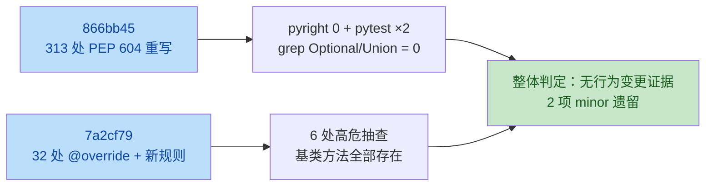

# yate Code Review — Python 3.12 升级迁移审查 — 2026-09-26

## Python 3.12 升级迁移审查 — 2026-09-26

> **范围**：`py-upgrade-3.12` 分支 `5d9cb59..b0c022d`（4 个提交：SP1 声明面 bump
> `ada345b`、SP3 PEP 604 迁移 `866bb45`、SP4 `@override` 落地 `7a2cf79`、校准回填
> `b0c022d`（纯文档，跳过）。**意图**：零行为变更的语法/声明现代化——PEP 604 联合、
> `typing.override` 显式覆写标注、`reportImplicitOverride = "error"` 防回归。
> **复核基准**：推送后 HEAD `b0c022d`；门禁实测 pyright 0/142（strict，含新规则）、
> pytest 1216 passed ×2、冒烟 917/917 checks 88 场景。
> **校验方式**：主代理通读两个大提交的可疑 hunk + 2 个独立校验代理并行复核
> （2/2 一致），并对语义风险最高的 6 处 `@override` 做了基类存在性抽查（全部通过）。
> **结论**：迁移面整体干净；以下 2 项均 minor，无 critical/major。



### 审查发现

- [x] **`harness.py` 括号多行导入残留单名字 `cast`（Minor，风格）** —
  [tools/smoke_test/harness.py:29](../../tools/smoke_test/harness.py#L29)
  ~~```python
  from typing import (
      cast,
  )
  ```~~
  **核实：成立（2/2 校验代理一致）。** SP3 3c 孤立导入清理脚本按 HEAD 基准重建导入行时，
  对原括号多行形式保留了括号壳；单名字导入应扁平化为 `from typing import cast`（与项目
  其余 52 个文件的清理结果一致）。纯风格，pyright/pytest 均不受影响。
  *✅ 已修复（2026-09-26）— 扁平化为 `from typing import cast`；pyright 0/142、
  harness 模块导入验证通过。*

- [ ] **Gitee Go 3.12 流水线从未实际运行，镜像可用性未验证（Minor，待观察项）** —
  [.workflow/test.yml:48-49](../../.workflow/test.yml#L48-L49)
  **核实：成立（2/2 校验代理一致）。** SP1 把 `pythonVersion` 切到 `'3.12'` 并把注释改为
  "公共构建机使用 3.12 镜像"，但该声明的运行时验证依赖 Gitee 公共构建机的实际镜像，
  本地/GitHub 侧门禁均无法覆盖（升级计划 D2 可选验证已明确跳过）。若镜像缺失，Gitee 腿
  将在首次流水线运行时失败。
  **处置**：非代码缺陷，登记为**待观察项**——下一次 Gitee Go 流水线触发时确认绿/红；
  若红按升级计划 D2 预案处理（延后切腿或换镜像）。GitHub Actions 腿不受影响。

### 排查后排除的项（记录以防重提）

- **`asyncio.TimeoutError` → `TimeoutError`（editor_lsp 6 处 except）**：pyupgrade 顺带重写，
  超出"仅注解行"边界，但 3.11+ 两者为同一对象（实测 `asyncio.TimeoutError is TimeoutError`
  → True），捕获面完全一致，运行时等价——已在校准记录留痕，非问题。
- **4 处手工重写**（`Node` / `ExitState` / `ExitFn` 运行时别名、manager.py 嵌套
  `Task[LspClient | None]` 下标）：3.12 运行时下 `|` 与 `Union[...]` 等价，pytest 导入路径覆盖。
- **遗留 `Optional` 散文 2 处**（[test_app_textual.py:99](../../tests/test_app_textual.py#L99)
  注释、extensions.en.md 文档表）：均为英文散文用法，非类型注解，无需改。
- **32 处 `@override` 抽查**（app.py compose/`get_theme_variable_defaults`/`action_quit`、
  logs.py emit/close、vim.py/vsc.py Keymap 方法）：基类方法全部存在，签名兼容
  （pyright strict 的 reportIncompatibleMethodOverride 已覆盖），`App.action_quit` 覆写
  Textual 基类 action 合法。

- 2026-09-26 全项目评审报告：[2026-09-26-full-project-review.md](2026-09-26-full-project-review.md)
