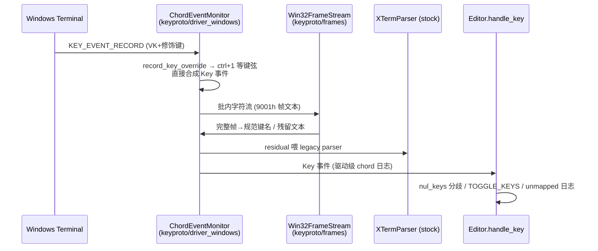
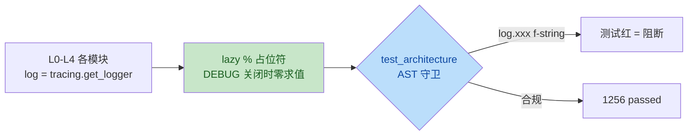

# yate 分支代码评审报告 — issues/keybinding-fix-wt（2026-09-27）

> 评审对象：分支 `issues/keybinding-fix-wt` 相对 `master`（merge-base `108f763`），
> worktree `d:/Programming/yate-keybinding-fix-wt`，评审时 HEAD = `b21ff37`（39 commits，34 代码文件，+1308/-25）
> 评审范围：键位修复主线（L0 新包 `yate/keyproto`：键弦模型 + Windows chord 驱动 + win32-input-mode 帧解码；
> `key_protocol` 配置；双键位守卫测试）+ 分层 trace 日志（L0-L4 接入 + AST 架构守卫）
> 评审方式：主代理通读全量 diff + 对照 Textual 8.2.8 stock 源码逐行核实 + 2 个独立验证子代理交叉复核 + 全门禁复跑
> 历史审查：全项目级审查见 [2026-09-26-full-project-review.md](2026-09-26-full-project-review.md) / [README.md](README.md)（评审总纲索引），本文只记分支增量

---

## 一、门禁与基线（实测数字，2026-09-27）

| 门禁 | 结果 | 证据 |
|---|---|---|
| `pytest tests/ -q`（Windows） | **1257 passed / 7 skipped / 0 failed**（315.85s） | worktree 实测，含架构守护 14 用例 |
| pyright strict（yate/ + tests/ + tools/） | **0 errors** | 主代理与验证员各跑一次 |
| 行覆盖率（branch 模式） | **90%**（10333 stmts / 829 partial），高于 CI gate 75 | `pytest --cov=yate --cov-branch` |
| 冒烟 `tools.smoke_test run --coverage` | **920/920 checks（88/88 scenarios）**；命令覆盖 43/44（缺 `saveas`）、action 65/65 | exit 0 |
| 真机无人值守验收（PB6） | SendInput 注入真实 WT + YATE_TRACE 断言 **12/12 PASS** | 见 PLAN_v3_steps.md 执行状态表 PB6 行 |

## 二、整体质量评分

| 维度 | 得分 | 依据 |
|---|---|---|
| 程序健壮性 | 8.5 / 10 | key-up 双触发、空字段崩溃等真机暴露缺陷均已修复并带 fixture 守卫；扣分：帧解码畸形输入曾依赖 blanket except 兜底（已修） |
| 可扩展性 | 9.5 / 10 | L0 keyproto 零上层依赖（UI_FREE 白名单登记）；name-first 交付使派发层零改动；驱动配置留 `legacy` 逃生阀 |
| 可维护性 | 9 / 10 | docstring 详实、证据链注释完整（悖论结论写死防再犯）；扣分：stock 复刻漂移风险（本轮已加版本 pin 注释缓解） |
| 测试质量 | 9 / 10 | 探针真实帧为 fixture、反向演练守卫、真机 harness；扣分：conhost/VS Code 矩阵待人工复测（PB5 遗留） |
| **总评** | **9 / 10** | 分支可合并质量；2 项发现均已在评审轮内闭环（`b21ff37`） |

## 三、核心问题清单

本轮未发现「致命」级缺陷。经双验证员交叉复核确认成立并**已修复**的问题：

### 1. `_decode_frame` 空字段抛 ValueError → 输入线程死亡（严重，已修复）
- **位置**：[frames.py:95-109](../../yate/keyproto/frames.py#L95-L109)
- **维度**：健壮性 / 非法输入容错
- **问题**：`_FRAME_RE = r"\x1b\[([0-9;]+)_"` 的字符类允许 `;;` 空字段；`int(part)` 对空串抛
  `ValueError`。畸形帧（例如粘贴文本含 `\x1b[1;;2_`）经 `ChordEventMonitor.run` 的
  blanket `except Exception`（照抄 stock，只记日志不恢复）后**输入线程退出，键盘永久失灵**直到重启。
  且 docstring 声称 "missing **or empty** fields default to zero"，代码只补齐缺失尾部、未处理空字段——文档与实现不符。
- **后果**：一次畸形帧即瘫痪全部键盘输入；触发面窄（需故意构造）但后果重。
- **修复**（`b21ff37`）：`int(part) if part else 0`，补 `;;` 帧 fixture 测试（`test_frame_stream_decodes_real_probe_frames`）。

### 2. stock 复刻静默漂移风险（建议，已修复）
- **位置**：[driver_windows.py:103-112](../../yate/keyproto/driver_windows.py#L103-L112)、[driver_windows.py:248-257](../../yate/keyproto/driver_windows.py#L248-L257)
- **维度**：可维护性
- **问题**：`ChordEventMonitor.run` 与 `start_application_mode` 全量复刻 Textual stock 实现
  （本轮已对照 `.venv` 中 Textual 8.2.8 逐行核实忠实，无遗漏/多余）；Textual 升级改动 stock 时子类会静默漂移。
- **后果**：升级后输入行为偏差难以定位。
- **修复**（`b21ff37`）：两处 docstring 注明基于 Textual **8.2.8** 复刻，升级时先 diff stock。

### 排除项（验证后不成立，存档防重报）
- **AST 日志守卫面窄**（`test_architecture.py` 只识别接收者名为 `log` 的调用）：grep 全仓无绕过写法，属理论缺口，现有代码零违规，不构成问题。
- **`Win32FrameStream` 双缓冲乱序**：`feed()` 推演 + 跨批/中断帧测试确认字符顺序严格保持、无吞字。

## 四、评审报告流程图存档（对话评审时生成，回写于此）

### 按键输入管线（本分支核心改动）

- record 路径：`record_key_override`（VK+dwControlKeyState→KeyChord）弥补 stock 驱动只读
  UnicodeChar 丢修饰的缺陷；
- 帧路径：`start_application_mode` 下发 `\x1b[?9001h`（退出补 `\x1b[?9001l`），WT 把无损帧以文本
  形态透传进 record 字符流，`Win32FrameStream` 跨批流式解码拦截；
- 两条路径产出同名规范键名（name-first），全部走既有派发表，派发层零改动。

### 分层 trace 日志与格式守卫

- 每层模块持有 `log = tracing.get_logger(__name__)`，默认关闭、`YATE_TRACE=1` 落盘
  `~/.yate/data/logs/`；
- 热路径豁免：LSP `didChange` / `publishDiagnostics` 不逐条记录（manager 已汇总）；
- `test_log_calls_use_lazy_percent_formatting` 以 AST 拦截 f-string 日志（python-coding-style 4.6）。

## 五、遗留与后续

1. **PB5 三终端矩阵**：WT 已由真机 harness 覆盖；conhost / VS Code 待人工复测
   （VS Code 集成终端在工作台层消费 ctrl+1/ctrl+\`，属宿主行为）；
2. ~~冒烟命令覆盖缺 `saveas`（43/44）~~ **✅ 已解决（2026-09-27）**：新增
   `saveas_command` 场景（覆盖 `:saveas FILE` 命令 + readonly 解锁 + 原文件不动 +
   文档重定向），命令覆盖 **44/44**、冒烟 **89/89 scenarios / 932 checks** 全绿；
3. ~~合并回 master 前建议再跑一次全门禁~~ **✅ 已复跑（2026-09-27，saveas 场景合入后）**：
   `pytest` 1257 passed / 7 skipped · pyright strict 0 errors · 冒烟 89/89 scenarios /
   932/932 checks（commands 44/44、actions 65/65，exit 0）。
