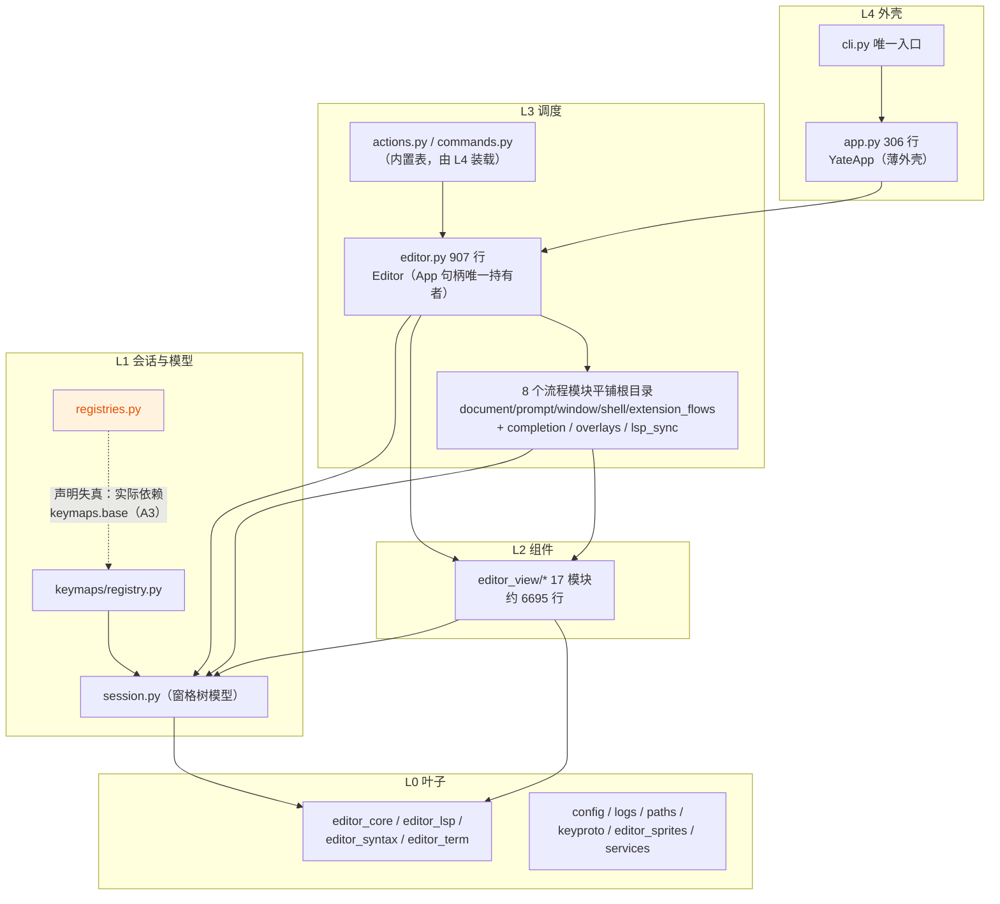

# 仓库架构与结构全量评审（repo architecture audit）— 2026-10-07

> 范围：仓库整体架构、项目结构清晰性、扩展性、合理性、规范性（用户指定五维）。
> 方法：3 个只读探索子代理并行分区深审（yate 根模块 / yate 子包 / tests·tools·pack·文档·CI），
> 主代理对全部 major 结论逐条独立复核（import 扫描、行数实测、CI 配置 grep、docstring 原文比对）。
> 与既有评审的关系：与 [2026-09-26-full-project-review.md](2026-09-26-full-project-review.md)
> （代码级建议 6 条）及 [2026-10-03-python-code-review.md](2026-10-03-python-code-review.md)
> （83 项风格/缺陷）互补——本轮专注**架构与结构**维度，不重复其代码级发现；重叠条目已在
> §五 逐条核对标注。本记录为只读事实文档（doc-conventions §2.1），不含修复排期。

---

## 一、总体结论

**通过（0 Critical / 8 Major / 9 Minor / 3 Suggestion）**，总评 8.5/10。

yate 的架构纪律在同体量项目中属第一梯队：L4→L0 依赖方向经逐文件 import 实测
**零违规**，且有 22 条 AST 架构守护测试（`tests/test_architecture.py`）防回归；
`editor_view` 全部 17 个模块无一处向上 import；注册表是简洁的函数表，内建能力与
插件走同一注册通道；`tools/` 是带统一 `python -m tools.<pkg>` 入口的体系化工具集
而非脚本堆。主要问题集中在**规则与实现的偏差**（三处层级 docstring 声明失真、
5 个子包 `__init__` re-export 与"惰性"规则两套做法并存）和**工程化断点**
（pyright strict 门禁无 CI 步骤、双语 CHANGELOG 中文覆盖断档、dev/ts 依赖组
26 行手工重复、一个 5222 行的巨型测试文件）。

## 二、分层现状图（实测 import 关系）

实测全绿的硬规则：R1（仅 `cli.py` import `yate.app`）、R3（`editor_view` 零向上
import）、R4（keymaps/services/keyproto/editor_sprites 不依赖 editor_view）、
R5（`editor.py` 不 import 内置表）、R6（全仓 0 处 `TYPE_CHECKING`）、R7（外壳装载
内置表）、R10/R12/R13 抽查通过。**本图与 `architecture-boundaries.md` 的差异点
均已列入 §四 问题清单。**

## 三、五维评审结论

### 3.1 整体架构 — 优

- 依赖方向正确且被显式设计保护：`actions.py:15` / `commands.py:13` 单向依赖
  `yate.editor`，`editor.py` 不反向 import，由 `app.py:162-165` 装载闭环
  （`editor.py:103-104` 有配套注释）——教科书级防循环方案。
- L4 极薄：`app.py` 仅 306 行，docstring 声明 "owns the Textual lifecycle ...
  and nothing else"（`app.py:3-7`），全部编辑操作委托 `self.editor.*`。
- L0 真正 stdlib-only：`logs.py` 把 textual 懒加载关在
  `create_devtools_bridge` 工厂内部（`logs.py:26-56`），保证 `--help` 路径
  不拖入 TUI 栈。
- 窗格树模型（`Leaf`/`Split`/`ViewState`）归 L1 纯函数，UI 层只消费不重导出
  （架构测试用例 13 守护）。

### 3.2 项目结构清晰性 — 良（根目录平铺是主要扣分点）

- 优点：`ls yate/` 顶层 23 个 `.py` 即分层清单；子包边界由 docstring 自述
  （如 `editor_sprites/__init__.py:3-4` "no Textual/rich/UI imports, no I/O,
  no state"，实测属实）；资源单一入口（15 个 `.tcss` 全部经 `paths.load_tcss`
  加载，文件头反向标注消费方）。
- 扣分：8 个 L3 流程模块与 L4/L1/L0 文件平铺混在同一层，且命名两套
  （`*_flows.py` vs `completion.py`/`overlays.py`/`lsp_sync.py`），见 A10 与
  §六 结构建议。
- 扣分：用户文档存在两处堆放点（`yate/docs/` 与 `yate/resources/manual.*.md`），
  职责边界未成文，主题模板章节内容重叠（A16）。

### 3.3 扩展性 — 中上（插件通道统一，能力面偏窄）

- 优：新增 action / `:` 命令只需在 `populate()` 加一行注册
  （`actions.py:36-40` 模式）；扩展经 `ExtensionContext` 拿到**与内建完全相同**
  的注册表（`editor.py:385-386`），无双轨。
- 优：插件装载机制成熟——失败不崩主程序、按 resolved path 去重、半初始化模块
  从 `sys.modules` 清除（`services/extensions.py:481-523`）、工作区信任门控
  （`:627-633`）；高亮注册声明式与 tree-sitter 双轨，配 7 个 `.py.example` 模板。
- 扣分：插件 API 仅有 setup/teardown 两个钩子，无事件订阅（文档保存/模式切换/
  诊断更新）、无 UI 贡献点；`api.app` 直接暴露是唯一逃生口
  （`extensions.py:294-297` 自注 "advanced use"），等于承认封装不足（A12）。
- 扣分：新增 L3 流程模块的装配摩擦集中在 `editor.py`（30 个类属性声明 +
  `OverlayFlows` 16 参数、`DocumentFlows` 12 参数手工注入，`editor.py:220-290`），
  接入步骤无文档（A18）。

### 3.4 合理性 — 良（文件体量是主要偏差）

- 优：`Editor.__init__` 缩为 5 行构建步骤（模块级工厂 `_build_models` /
  `_build_widgets` / `_build_pane_stack` / `_build_key_ui`，`editor.py:74-308`），
  构造顺序因果有行内注释——这是 2026-09-26 评审 #5 "editor.py 组装过载" 修复
  后的形态，闭环质量高。
- 优：`.trae/documents/` 162 篇计划文档 100% 符合 `doc-conventions.md` 命名
  （0 下划线、子计划目录统一 `overview.md` 总纲），单篇最大 70.45 KB 远低于
  1 MB 拆分红线。
- 扣分：8 个文件超 800 行（实测含空行口径）：`regex_backend.py` 1097、
  `vim.py` 1013、`config.py` 924、`editor.py` 907、`diffview.py` 901、
  `buffer.py` 871、`emulator.py` 856、`editor_lsp/manager.py` 818；规则侧
  无豁免名单与拆分判定标准，阈值空转（A11）。

### 3.5 规范性 — 优（代码）／中（工程化断点）

- 优：抽查 14 个根模块 100% 具备模块 docstring、
  `from __future__ import annotations`、完整类型注解；日志统一 tracing 惰性
  `%` 格式；无散落 `print`（仅 cli/diagnostics/logs 的正当输出位）。
- 优：测试隔离体系完整——autouse `isolated_home` fixture 重定向 HOME
  （`tests/conftest.py:44-63`）、进程级 `YATE_PYTHON_LSP=off`、共享 helper
  （`wait_until` / `make_key_ui` 等，`conftest.py:66-124`）。
- 优：`pack/` 双 spec 共享逻辑下沉 `_common.py` 并有 560 行 AST 守护测试；
  `typings/pyperclip` 本地 stub 自文档化。
- 扣分：pyright strict 零诊断是成文合并门禁（`pyproject.toml:97-99`），但
  GitHub 与 Gitee 两条流水线**均无 pyright 步骤**（A4）；双语 CHANGELOG 中文
  覆盖断档（A5）；dev/ts 依赖组手工重复（A6）。

## 四、问题清单（主代理逐条复核属实）

### Major

| # | 问题 | 证据（已复核） | 修改建议 |
|---|---|---|---|
| A1 | 5 个子包 `__init__.py` re-export，与"包 `__init__` 保持惰性、不 re-export"规则两套做法并存，且 re-export 已被核心代码消费，规则形同虚设 | `editor_core/__init__.py:12-18`、`editor_lsp/__init__.py:18-26`、`editor_syntax/__init__.py:25-35`、`editor_term/__init__.py:9-11`、`keymaps/__init__.py:11-19` 有 `from ... import` + `__all__`；消费方含 `services/extensions.py:41,48`、`editor_view/statusbar.py:19-20`；而 `editor_view/__init__.py:23-26`、`services/__init__.py:3-7` 明确不 re-export。`editor_lsp` 的 re-export 导致 `import yate.editor_lsp` 即加载 818 行 `manager.py`，惰性目标未达成 | 二选一并**写进 `architecture-boundaries.md` §三.5**：(a) 全面禁止——把 `services/extensions.py:41,48` 等改为子模块路径 import；(b) 承认"纯叶包允许 re-export 作为公共 API 面、UI/服务包禁止"为成文例外，并在 5 个 `__init__.py` 注明。当前"一半执行"状态最伤 |
| A2 | keyproto 层级声明与实现矛盾：自称 L0 只许依赖 `keymaps.base`，实际 import `yate.logs` 与 textual 私有 API | 声明在 `keyproto/__init__.py:16-17`（"must not import any other yate module except `yate.keymaps.base`"）；违规在 `keyproto/driver_windows.py:55`（`from yate.logs import tracing`）与 `:33-36`（`textual._xterm_parser` / `textual.drivers._writer_thread` / `windows_driver` 三个下划线私有模块，无稳定承诺） | ① `yate.logs` 依赖二选一：在 `__init__.py` 豁免并注明理由（trace logger 无副作用），或改用 stdlib `logging.getLogger`；② textual 私有 API 收敛到一个薄适配模块并集中记录所依赖的 Textual 最低版本，CI 加 pin 版本 import 冒烟，升级时第一时间暴露断裂 |
| A3 | 层级 docstring 声明失真（registries / session 两处），规则文档与代码互相误导 | `registries.py:5-6` 声称 "live in their own leaf module (below `keymaps` ...)"，但 `registries.py:19` `from yate.keymaps.base import ActionContext`，而 `keymaps/base.py:17` 又 import `yate.session`——registries 实际在 keymaps **之上**；`session.py:16` 声称窗格模型 "is L1 state with L0-only dependencies"，但 `session.py:31-34` import 了 `yate.editor_core` 与 `yate.services.workspace`（均非 L0 清单成员） | ① 把 `ActionContext`（仅数据类）下沉到真叶子模块（如并入 `session.py` 或新建 `yate.action_context`），keymaps.base 与 registries 都从该处 import；② 或最低成本：修正两处 docstring 如实描述层级（声明失真而非运行时风险，故 major 而非 blocker）。修正后同步 `architecture-boundaries.md` §一的 L1 清单描述 |
| A4 | pyright strict 零诊断门禁无任何 CI 步骤，完全依赖合并者本地自觉 | `pyproject.toml:97-99` 注释宣称 strict 零诊断是合并门槛；`.github/workflows/test.yml` 与 `.workflow/test.yml` 步骤均为 changelog gate → install → pytest+cov，grep `pyright` 零命中 | 在 `test.yml` 增加 lint job（`pip install pyright && pyright`），Gitee 侧可因构建机限制只保留 GitHub 执行；这是把已有成文门禁落进流水线的低成本高收益项 |
| A5 | `CHANGELOG.zh.md` 大量 `[缺中文]` 未翻译条目，含已发布版本区段，zh_overrides 覆盖机制未跟上新增提交 | `CHANGELOG.zh.md:10-135`（未发布 + v0.2.9 区段）几乎每条英文原文 + `[缺中文]` 占位，grep 命中 40+；`tools/changelog/zh_overrides.json`（34.89 KB）的覆盖未更新；changelog CI 门禁只校验结构不校验中文覆盖 | ① 补录 zh_overrides 清偿存量；② 为 `python -m tools.changelog check` 增加可选 `--require-zh` 门禁（已发布 tag 区段强制、未发布区段警告），发布前阻断缺翻译 |
| A6 | `pyproject.toml` dev 与 ts 依赖组手工重复 26 个 tree-sitter 条目，唯一同步手段是一行注释 | `pyproject.toml:24-53`（dev）与 `:57-88`（ts）逐行重复；`:28` 注释 "# keep in sync with the ts group below"；ts 组升版本而 dev 漏改时，`.[dev]` 的 strict 类型检查与 ts 后端将版本漂移 | 迁移 PEP 735 `[dependency-groups]`（`dev = [{include-group = "ts"}, "pyright", ...]`，pip 25.1+/hatchling 支持），或仿 `test_pack_spec.py` 加一条两组依赖一致性的 AST/正则守护测试 |
| A7 | `tests/test_app_textual.py` 5222 行（205.76 KB）巨型测试文件，为第二大（`test_vim_keymap.py` 1663 行）的 3 倍；另有 7 个测试文件 ≥1000 行 | 实测 `(Get-Content).Count`：5222 行；全 tests/ 另有 test_config / test_changelog_tool / test_editor_core / test_diffview / test_ts_backend / test_lsp / test_vim_keymap ≥1000 行 | 按功能域拆为 `test_app_explorer.py` / `test_app_terminal.py` / `test_app_panes.py` / `test_app_find.py` 等（仓库对 `yate/editor.py` 拆分已有 editor-split 先例），conftest helper 直接复用；拆分是纯移动 + import 调整，行为零变化 |
| A8 | `:set` 选项知识双份硬编码，新增选项须同时改两处，漏改则补全与行为脱节 | `commands.py:190-253` `_set` 为 if/elif 链（keymap/theme/shell/terminal_height/show_hidden/readonly/filetype 各自带校验文案）；`prompt_completion.py:21-24` 另维护 `_SET_OPTIONS` 元组供补全；`terminal_height` 的 3..40 范围校验内联在命令处理器，与 config 校验分离 | 在 config.py（L0）定义单一选项表 `dict[str, SetOption]`（名称、解析器、取值候选、apply 签名），`_set` 表驱动、`_SET_OPTIONS` 从表派生；注意这是配置专属类型，不触碰"禁止公共类型层"红线 |

### Minor

| # | 问题 | 证据 | 修改建议 |
|---|---|---|---|
| A9 | `config.py` 924 行多职责：选项 schema + 5 个配置 dataclass + yaterc exec 加载 + 校验混装 | 实测 924 行；`config.py:67-81` schema、`:84` 起 `LanguageServerSpec`/`ScreenSaverConfig` 等 | 拆为 `config.py`（数据类）+ `yaterc.py`（加载/合并/校验），均保持 L0 |
| A10 | L3 流程模块命名两套：`*_flows.py` 5 个 vs 无后缀 3 个（completion / overlays / lsp_sync），损害可发现性 | `completion.py:51` 类名 `CompletionFlows`、`overlays.py:33` 类名 `OverlayFlows`——文件名与类名已经不一致 | 与 §六 flows/ 子包迁移一并统一为 `*_flows.py`（lsp_sync 按规则命名法保留动词式 `LspSync` 类名，文件可改 `lsp_flows.py` 或保留，需与规则 §五 命名清单同步修订） |
| A11 | 800 行阈值空转：8 个文件超阈值，无豁免名单与拆分判定标准 | 见 §3.4 实测清单 | 在 `architecture-boundaries.md` 或 coding-style 补"超阈值处置"条款：豁免名单（单一职责长文件）+ 拆分判定（多职责混合型必拆）；优先拆 `regex_backend.py`（LangSpec 数据表与 tokenizer 分离）与 `vim.py`（motion/operator/text-object 分模块、类不变） |
| A12 | 插件 API 能力面窄：仅 setup/teardown，无事件订阅与 UI 扩展点；`api.app` 直接暴露为逃生口 | `docs/extensions.en.md:130-133` 确认仅两个钩子；`services/extensions.py:294-297` | 优先补事件订阅（文档打开/保存/关闭、模式切换、诊断更新），再做每扩展一个状态栏 item 的窄 API；同时收敛 `api.app` 暴露面 |
| A13 | 扩展 setup 半注册不回收仍是文档约定而非机制；与速览 #5（2026-09-26 "扩展 setup 半注册" 已修）并存，需核对修复范围 | `services/extensions.py:6-9` docstring 现文："anything registered before the failure is not guaranteed to be reclaimed -- perform every validation ... ahead of the first registration call" | 先核对 2026-10-01 修复轮（`55e1055` 等）实际覆盖面；若确未机制化：ExtensionAPI 记录本扩展注册动作（actions/commands/bindings/highlight 键），`load_file` except 分支统一反注册，把不变量从文档移进机制 |
| A14 | CI 无 Python 3.13 腿（`requires-python >=3.12` 从未在 3.13 验证；pyproject:58-62 注释还提及 3.13 tree-sitter 堆损坏问题，更需回归）；无 macOS 腿 | `test.yml:41` 固定 `'3.12'`；`:28-29` 矩阵仅 ubuntu/windows | 矩阵扩为 os × python `[3.12, 3.13]`（至少 Linux 跑 3.13）；macOS 视用户群需求 |
| A15 | `.trae/documents/` 混入非文档资产 | `fancy-sym-plans/roster.svg`（633 KB，外围最大单文件）；`keybinding-fix-wt-plans/` 下 `pb6_real_input_harness.py` / `verify_matrix.ps1` / `win32im_probe.py` | 可执行脚本移入 `tools/` 或独立 `scripts/`；svg 移入资源目录，保持文档树纯度 |
| A16 | 用户文档两处堆放点职责边界未成文，主题模板章节内容重叠 | `yate/docs/`（4 主题 × 双语）与 `yate/resources/manual.*.md`（应用内手册 75/72 KB）并存；`resources/manual.zh.md:932-947` 与 `docs/themes.zh.md:96-120` 主题模板用法各讲一遍 | 两处各加 README 说明分工（docs/ = 站外阅读，resources/manual = 应用内渲染），主题模板章节单一来源、另一方链接过去 |
| A17 | tests 与模块的覆盖映射约定未成文：7 个根模块无同名 `test_<module>.py`（由 pilot 集成测试间接覆盖），新贡献者易误判覆盖缺口 | `dist_meta.py`、`document_flows.py`、`window_flows.py`、`extension_flows.py`、`overlays.py`、`prompt_flows.py`、`lsp_sync.py` 无同名测试；`actions.py`+`commands.py` 合并进 `test_action_table.py` | 在 `tests/` 加简短 README 或 conftest docstring 说明"按行为组织"的约定与间接覆盖关系 |

### Suggestion

| # | 建议 | 证据 | 说明 |
|---|---|---|---|
| A18 | 新增 L3 流程模块装配摩擦：30 个类属性声明 + 手工长注入（`OverlayFlows` 16 参数），接入步骤无文档 | `editor.py:339-346`、`overlays.py:36-54`、`document_flows.py:48-61` | 不建议建共享 context 类型（逼近"公共类型层"红线）；建议在 `architecture-boundaries.md` 或开发文档写明接入清单（声明 → 构造 → attach），保持显式注入 |
| A19 | `editor_sprites/chars/` 24 个同构纯数据文件（每个 30-69 行，结构完全一致） | `characters.py:25` 一次性全量 import | 现规模可接受（纯 L0、零逻辑、ASCII 画享受编辑器高亮）；角色数 >40 再评估合并为单一数据文件 + 生成式注册 |
| A20 | `editor.py` 907 行临界超标，但已高度分区且 300 行为构造工厂 | `editor.py:74-308` 工厂、`:769-840` `:set` 后端 setter 约 70 行 | 可把 setter 组迁入流程模块，或在 A11 的豁免名单中登记并注明理由 |

## 五、与既有评审条目的重叠核对

| 本轮条目 | 既有条目 | 核对结论 |
|---|---|---|
| A13（setup 半注册） | 速览 #5（2026-09-26，✅ 已修） | **部分重叠**：`extensions.py:6-9` docstring 现文仍声明"不保证回收"，与 #5 "扩展 setup 半注册已修"并存；处置前须先核对 `55e1055` 等修复的实际范围 |
| A20（editor.py 体量） | 速览 #5 内 "editor.py 组装过载"（✅ 已修） | **已修项的残留观察**：工厂拆分后 `Editor.__init__` 已收敛，本轮仅登记 907 行临界值，非同一问题 |
| A11（大文件阈值） | [2026-09-29-editor-split.md](2026-09-29-editor-split.md)（editor.py 1425→882 行） | **互补**：editor-split 证明拆分路径可行；本轮扩展到其余 7 个超阈值文件并指出规则侧缺判定标准 |
| A4（pyright 无 CI）/ A5（缺中文）/ A6（依赖重复）/ A7（巨型测试） | 无 | **新发现**，既有 34 条速览与轮次总表均未登记 |
| 全部代码级发现 | 速览 #22（2026-10-03，83 项已修） | 本轮聚焦架构/结构维度，未发现与其重叠的未修代码级问题 |

## 六、结构调整建议：L3 流程模块收进 `yate/flows/` 子包

**建议实施**（一次到位，含命名统一 A10）。要点（改动面已由子代理全量核查）：

- **迁移对象**：`document_flows.py`、`prompt_flows.py`、`window_flows.py`、
  `shell_flows.py`、`extension_flows.py`、`completion.py`、`overlays.py`、
  `lsp_sync.py`（`prompt_completion.py` 纯函数可一并迁入）。
- **改动面**：生产代码仅 `editor.py` 的 10 个 import（`editor.py:31-66`）与
  两处同层互引（`window_flows.py:21`、`document_flows.py:26`）；测试 4 处
  （`test_prompt_completion.py:17`、`test_changelog_view.py:23`、
  `test_app_textual.py:28`、`test_explorer.py:31`）。无 editor_view 反向引用，
  迁移不制造新依赖方向。
- **收益**：根目录 23 → ~14 个 `.py`，`ls yate/` 直接读出层次；`*_flows` 命名
  收敛；测试与源码映射更直观。
- **合规要点**：`flows/__init__.py` 必须惰性（空或仅 docstring）；不新建公共
  类型层；迁移后同步修订 `architecture-boundaries.md` §一 L3 清单、R11 冻结
  文件清单（`tests/test_architecture.py` 的 `UI_FROZEN_FILES` 路径）与
  `UI_FREE_PACKAGES` 守卫面。
- **时机**：当前版本 0.2.9、扩展生态尚小，外部以 `yate.overlays` 等路径
  import 的破坏面最小，宜早不宜迟。
- **明确不做**：拆 `logs.py`（686 行三服务内聚且 docstring 已论证共存理由）；
  为流程模块建共享 context 类型（公共类型层红线）；迁移 `diagnostics.py`
  （L4 侧一次性工具，独立有理由）。

## 七、评审过程记录（子代理存活与复核）

- 分工与产出：3 个只读探索子代理（根模块 / 子包 / 外围）同一批次下发，
  3/3 存活并返回结构化报告（37/47/49 次工具调用）。
- 主代理独立复核：A1-A8 全部 major 逐条重取证（import 原文 grep、行数
  `(Get-Content).Count` 实测、CI 配置 grep、docstring 原文比对），全部属实；
  行数口径差异已统一（子代理报告与含空行口径一致，`Measure-Object -Line`
  的非空行口径偏小约 15%，本文统一用含空行口径并在各条标注）。
- 门禁：纯文档变更（仅新增本记录 + 索引登记），按 `misc-rules.md` §三 豁免
  pyright / pytest / 架构测试。
