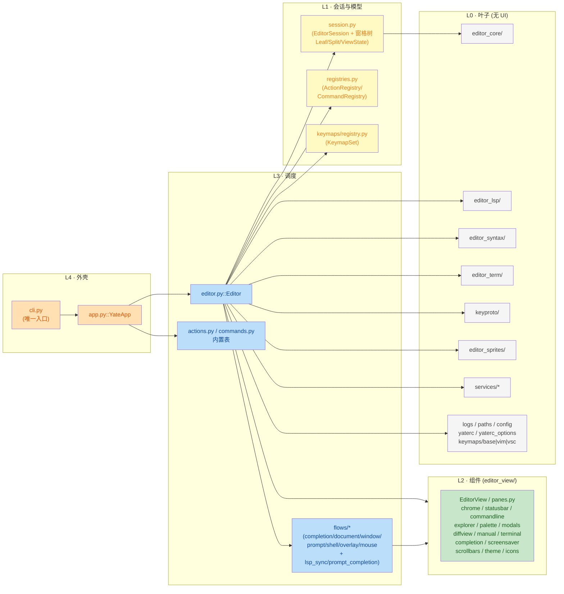
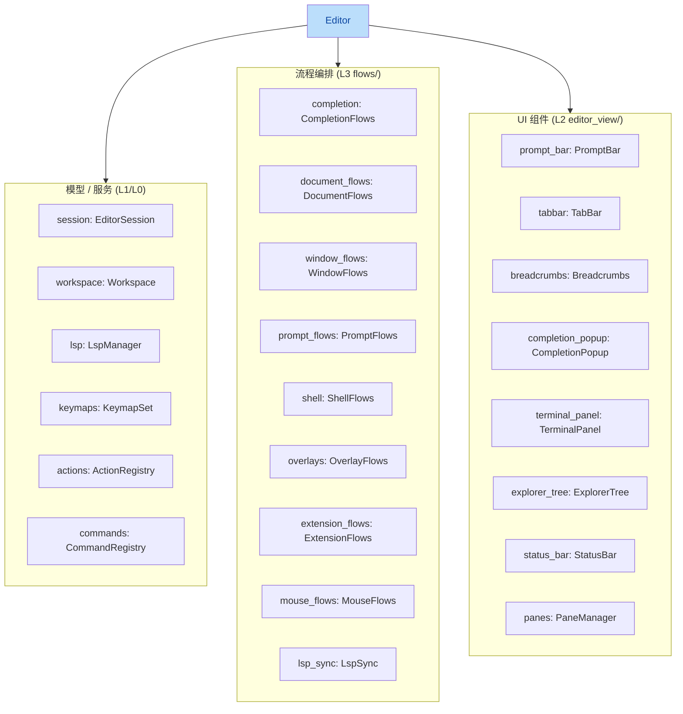
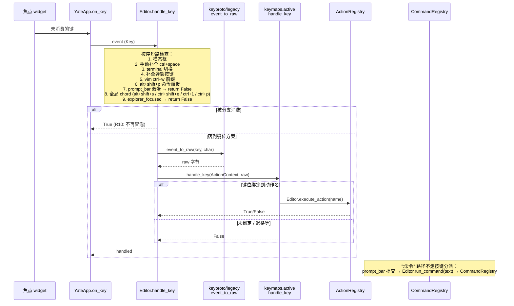

# yate 架构总览

> 基于当前代码梳理（`yate/` 包，Textual 终端编辑器）。
> 相关文档：`textual-framework-hooks.md`（框架钩子细节）。

## 1. 分层结构与持有关系

依赖方向严格单向：**cli → app → editor → 各子模块**，UI 无关的内核
（editor_core、editor_lsp、editor_syntax、editor_term、keyproto、
editor_sprites、session、registries、services）位于依赖链末端。

### 1.1 分层依赖图

### 1.2 资源与入口

- **入口** `yate/__main__.py` → `yate/cli.py::main()`：解析参数、安装 crash/trace
  日志、加载 `yaterc` 与主题目录，惰性导入 TUI 后构造 `YateApp.run()`；
  `--diag` 走无头诊断路径（`yate/diagnostics.py`）。
- **外壳 CSS**：不再内联于 `app.py`，而是打包资源 `yate/resources/app.tcss`
  （`YateApp.CSS = paths.load_tcss("app.tcss")`，见 `app.py:82-83`；文件头注释声明
  "selector ids are frozen by R9"），改 id 必须同步该 `.tcss`。
- **L4 资源**：`yate/resources/`（`app.tcss` 外壳 CSS、字体、manual/changelog 文档、
  主题示例）。

### 1.3 Editor 持有关系

`yate/editor.py::Editor` 是 L3 枢纽，持有以下对象（`editor.py:318-382` 构造装配）：

- **外壳** `yate/app.py::YateApp`（Textual `App` 子类）：刻意单薄，只负责主题桥、
  CSS（装载 `app.tcss`）、生命周期（compose/on_mount/on_unmount）、驱动选择
  （`get_driver_class`：Windows 上换用 `keyproto` 的键弦驱动）、空闲探测
  （`on_event` 打点 `IdleTracker`，`poll_idle` 触发屏保）与按键兜底转发。
  构造时创建 `Editor` 并执行 `populate(self.editor.actions, self.editor)` /
  `register_commands(self.editor.commands, self.editor)` 灌入内置表
  （R7 规则：表模块导入 editor，editor 不得反向导入它们）。
- **架构守护**：`tests/test_architecture.py` 在测试层强制约束上述分层
  （2026-10-09 实测 **27 个用例全部通过**，R1–R13 + 命名/T1/T2 + 文件体量等守卫）。

## 2. 顶层模块职责

| 模块 | 职责 | 关键类/函数 |
| --- | --- | --- |
| `editor_core/` | UI 无关编辑内核 | `buffer.py::TextBuffer`、`document.py::Document`、`search.py::SearchEngine`、`diff.py`（行/字符 diff 与三方合并，纯 `difflib`）、`indentation.py`（语言缩进与括号对规则）、`textobjects.py`（vim 动作与文本对象的无状态扫描） |
| `session.py` | 文档会话模型（tabs/活动文档/搜索）+ **窗格树模型** `Leaf` / `Split` / `ViewState` 与纯树操作，不依赖 UI | `EditorSession`、`find_leaf` / `replace_node` / `remove_node` / `leaves` / `find_axis_split` |
| `registries.py` | 叶子模块，两个纯容器注册表 | `ActionRegistry`、`CommandRegistry` |
| `actions.py` | 内置动作表 | `populate()`（闭包绑定具体 Editor 实例） |
| `commands.py` | 内置 ex 命令表 | `register_commands()` |
| `config.py` | yaterc（Python 脚本式配置）加载 | `YateConfig`，支持 `register_theme` 注入、`language_servers` 声明 |
| `flows/completion_flows.py` / `flows/prompt_completion.py` | 补全控制器与 prompt 补全 | `completion_flows.py::CompletionFlows`（即 `editor.py:349` 的 `Editor.completion` 类型） |
| `keymaps/` | 可插拔键位方案 | `base.py::Keymap/ActionContext`、`registry.py::KeymapSet`、`vsc.py`、`vim.py` |
| `editor_term/` | 内置终端：VT100/xterm 模拟器 + 跨平台 PTY | `emulator.py`、`pty_proc.py`、`shells.py` |
| `editor_lsp/` | UI 无关 LSP 客户端与管理器 | `client.py::LspClient`、`manager.py::LspManager`（didOpen/didChange/didSave/didClose、补全、诊断） |
| `editor_syntax/` | 语法高亮，按文件类型路由 | `engine.py` → tree-sitter 后端（`ts_backend/`）或正则后端（`regex_backend.py`），`.scm` 查询文件 |
| `keyproto/` | 键弦模型与 Windows 键输入驱动（L0 叶包，2026-09-28 新增核对） | `chords.py::KeyChord` + VK/修饰位常量、`aliases.py`（弦→Textual 键名 / →C0 字节）、`legacy.py::event_to_raw` / `textual_key_to_raw`、`frames.py`（Windows Terminal `win32-input-mode` 键帧解码）、`driver_windows.py::YateWindowsDriver` |
| `editor_sprites/` | 屏保精灵子系统（L0 叶包：纯数据 + 纯渲染，无 Textual/rich/IO，2026-09-28 新增核对） | `characters.py`（27 个角色的帧/调色板注册表，`character_names` / `get_character` / `shuffle_order`）、`render.py::render_rows` / `walk_x`、`chars/`（24 个角色位图模块 + 共享 `_shared.py`） |
| `services/` | 平台服务 | `extensions.py::ExtensionAPI`（扩展脚本 `setup(api)`）、`workspace.py`、`fonts.py`、`user_setup.py`、`trust.py`（工作区信任门控）、`shell.py`、`clipboard.py`（pyperclip 降级安全包装）、`idle_tracker.py::IdleTracker`（屏保空闲打点，无定时器/线程） |
| `flows/*`（`*_flows.py` + `lsp_sync.py`） | 从 `editor.py` 抽出的流程模块（`yate/flows/` 子包；由 `Editor` 构造，一律不反向导入 UI 层） | `document_flows.py::DocumentFlows`、`window_flows.py::WindowFlows`、`prompt_flows.py::PromptFlows`、`shell_flows.py::ShellFlows`、`extension_flows.py::ExtensionFlows`（扩展加载 + yaterc `language_servers` 注册）、`overlay_flows.py::OverlayFlows`（palette / help / manual / diff 推屏）、`mouse_flows.py::MouseFlows`、`completion_flows.py::CompletionFlows`、`prompt_completion.py::prompt_completions`、`lsp_sync.py::LspSync` |
| `extensions/` | 内置扩展示例 | `python_lsp.py`（内置 Python LSP 扩展）+ 6 个 `*.py.example` 示例（batch / diff / fsharp / git / ini / yatesh 语法）；C# 等语言高亮属**内置**语法层（`editor_syntax/ts_backend/queries/csharp.scm` 等），不在本目录 |
| 其他 | `logs.py`（crash/tracing）、`paths.py::load_tcss`（打包资源读取）、`diagnostics.py`、`dist_meta.py`（解析自身 Requires-Dist，供 `--diag` 与 PyInstaller spec 共用）、`resources/`（**`app.tcss` 外壳 CSS**、字体、manual/changelog 文档、主题示例） | |

## 3. editor_view/ 组成（Textual UI 层)

| 文件 | 职责 |
| --- | --- |
| `editor.py::EditorView` | 主编辑面：Rich 渲染、语法高亮、选择/搜索叠层 |
| `panes.py::PaneManager/PaneHost` | 编辑区窗格管理 |
| `chrome.py` | TabBar / Breadcrumbs |
| `statusbar.py::StatusBar` | 状态栏 |
| `commandline.py::PromptBar` | 底部命令行 / 提示条 |
| `explorer.py::ExplorerTree` | 侧边文件浏览器 |
| `palette.py::PaletteScreen` | quick-open / 命令面板 |
| `modals.py` | Help / Output 覆盖层 |
| `diffview.py::DiffScreen` / `DiffPane` | 两路 / 三路 diff 视图（`DEFAULT_CSS = load_tcss("diff-view.tcss")`，由 `overlays.py::OverlayFlows.open_diff` 推入；每侧一个 `DiffPane`） |
| `manual.py::MarkdownDocScreen` | 帮助手册 / changelog 查看器（引用 `$doc-hit-*` CSS 变量） |
| `terminal.py::TerminalPanel` | 内置终端面板 |
| `completion.py::CompletionPopup` | 补全弹出层 |
| `screensaver.py::ScreensaverScreen` | 全屏屏保（`ModalScreen`，精灵队列调度与自我消解；不含精灵数据本身） |
| `scrollbars.py` | 细滚动条按 widget 实例注入（`apply_slim_scrollbars(widget)`） |
| `theme.py` | yate 主题定义 + `to_textual_theme()` 桥接 |

> `keys.py` 已不存在：Textual 键名 → raw 字节翻译于 2026-09-28 核对确认已迁至
> L0 叶包 `yate/keyproto/legacy.py`（`event_to_raw` / `textual_key_to_raw`）。
| `icons.py` | Nerd Font 字形 |

## 4. 事件流：按键 → 动作 → 命令

`Editor.handle_key`（`editor.py:549-653`）的实际分派顺序与短路点：

| # | 行号 | 分支 | 命中时 |
| --- | --- | --- | --- |
| 1 | `editor.py:561-562` | 模态框（`has_modal_screen()`） | `return False`，输入归模态屏所有 |
| 2 | `editor.py:583-587` | 手动补全（`ctrl+space` / `ctrl+@`） | `completion.request(manual=True)` |
| 3 | `editor.py:588-590` | terminal 切换（`TOGGLE_KEYS`） | `terminal_panel.toggle()` |
| 4 | `editor.py:597-610` | 补全弹窗（`tab`/`enter`/`up`/`down`/`escape`） | 接受候选 / 上下选择 / 关闭 |
| 5 | `editor.py:613-614` | vim `ctrl+w` 窗口前缀 | `window_flows.try_window_prefix` |
| 6 | `editor.py:619-621` | `alt+shift+p` | `overlays.open_command_palette()` |
| 7 | `editor.py:622-625` | `prompt_bar.active_mode` | **提前 `return False`**：`:command` 输入中不劫键 |
| 8 | `editor.py:630-643` | 全局 chord（`alt+shift+s` 屏保、`ctrl+shift+e` 侧栏、`ctrl+1`、`ctrl+p`） | 各自执行 action |
| 9 | `editor.py:644-645` | `explorer_focused()` | `return False`：侧栏自己消费按键 |
| 10 | `editor.py:646-653` | `event_to_raw()` → `handle_raw_key()` | 进入活动键位方案（见上方序列图） |

- 两个注册表在 `YateApp.__init__` 中由 `populate` / `register_commands`
  一次性灌入；扩展可通过 `ExtensionAPI` 追加。
- 键位方案可插拔：`keymaps/` 下 `base`/`vsc`/`vim`，`KeymapSet` 管理激活态。

## 5. 主题桥接机制

- `editor_view/theme.py::Theme` 定义 chrome + 语法调色板（8 个内置主题）；
- `to_textual_theme()` 生成 Textual `Theme`（命名 `yate-<name>`）；
- `YateApp.__init__` 中把所有桥注册进 Textual，并把 `self.theme` 设为活动
  桥，使所有覆盖层（help/manual/palette…）零切换自动同主题；
- 自定义主题：`set_theme` 支持 yaterc / `--theme-dir` / `--theme`
  （`register_theme` + `validate_theme` 严格校验）；
- `$doc-hit-*` 等自定义 CSS 变量的兜底见 `app.py::get_theme_variable_defaults`
  （详见 `textual-framework-hooks.md`）；
- 主题着色归组件自持（R13）：组件订阅 `theme.subscribe(listener)` 自行上色，
  `Editor` 只调 `theme.set_theme(name)`；屏保画面的颜色也走 CSS 变量，
  外壳不直接给它上色。

## 6. 外部集成

- **LSP**：`LspManager` UI 无关；server 来自 yaterc `language_servers` 声明
  与扩展 `api.lsp.register`；editor 在四个文档生命周期点挂钩
  （启动挂钩见 `editor.py:442-443` → `extension_flows.py:49` `load_extensions()`
  与 `:104` `register_configured_servers()`；headless `--diag` 走
  `cli.py:379-380`），诊断经 `on_event` 回调驱动
  UI 重绘。
- **内置终端**：`pty_proc.py` 起 PTY → `emulator.py` 把字节流驱动成单元格
  网格 → `TerminalPanel` 渲染。
- **扩展系统**：`services/extensions.py::ExtensionLoader` 加载 `setup(api)`
  脚本，受 `trust.py` 工作区信任门控。
- **Windows 键输入**：`YateApp.get_driver_class()` 在 `win32` 且
  yaterc `key_protocol != "legacy"` 时返回 `keyproto/driver_windows.py::YateWindowsDriver`
  ——原 Textual 驱动把按键记录退化成字符，ctrl+数字 / `ctrl+`` 会丢失；
  键弦驱动改从控制台记录的虚拟键码 + 修饰位合成规范键名。
- **屏保**：`services/idle_tracker.py::IdleTracker` 由 `YateApp.on_event`
  打点、`poll_idle`（每秒轮询）判满 `screen_saver.interval` 后执行
  `toggle_screensaver` action；画面由 `editor_view/screensaver.py::ScreensaverScreen`
  调度，精灵位图来自 `editor_sprites/`。

## 7. 测试与工具链

- **`tests/`**：pytest，78 个 `test_*.py`（2026-10-09 实测）按模块一一对应，
  含 `test_architecture.py`（27 个用例，守护 R1–R13 + 命名/T1/T2 + 文件体量等约束）；
  另有主题断言（如 `test_theme_palettes.py`）。
- **`tools/`**：独立 CLI 工具集——`changelog/`（git + Gitee 生成双语
  changelog）、`pack/`（图标打包）、`release/`、`smoke_test/`（分场景
  端到端冒烟测试）、`translate/`（Markdown 文档翻译 CLI）。
